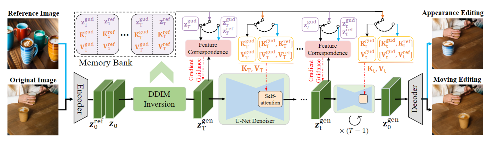

- [1. DreamBooth: Fine Tuning Text-to-Image Diffusion Models for Subject-Driven Generation(2023.5)](#1-dreambooth-fine-tuning-text-to-image-diffusion-models-for-subject-driven-generation20235)
- [2. LoRA:Low-Rank Adaption of large language model(2021.10)](#2-loralow-rank-adaption-of-large-language-model202110)
- [3. Controlnet: Adding Conditional Control to Text-to-Image Diffusion Models(2023.11)](#3-controlnet-adding-conditional-control-to-text-to-image-diffusion-models202311)
- [4. T2I-Adapter: Learning Adapters to Dig out More Controllable Ability for Text-to-Image Diffusion Models(2024 aaai)](#4-t2i-adapter-learning-adapters-to-dig-out-more-controllable-ability-for-text-to-image-diffusion-models2024-aaai)
- [5. SDEdit: Guided Image Synthesis and Editing with Stochastic Differential Equations(2022 iclr)](#5-sdedit-guided-image-synthesis-and-editing-with-stochastic-differential-equations2022-iclr)
- [6. IP-Adapter: Text Compatible Image Prompt Adapter for Text-to-Image Diffusion Models(2023.8)](#6-ip-adapter-text-compatible-image-prompt-adapter-for-text-to-image-diffusion-models20238)
- [7. DragonDiffusion: Enabling Drag-style Manipulation on Diffusion Models(2024 cvpr)](#7-dragondiffusion-enabling-drag-style-manipulation-on-diffusion-models2024-cvpr)
- [8. DragDiffusion: Harnessing Diffusion Models for Interactive Point-based Image Editing(2024 cvpr)](#8-dragdiffusion-harnessing-diffusion-models-for-interactive-point-based-image-editing2024-cvpr)
- [9. DiffEditor: Boosting Accuracy and Flexibility on Diffusion-based Image Editing(2024 cvpr)](#9-diffeditor-boosting-accuracy-and-flexibility-on-diffusion-based-image-editing2024-cvpr)

# 1. DreamBooth: Fine Tuning Text-to-Image Diffusion Models for Subject-Driven Generation(2023.5)
Google的工作，过去的文生图模型缺乏模仿给定subject参考集（比如确定外观的狗）并合成新的在不同背景下subject的能力。Dreambooth是一种文本到图像扩散模型“个性化”的新方法，对预训练的文生图模型进行微调，使其学会将唯一标识符与特定subject绑定，就可以使用唯一标识符来合成不同场景中subject的新颖的真实感图像，并可以保留其关键的识别特征。
- 目标：给定一个subject的几个图像，没有任何文本描述，目标是生成具有高细节保真度和**文本提示引导**的变化的subject新图像，变化包括改变subject位置、改变subject属性（例如颜色或形状）、修改subject的姿势、视点和其他语义修改。

- Designing Prompts for Few-Shot Personalization:为了将subject加入扩散模型的“词典中”，文中为few-shot set设计了以下prompt，a [identifier] [class noun]，class noun是为了利用固有的类先验知识
- Rare-token Identifiers:文中发现现存英文单词作为identifier是次优化的，因为模型需要分离其固有先验再与subject联系起来。而随机特定编码如xx55y效果也不好，因为分词器会把每个letter编码成token也有强先验。文中采用的方法是，先在词汇表中对rare token进行搜索，再其反编码回text（长度小于等于3时效果好），从而得到定义unique identifier的字符序列。
- Class-specific Prior Preservation Loss:在微调预训练扩撒模型时，为了保持先验知识并避免降低多样性，提出了一种loss

  第二项损失，先输入$x_{pr}$=a [class noun]，生成基于模型先验的图片$x_{pr}$，用它自己生成的样本来监督模型，从而在本batch的参数优化中保持该先验；第一项损失即为平常的重建损失，以few-shot set为监督。

  

# 2. LoRA:Low-Rank Adaption of large language model(2021.10)
本用来给LLM微调的方法，原理很简单，在扩散模型中也很有效。

  

- 方法：固定大网络参数，只训练某些层参数的增量，且这些参数增量可通过矩阵分解变成更少的可训练参数。具体来说，对于参数$W_O$，在微调时训练$W=W_0+\Delta W=W_0+AB$，其中$W_0$参数冻结，只训练$A\in R^{D\times r}, B\in R^{r\times D}$，由于r可以很小（如2），要训练的参数量大大下降。在初始化时，A初始化为标准高斯分布，B初始化为0.
- 该方法主要用于某些层的线性部分，比如Transformer中的QKV的线性投影，以及FFN的线性部分
- 扩散模型：大多用LoRA微调CLIP以及Unet中交叉注意力层的线性部分。
- 
# 3. Controlnet: Adding Conditional Control to Text-to-Image Diffusion Models(2023.11)
本文提出了一种Paper/diffusion/image/Image-to-image translation的条件控制扩散模型方法，利用附加图片（例如，边缘图、人体姿势骨架、分割图、深度、法线等）条件控制生成的图片。而在特定条件下的训练数据量，明显小于一般文本到图像训练的可用数据，不能直接训练/微调，本文提出Controlnet，增强预训练文生图扩散模型对于spatially localized, task-specifically的图像条件生成。实现了很好的效果，并对数据集大小具有很好的scalabel和鲁棒性。
- ControlNet:对于一个NN块，ControlNet将原有参数固定并复制，复制部分可训练且由零卷积残差连接到原有部分，复制块的输入为x+经过零卷积的条件c，零卷积可以保护复制块参数不被训练之初的噪声干扰

  

- Controlnet for SD:对于SD的编码块和中间块使用Controlnet，并且将结果加到skip connection上。由于SD是LDM，图片条件c被resize到64\*64且经过一个tiny的CNN再输入Controlnet

  

- Training:训练时，随机50%将文本$c_t$替换为空字符串，这种方法增强了 ControlNet 直接识别输入条件图像中的语义（例如边缘、姿势、深度等）的能力，以替代提示。由于零卷积不会给网络增加噪声，因此模型应该始终能够预测高质量的图像，但是对于条件控制的学习，会出现“突然收敛现象”，模型并不是逐渐学习条件控制，而是突然成功地遵循输入条件生成图像（通常优化步骤少于 10K）

- Classifier-free guidance resolution weighting：为了实现CFG，条件图片默认加入到两种噪声的生成中。对于没有文本prompt的情况，全加入会导致CFG失效，而只加入条件噪声会导致guidance过强。为此提出了CFG Resolution Weighting，在向$\epsilon_c$中加入条件图片时，Controlnet结果加入到skip-connection之前成一个权重$w_i=(\frac78)^{12-i}$，$i$为第i个block([0,12])，由浅到深权重逐渐趋向1

- Composing multiple ControlNets：可以使用多张条件图片，直接将对应Controlnet的结果加起来即可

# 4. T2I-Adapter: Learning Adapters to Dig out More Controllable Ability for Text-to-Image Diffusion Models(2024 aaai)
T2I模型中，文本很难提供准确的structural指导，以让生成结果符合人们的期望，导致在一些复杂场景下结果随机且不稳定。本文认为，这是因为文本无法提供准确的指导来对齐内部知识和外部控制信号，而这种对齐可以很容易地以低成本学习，从而提出T2I-adapter，可以为预训练好的T2I模型提供即插即用的adapter，实现Structure control（骨骼，关键点，mask，颜色等）。
- 模型：本文以SD为例，LDM+Unet去噪+预测噪声，text用CLIP提取再输入交叉注意力。
- T2I-Adapter：结构也很简单，先将输入图用Pixel unshuffle下采样到64\*64，再经过四个卷积block，得编码到四个尺度的条件特征图，直接加到去噪Unet编码器中对应尺寸特征图上。并且，直接将adapter提取的特征图加权相加即可实现multiple conditions control。
- Non-uniform time step sampling during training：文中发现，向adapter输入时间戳特征有利于guidance，但是这大大降低了效率（每一步采样都得提取一次条件）。同时，使用DDIM采样时，guidance仅当早期（t较大时）加入时有效，而中后期难以control，因此，文中在训练阶段采样时间t时，更多的采样t较大的早期阶段（$t=(1-(\frac{t}{T})^3)*T$），增强了guidance。（相当于，adapter默认输入t较大的时间戳，既有利于guidance，又不用降低效率）

# 5. SDEdit: Guided Image Synthesis and Editing with Stochastic Differential Equations(2022 iclr)
一篇比较早期的结构化控制图片生成的工作，方法比较简单
- 问题设置：首先看一下本文实现了什么样的条件控制？如下图所示，我们向模型输入一个RGB图片作为guidance，这既可以是色块图，也可以是在原图基础上生硬改动（如右列），模型会根据guidance图生成自然且贴切的图片，即实现一个faithfulness and realism的均衡。

- 方法：很简单，选择一个时间戳$t_0$，将guidance加入$t_0$的噪声，以此为初始化开始去噪直到0。$t_0$越大，图片越真实而guidance越弱，因此控制$t_0$以达到均衡
- 理论：本文通过SDE推导，证明了上述方法得到的$x_0$与guidance之间的L2损失存在一上界，因此无需做额外训练或修改便可实现edit

# 6. IP-Adapter: Text Compatible Image Prompt Adapter for Text-to-Image Diffusion Models(2023.8)
本文提出了一个新的adapter，向T2I模型加入image prompt（如下图所示，与structure control的概念有所不同），相比过去的adapter，在轻量化的同时可以与整体微调/从头开始训练的性能相匹配。

- 动机：本文认为，过去的adapter，大多数方法只是将图片特征通过冻结的交叉注意层插入预训练SD模型，但这参数原本只对text特征敏感，从而使图像特征无法通过交叉注意力有效嵌入到预训练模型中。本文提出了一种新的adapter。
- IP-Adapter：在Unet所有原有交叉注意力层，加入一个新的交叉注意力层接受image条件，二者的query共用，结果相加作为新的输出（可以加权）。为了提高效率，注意力的Q矩阵公用，新K,V以原K,V为初始化。
- IP-Adapter是reusable and flexible。训好的adapter可以推广到从同一基础扩散模型微调的其他自定义模型；并且可以与ControlNet 等其他controllable adapter兼容，将image prompt与structure control结合起来。

# 7. DragonDiffusion: Enabling Drag-style Manipulation on Diffusion Models(2024 cvpr)
本文实现了通过拖拽(drag)实现edit，利用classifier-guidance思想，借助特征对应的梯度引导，实现高效image edit，此过程无需额外模块或微调。为了将编辑信号注入到模型的扩散过程当中，并保持编辑前后图像的内容一致性，共采用三种方法，思路挺直接的，方法的细节不少，仅作大致总结

- DDIM inversion with memory bank:将原图潜在特征$z_0$按DDIM格式逐步加噪，将每个t的$z_t$和对应UNet decoder自注意力层的$K,V$存在memory bank中。以$z_T$为初始化进行去噪，和SDEdit类似
- Gradient-guidance-based editing design:classifier guidance在采样时，利用分类模型的梯度$\triangledown log\ p(y|x_t)$引导生成，分类模型其实可以推广为“能量模型”，度量x和y的相似度。本文构建通过特征响应的能量函数，利用其梯度引导采样完成edit的目标。
  - content editing：扩散模型中间特征具有强对应关系，对于任意t，从memory bank取到对应DDIM加噪$z_t$，经过去噪Unet提取中间特征F，再给定标出原图目标(original content position)的mask，从而得到原图目标的区域特征；再给定generate过程的潜在变量（从$z_T$开始去噪），经过去噪Unet提取中间特征，再用 标注target dragging position的mask提取得到目标区域的特征。为了实现drag的图片edit，我们希望上面mask出来的两部分相似，用cosine度量相似度，能量函数构建为以下形式，S包括局部和全局两种度量函数。
    
  这里，按我的理解，能量函数的梯度与log p的梯度之间是差了个负号的，因此梯度引导会倾向于使能量函数减小，从而使S相似度增大。
  - consistency：为了保证，edit区域之外保持一致，还加入了以下项，$m^{share}$指origin和target目标区域的并集的补集。
  
  - total：为了适应特定任务，还加入了一个优化项，最终如下式
      
  - 文中分析了扩散模型的中间特征，第二层的特征包含更多的语义信息，可以重建与原始图像语义相似但内容细节存在一定差异的图像；第三层的特征往往表达低层特征，但无法对高层纹理提供有效监督，导致结果模糊。因此本文结合了这两个分辨率的中间特征进行guidance
- 视觉交叉注意力：为了进一步加强guidance，文中用memory bank中的K,V替换对应t的去噪模型decoder自注意力层的K和V，使generate去噪过程中可以结合原图经DDIM加噪版本的特征。

  

> ps1:文中2.2部分的公式2打错了

> ps2:文中直接将能量函数的梯度加到去噪模型的结果上了，这初看是错的，但实际没问题。因为文中去噪模型预测的是噪声而非score，二者方向差个符号，$log\ p(y|x)$的梯度和能量函数的梯度也差个负号，score应该加相对于$log\ p(y|x)$的梯度，因此噪声应该减，即加相对于能量函数的梯度。
# 8. DragDiffusion: Harnessing Diffusion Models for Interactive Point-based Image Editing(2024 cvpr)
本文也是受dragGan启发（方法也挺像），将点编辑drag引入到扩散模型领域，并且提出了一个benchmark，本文采用的方法只需在一个特定时间步注入drag信息即可实现编辑。
- Identity-preserving Fine-tuning：首先对LDM进行LoRA微调，和前边的工作一样，对原图进行DDIM inversion作为初始化噪声，从而微调使LDM模型学会重建，更好的在扩散过程中编码输入图像
- Diffusion Latent Optimization：具体细节不作详细阐述，主要是以下损失函数，第一项保证drag前后点邻域的点特征（来自Unet输出特征图）保持一致，第二项保证去噪后未被mask的区域前后保持一致。在单个时间步中，进行多次该优化。

- Reference-latent-control：就是视觉交叉注意力，用原图作为K,V

# 9. DiffEditor: Boosting Accuracy and Flexibility on Diffusion-based Image Editing(2024 cvpr)
基于DragonDiffusion接着做的工作

- Content Description with Image Prompt：主体结构仍为DragonDiff，加入了image prompt，用QFormer提取视觉token，和text token一起输入交叉注意力（与IP-Adapter中一致的并行注意力）；依然使用了memory bank，和视觉交叉注意力
- Sampling with Regional SDE：过去方法多使用ODE的确定性采样，文中认为这种采样限制了创造力和多样性，因此采用了region SDE，也就是在某些(region)时间步使用SDE采样，即方差>0，并且edit区域的方差稍大于其余区域
- Editing with Gradient Guidance：在DragonDiff能量函数的基础上，本文修改为Regional gradient guidance，将原能量函数梯度分别限制在对应区域；并且加入了Time travel，在整个采样过程中，有三次roll back，即根据$z_{t-1}$重新获得$z_t$，文中说有效提高了质量，这也是借鉴了DragDiffusion，在单个扩散时间步中进行循环guidance。
