- [few shot semantic segmentation](#few-shot-semantic-segmentation)
  - [1.One-Shot Learning for Semantic Segmentation(2017 BMVC)](#1one-shot-learning-for-semantic-segmentation2017-bmvc)
  - [2.Few-Shot Semantic Segmentation with Prototype Learning(2018 bmvc)](#2few-shot-semantic-segmentation-with-prototype-learning2018-bmvc)
  - [3.Conditional networks for few-shot semantic segmentation(2018 iclr)](#3conditional-networks-for-few-shot-semantic-segmentation2018-iclr)
  - [4.CANet: Class-Agnostic Segmentation Networks With Iterative Refinement and Attentive Few-Shot Learning(2019 cvpr)](#4canet-class-agnostic-segmentation-networks-with-iterative-refinement-and-attentive-few-shot-learning2019-cvpr)
  - [5.Feature Weighting and Boosting for Few-Shot Segmentation(2019 iccv)](#5feature-weighting-and-boosting-for-few-shot-segmentation2019-iccv)
  - [6.AMP: Adaptive Masked Proxies for Few-Shot Segmentation(2019 iccv)](#6amp-adaptive-masked-proxies-for-few-shot-segmentation2019-iccv)
  - [7.Pyramid Graph Networks with Connection Attentions for Region-Based One-Shot Semantic Segmentation(2019 iccv)](#7pyramid-graph-networks-with-connection-attentions-for-region-based-one-shot-semantic-segmentation2019-iccv)
  - [8.PANet: Few-Shot Image Semantic Segmentation with Prototype Alignment(2019 iccv)](#8panet-few-shot-image-semantic-segmentation-with-prototype-alignment2019-iccv)
  - [9.Attention-Based Multi-Context Guiding for Few-Shot Semantic Segmentation(2019 aaai)](#9attention-based-multi-context-guiding-for-few-shot-semantic-segmentation2019-aaai)
  - [10.PFENet: Prior Guided Feature Enrichment Network for Few-shot Segmentation(2020 trami)](#10pfenet-prior-guided-feature-enrichment-network-for-few-shot-segmentation2020-trami)
  - [11.FSS-1000: A 1000-Class Dataset for Few-Shot Segmentation(2020 cvpr)](#11fss-1000-a-1000-class-dataset-for-few-shot-segmentation2020-cvpr)
  - [12.Few-Shot Semantic Segmentation with Democratic Attention Networks(2020 eccv)](#12few-shot-semantic-segmentation-with-democratic-attention-networks2020-eccv)

**由于电脑卡机，自动将GB 2312编码格式的文件存成了UTF，重新打开已经破坏了，下面部分内容为回忆**
# few shot semantic segmentation
## 1.One-Shot Learning for Semantic Segmentation(2017 BMVC)
第一篇将小样本方法引入分割的文章，现在回头看已经没什么好写的了，后面几篇的大体框架还是沿用的这个。
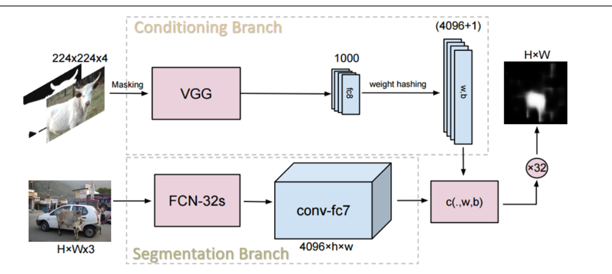
- 前mask，支持集的图片输入前就mask了，后面几篇文章都改成后mask了
- 条件分支根据支持集，提出表征，作为分割分支最后全连接层的参数
- k-shot：文中将k张图片看作k个独立分类器，认为他们精度高但召回率低，将k个结果取并。后面几篇文章基本都改了。
s

## 2.Few-Shot Semantic Segmentation with Prototype Learning(2018 bmvc)
第一篇将原型学习的思想引入SSS分割的文章，还是很复杂的，只把思路写一下。
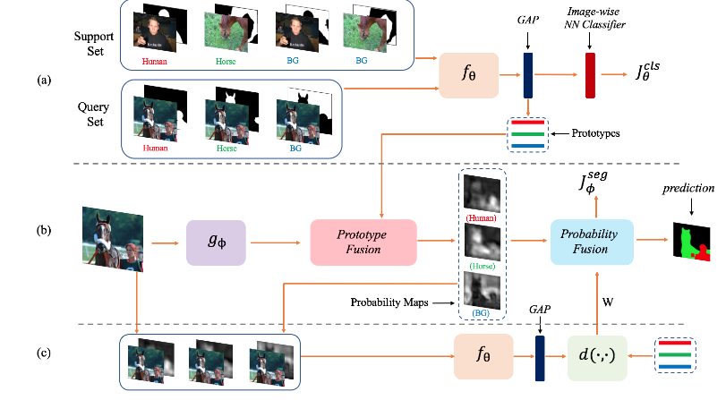
训练一个原型学习器f，输入为支持集图片+二元mask，输出一个向量，此处的损失为度量学习的方法，最小化与目标类别原型的距离。分割网络g，输入query，得到特征图，将其与各圆形分别融合，再经过1\*1压缩成一维，经归一化后得到N+1张特征图。分别将其作为mask，与query一起输入f得到原型，根据其与对应支持集原型的距离，计算出一个权重W，作为最后一个分类头的参数。

## 3.Conditional networks for few-shot semantic segmentation(2018 iclr)
iclr workshop的一篇短文，感觉没啥新东西，作者说支持集的标注可以只是几个正例和负例的像素点
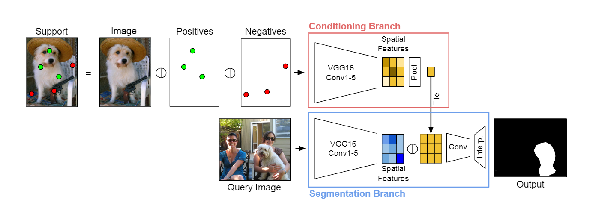
- 创新的话，条件分支提取的表征与分割分支的特征相加，而不是作为参数了。这特征融合方式太生硬了，后边几篇文章也把这优化了。
## 4.CANet: Class-Agnostic Segmentation Networks With Iterative Refinement and Attentive Few-Shot Learning(2019 cvpr)
相比之前几篇文章，精度提升很大。
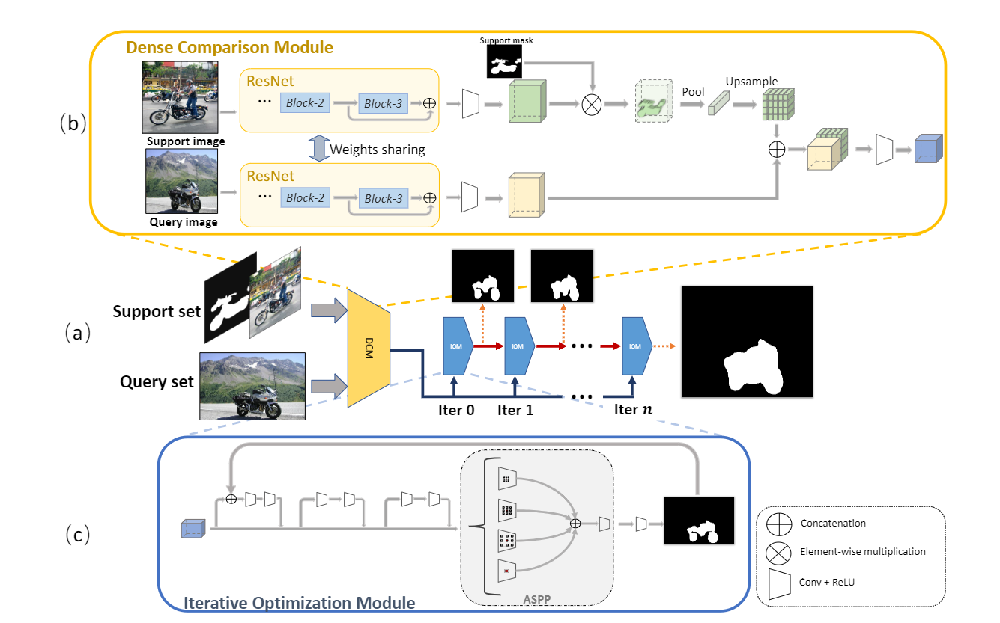

- 第一个提出来后mask+pool提取全局表征的方法，后面好几篇文章也用的这个。将全局表征上采样到原始特征图尺寸并和query的特征图叠起来，作为融合后的特征。
- Iterative Optimization Module:提出一种迭代优化的方法，不断优化预测的mask
- 用注意力方法推广到k-shot，用了类似于SE注意力的方法，为每个shot的刚叠起来的特征图计算一个权重，k个shot之间softmax一下，将结果加权（注意力可以捕捉叠起来的两部分的相似性？越相似结果可能越好？感觉有些扯）。加权后的结果作为最后特征进入IOM。

## 5.Feature Weighting and Boosting for Few-Shot Segmentation(2019 iccv)
数学上有些难绷的那篇文章，“最优化问题的闭式解”->其实是“求与一个向量点积最小的单位向量”初中问题。
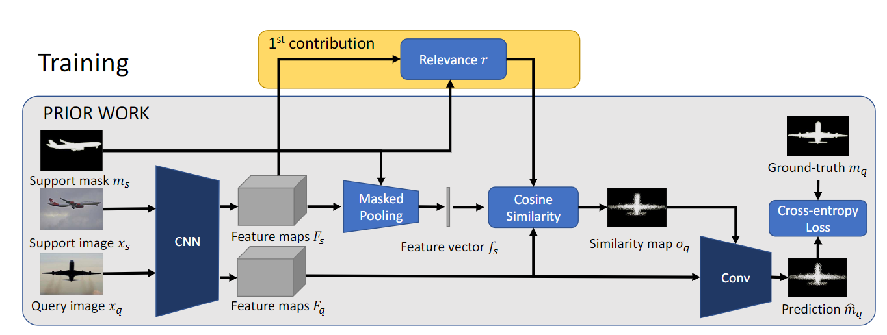
- 训练时，将支持集图片mask-pool得到表征，计算与特征图的逐像素余弦相似度，得到的相似度图和uqery原特征图叠起来输入卷积层。这里提出一个相关性向量，是由差异向量（前景所有位置的向量的均值-背景的）单位化得到的，在计算余弦相似度时（停顿）逐元素乘了特征图和support的表征
- 预测时，先将support输入CNN像query一样得到预测，用该预测与GT的loss进行梯度下降，并计算IoU作为置信度，共进行N轮迭代，梯度只传播到support的表征。用这N个表征分别对query进行预测，并用置信度进行加权求和得到最终预测
- k-shot:将k个表征取均值，作为one-shot问题进行后续所有操作，提高了鲁棒性
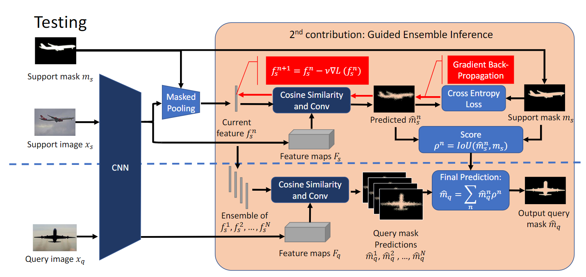

## 6.AMP: Adaptive Masked Proxies for Few-Shot Segmentation(2019 iccv)
一篇很水的文章，对于小样本学习没啥创新点，使用FCN多个尺度的特征图算创新吗？还是mask+pool，只是将小样本学习框架推广到视频语义分割和连续语义分割，属于是创造需求了，毕竟不同任务用不同框架才是正常情况。
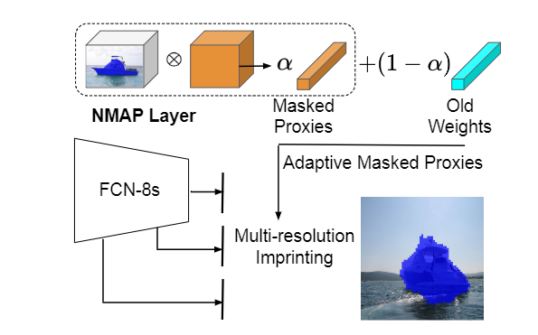
之所以能中，我感觉是因为全文围绕"proxy"和"imprinting"两个分类里的概念展开，讲了个高级的故事，前者其实就是全局表征，后者就是特征/嵌入
## 7.Pyramid Graph Networks with Connection Attentions for Region-Based One-Shot Semantic Segmentation(2019 iccv)
是一篇思路很自然的文章，看到后会觉得“为什么现在才有人提”。
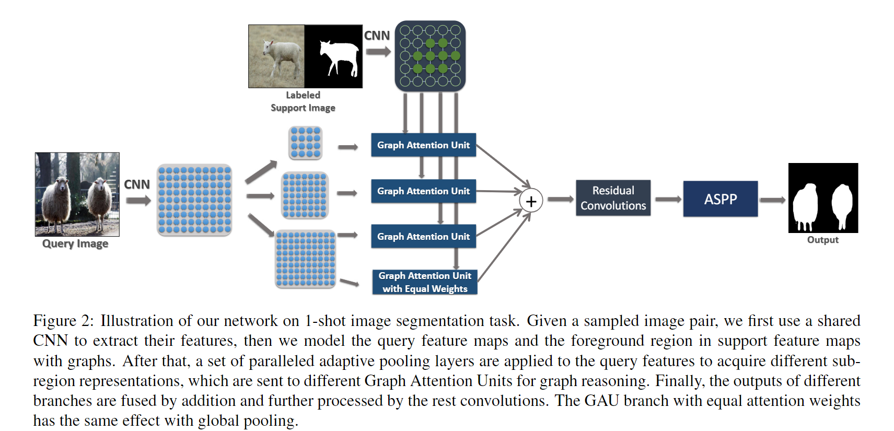
- 背景：现在SSS分割的方法大多沿袭分类任务的思路，但是，与分类不同，分割任务的数据具有结构化，由support分支指导分割分支时，为一个多对多信息传递问题。过去对support提取的全局表示，对query的每个像素都是相同的，很可能导致信息损失。本文提出了一种用图建模分割数据的方法，并使用注意力机制实现support到query的信息传递。
- Graph Attention Unit:用CNN提取特征图后，对query的每个像素/support的前景部分像素建模为图中的节点，计算query图中每个节点对supporttu所有节点的注意力分数（线性映射后点积），用support节点的加权和（先用g做线性映射）作为query节点的新值。将得到的新值与原特征图（经过g）连接起来得到最终的特征图。
- Pyramid Graph Reasoning:文中认为，将每个像素点建模为图可能忽略全局信息，例如，在人眼和狗眼之间建立联系；因而，将多个节点结合可以得到复杂对象的表征，更有判别性（人脸和狗脸）。建模query图前，进行自适应池化，得到不同分辨率的图。
## 8.PANet: Few-Shot Image Semantic Segmentation with Prototype Alignment(2019 iccv)
引用量很高的一篇文章，读了之后感觉这个方法肯定有效，也是“怎么现在才有人想到”的文章，我认为主要贡献是充分利用了支持集。
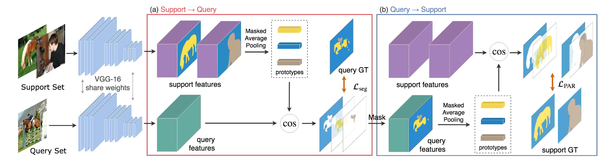
- 原型学习：对于一个C way N shot问题，将支持集的图片按类进行mask-pool，并取均值作为每个类的原型。
- 非参数的度量学习：计算query每个像素与每个原型的距离，最近的作为分类结果。预测概率为，对所有类的-$\alpha$d($F_{x,y},p_c$)作softmax。
- Prototype alignment regularization:本文认为，过去对支持集mask的利用不充分，仅仅用来mask。PAR在训练时，用对query的预测作为mask，提取原型后反向分割支持集，与query一样对结果计算损失，实现原型之间的对齐正则化。
## 9.Attention-Based Multi-Context Guiding for Few-Shot Semantic Segmentation(2019 aaai)
感觉没啥新东西，调参类型的文章。
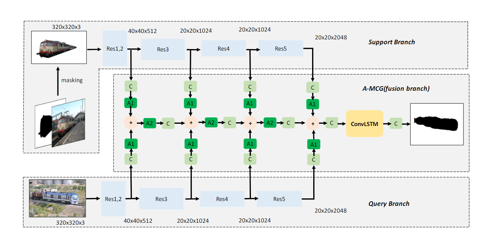
- 提出了应用注意力机制的多尺度融合模块（A-MCG）：support分支和query分支每个阶段的特征图用注意力模块融合（SE，RAM）
- 提出了一种融合k个shot结果的方法：用Conv-LSTM融合
## 10.PFENet: Prior Guided Feature Enrichment Network for Few-shot Segmentation(2020 trami)
很trick的一篇文章，感觉主要在设计网络
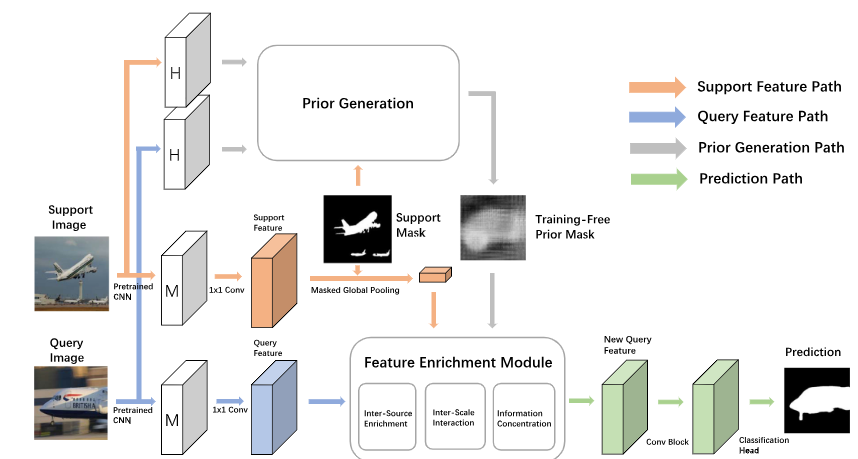
- Prior for Few-Shot Segmentation:“CANet [46]的实验表明，在少数样本模型的特征处理过程中简单地添加高级特征会导致性能下降。因此，在少数镜头设置中利用语义信息的方式并不简单。”，这里的高级特征指的是backbone最后一层（第五层），CANet因此将第五层删了。本文将高级特征作为先验，指导分割。这个先验差不多是，将query和support在backbone提取的特征，让query的每个像素计算与support每个像素（mask一下）的余弦相似度，每个像素选最大值作为相关性值。
- Feature Enrichment Module:设计了一个很复杂的模块，来融合特征。首先是Inter-Source Enrichment，将query的特征图，support的mask pool的特征图上采样，和先验图叠起来；其次Inter-Scale Interaction，对query特征图进行自适应池化，提取多尺度的特征，并将不同尺度的特征进行一个垂直的细化。
- 具体细节不写了，模块设计的很复杂。
## 11.FSS-1000: A 1000-Class Dataset for Few-Shot Segmentation(2020 cvpr)
提出了一个针对小样本分割的数据集，一个特点为类别多（1000个），另一个为类别样本数据量均衡（10个）。还提出了一个模型，U-Net形状的，支持集编码后取均值，与query特征图叠起来，卷积处理后解码，感觉很简单，不太靠谱。
## 12.Few-Shot Semantic Segmentation with Democratic Attention Networks(2020 eccv)
也是针对分割的结构化数据问题，和7一样，本文认为，由于像素之间的偏见竞争，支持图像中通常仅激活前景对象的一小部分区域，7的注意力方法会导致支持图像和查询图像之间的连接由一小部分像素主导，很大程度上限制了支持图像的连接。本文提出了一种“民主化”图注意力，前景物体上的像素往往会民主化地参与连接。
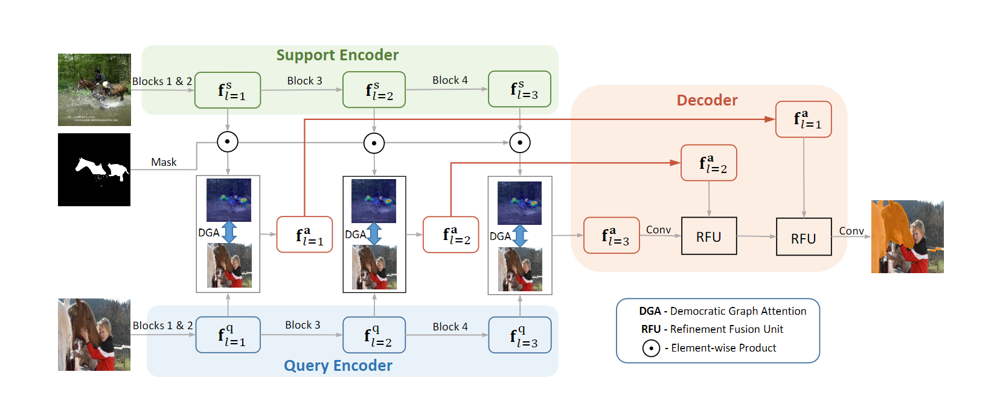
- 整体还是一个共享特征提取器的双分支框架，加了个解码器来细化，勉强算有两个创新点吧。
- Democratized Graph Attention:将Q和S提取的特征图，分别映射到kq,vq和ks,vs，计算kq和ks之间的注意力图，hw\*hw，将第一维度取均值恢复到原尺寸，把像素的值按降序排列，重建注意力图（值乘自己的次序，再除以一个常数HW+1），用softmax归一化后得到最终的注意力图，加权vs得到注意力特征图f，将f与vq叠起来输入下一模块。
- Multi-Scale Guidance：在特征提取器的每一个分辨率阶段，都计算DGA特征。最终，在解码器阶段逐阶段细化（注意力特征与上一阶段的特征叠起来）