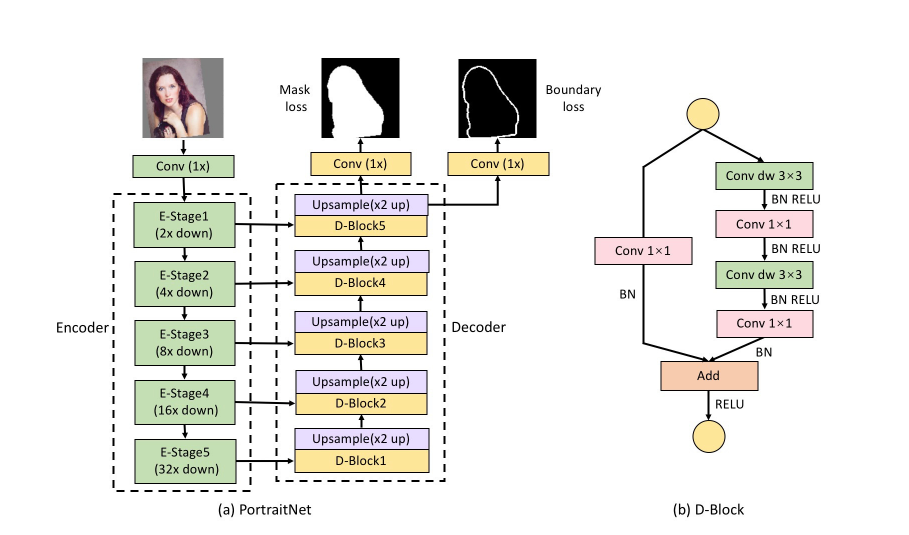
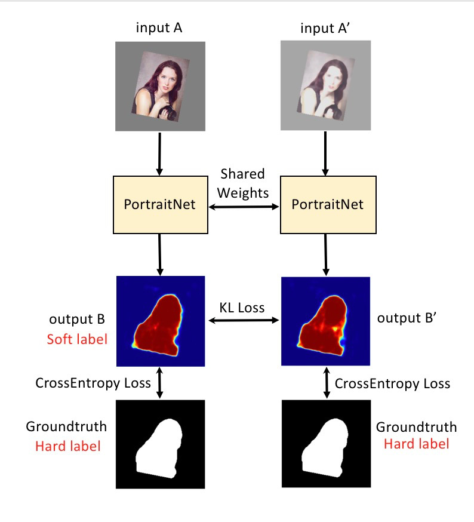
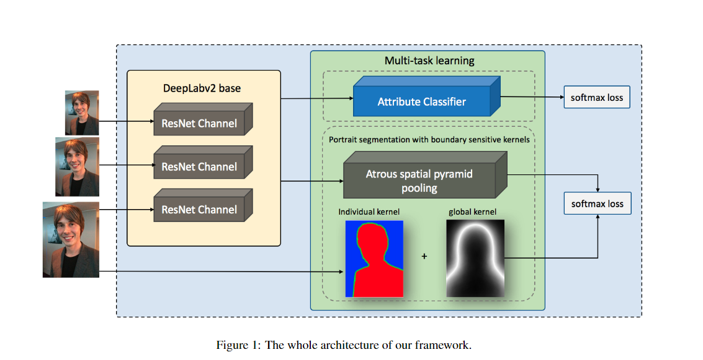
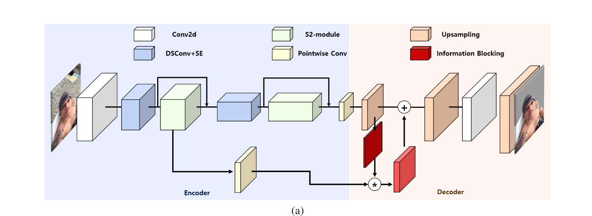
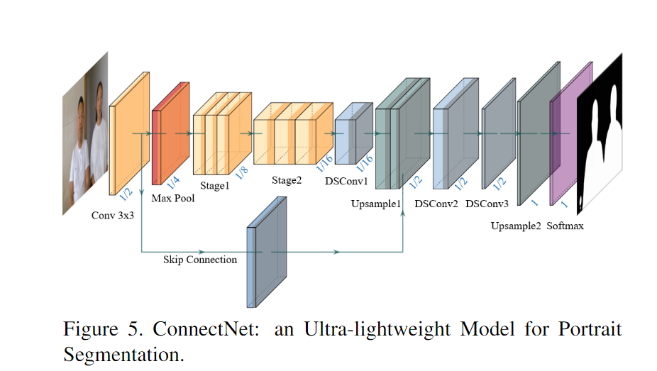
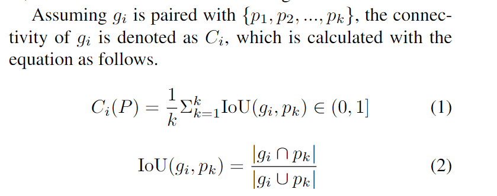

- [Portrait segmentation](#portrait-segmentation)
  - [1.PortraitNet: Real-time Portrait Segmentation Network for Mobile Device(2019)](#1portraitnet-real-time-portrait-segmentation-network-for-mobile-device2019)
  - [2.Boundary-sensitive network for portrait segmentation(2019)](#2boundary-sensitive-network-for-portrait-segmentation2019)
  - [3.Sinet: Extreme lightweight portrait segmentation networks with spatial squeeze module and information blocking decoder(2020)](#3sinet-extreme-lightweight-portrait-segmentation-networks-with-spatial-squeeze-module-and-information-blocking-decoder2020)
  - [4.PP-HumanSeg: Connectivity-Aware Portrait Segmentation with a Large-Scale Teleconferencing Video Dataset(0222)](#4pp-humanseg-connectivity-aware-portrait-segmentation-with-a-large-scale-teleconferencing-video-dataset0222)
- [3D Object Detection](#3d-object-detection)
  - [1.VoxelNet: End-to-End Learning for Point Cloud Based 3D Object Detection(2018)](#1voxelnet-end-to-end-learning-for-point-cloud-based-3d-object-detection2018)
  - [2.Frustum PointNets for 3D Object Detection from RGB-D Data(2018)](#2frustum-pointnets-for-3d-object-detection-from-rgb-d-data2018)
  - [3.SMOKE: Single-Stage Monocular 3D Object Detection via Keypoint Estimation(2020)](#3smoke-single-stage-monocular-3d-object-detection-via-keypoint-estimation2020)
  - [4.Centernet:Objects as Points(2019)](#4centernetobjects-as-points2019)
  - [5. RTM3D: Real-time Monocular 3D Detection from Object Keypoints for Autonomous Driving(2020)](#5-rtm3d-real-time-monocular-3d-detection-from-object-keypoints-for-autonomous-driving2020)
- [RT-Series](#rt-series)
  - [1.RT-1: ROBOTICS TRANSFORMER FOR REAL-WORLD CONTROL AT SCALE(2022.12)](#1rt-1-robotics-transformer-for-real-world-control-at-scale202212)
  - [2.RT-2: Vision-Language-Action Models Transfer Web Knowledge to Robotic Control(2023.8)](#2rt-2-vision-language-action-models-transfer-web-knowledge-to-robotic-control20238)
  - [3.Open X-Embodiment: Robotic Learning Datasets and RT-X Models(2023.10)](#3open-x-embodiment-robotic-learning-datasets-and-rt-x-models202310)
- [others](#others)
  - [1.Deformable Convolutional Networks(2017)](#1deformable-convolutional-networks2017)
  - [2.Deformable ConvNets v2: More Deformable, Better Results(2019)](#2deformable-convnets-v2-more-deformable-better-results2019)
  - [3.AVP-SLAM: Semantic Visual Mapping and Localization for Autonomous Vehicles in the Parking Lot(2020)](#3avp-slam-semantic-visual-mapping-and-localization-for-autonomous-vehicles-in-the-parking-lot2020)

# Portrait segmentation
## 1.PortraitNet: Real-time Portrait Segmentation Network for Mobile Device(2019)
[论文链接](http://www.yongliangyang.net/docs/mobilePotrait_c&g19.pdf)

人像分割作为语义分割的一个子领域，面临着独有的挑战：1. 人像在图片中占的面积很大；2.模糊的边界条件和复杂的光照条件。本文提出了基于mobilenet v2的encoder-decoder模型PortraitNet，实现实时人像检测的精度和效率平衡，其中还使用了skip connection,depthwise conv和辅助loss

- 第一个辅助loss为边界loss，在decoder的最后一层特征图后，加了一个预测边界的卷积层，使用focal loss预测边界（因为边界占的正例占比很少），从而使分割对边界更敏感
- 一致约束loss：将原图片A和经过纹理增强（改变亮度、对比度、锐度，加入随机噪声等）的A'都输入网络，并预测。此时认为，A为更精细的分割，从而使用KL散度loss约束A'向A靠拢，这可以增强网络对复杂光照环境的鲁棒性

- 使用FLOPs，参数量来比较速度

## 2.Boundary-sensitive network for portrait segmentation(2019)
[论文链接](https://arxiv.org/pdf/1712.08675)

主干是Resnet+deeplab v2的分割框架，文中为了人像分割设计了对边界敏感的模块

- 将原图的GT转变为soft label，前景和背景都是one hot，边界类为三元浮点向量，分割预测的类别有三类，从而修正交叉熵为加权交叉熵，边界有更多的权重，也提供了更多边界信息
- 将训练集的所有GT图取平均mask，若一个像素点的均值靠近0/1，则该像素点倾向为背景/前景，若靠近0.5，则倾向于边界。global boundary-sensitive kernel便按mask均值，边界概率高的像素点取更高的值，加权每个像素点的loss，从而使模型对困难的像素点（边界）更敏感
- 并行训练了一个边界属性的分类器（长发/短发）

## 3.Sinet: Extreme lightweight portrait segmentation networks with spatial squeeze module and information blocking decoder(2020)
[论文链接](http://openaccess.thecvf.com/content_WACV_2020/papers/Park_SINet_Extreme_Lightweight_Portrait_Segmentation_Networks_with_Spatial_Squeeze_Module_WACV_2020_paper.pdf)

和Portraitnet相比，本文提出的Sinet大大减小了参数量，精度下降较少，主要创新了两个模块 Information Blocking Decoder和 Spatial Squeeze module

- Information Blocking Decoder:在获取细节信息时，如低分辨率特征图融合高分辨率特征图时，后者信息太丰富会引入冗余/噪声。本模块的设计目的是让低分辨率的特征图在高分辨率特征图中更关注必要的局部信息，在低分辨率特征图后并行预测一个置信度图（边界往往置信度低）c，用1-c来加权高分辨率特征图，再将其与低分辨率特征图融合
- Spatial Squeeze module:本模块的设计目的是获得不同尺度的全局信息。S2 block通过池化获取上下文信息，S2 module先用bottleneck降低维度(分组卷积，减小计算量)，又并行连接两个分辨率不同的S2 block
- 辅助loss:用来解决边界问题。对GT进行形态学膨胀和腐蚀的数据增强，相减获得边界的GT，让边界GT和预测图对应位置算loss来加强对边界的敏感性
  

## 4.PP-HumanSeg: Connectivity-Aware Portrait Segmentation with a Large-Scale Teleconferencing Video Dataset(0222)
[论文链接](https://openaccess.thecvf.com/content/WACV2022W/HADCV/papers/Chu_PP-HumanSeg_Connectivity-Aware_Portrait_Segmentation_With_a_Large-Scale_Teleconferencing_Video_Dataset_WACVW_2022_paper.pdf)
本文提出了一个超轻量级的人像分割模型ConnectNet,用极少的参数(0.13M)实现了很强的效果。关键是提出了一种新的loss，使模型自我学习连通性。
- 网络很简单，深度可分离卷积，只用了一个skip，上采样后接bottleneck
  
- SCL: Self-supervised Connectivity-aware Learning for Portrait Segmentation:

- 先将pre和GT的连通性组件匹配，再计算连通性SC。loss=1-SC，由公式可以看出，这个loss将使模型倾向于产生数据更少的连通性组件，并使连通性组件的交并比更大，很巧妙！
- 有个问题，训练刚开始时，可能没有交集，此时loss为0，参数不更新。没有交集的情况使用了一种别的loss，$loss=\frac{|P+G|}{|I|}$，绝对值指像素数，I是整张图片，使P和G的并集减小，倾向于融合。
# 3D Object Detection
## 1.VoxelNet: End-to-End Learning for Point Cloud Based 3D Object Detection(2018)
这是三维目标检测的经典论文，提出了体素特征编码，避免了过去需要人工进行特征工程的弊端，相比逐点表征，大大减小了开销。
- 将空间中的点分组，沿三个维度划分成体素（小格子），经过VFE(Voxel Feature encoding)层，可以得到每个体素的特征表示。VFE先逐点提取特征，再使用最大池化聚合逐点特征，得到局部聚合特征。将局部聚合特征与逐点特征连接起来后，输入FCN得到体素的特征表示。
- 将体素的特征表示连接起来，$C*D*H*W$，输入中间卷积层，再输入RPN。锚框的采样频率为，沿H和W，每隔两个体素取样两个，最终rpn预测出每个点（特征图大小为$H/2*W/2$）的正类和负类的得分，和每个点的两个锚框的7个特征（与锚框的偏移，三个中心点坐标，三个尺寸，一个航向角）
  
## 2.Frustum PointNets for 3D Object Detection from RGB-D Data(2018)
也是一篇3维目标检测的经典论文。本文围绕3D点云，结合2D目标检测，达到了很好的效果。本文利用了RGB值和深度特征，与我们的项目刚好符合，之后可以继续调研一下这篇文章的后续发展。
- 先将RGB图输入2D目标检测网络，得到区域框和类别；再利用深度数据和相机的参数，将框内的点映射为一个视锥体内的点云；利用3D分割网络(pointnet)，对视锥体点云内的点进行分割，获得目标类别的点；将分割出的点输入3d框估计模块，其中，T-Net预测目标中心距离点云质心的残差，另一个框估计网络，输入为T-net目标中心坐标系下的点云，预测真实中心与T-net目标中心的残差，与NS个预设框尺寸的3的维度的残差值，NS个尺寸的得分，NH个与预设的航向角的残差和得分，共3+4*NS+2*NH个输出。最终可以得到3d框的中心坐标，尺寸和航向角。
## 3.SMOKE: Single-Stage Monocular 3D Object Detection via Keypoint Estimation(2020)
第一篇单阶段单目3D目标检测的工作，省略了预测2D框的步骤，看知乎上工业界至今仍常用。
- 主干网络用的DLA，感觉不少用这个。之后分两个分支，关键点分支预测目标分类和关键点坐标(给每个点打分，具体方式见Centernet)，关键点为3D中心投影到2D后的点，回归分支预测3D信息。回归分支中，对每个关键点，回归预测一组值，三个关键点坐标的偏差值，三个尺寸的偏差值（是个指数比例的），观测角的sin和cos（进而计算yaw轴角）。
- 关键点分支使用的focal loss，回归分支将预测的3d信息，先使用激活函数约束转换一下，再转为3d框的8个角点的坐标，计算与GT角点坐标的L1损失，算是使用统一的损失函数对它们进行回归。
- 训练时，这两个分支是并行进行的，而预测时应该是先后进行的。
- 训练时将梯度解耦了，这对预测3D信息是有利的：对于坐标的偏差值，使用GT投影中心点的坐标xy，结合预测的坐标偏差，回归GT坐标值。对于角度，除了角度之外用的都是GT值（主要是坐标），对于尺度也是如此。

## 4.Centernet:Objects as Points(2019)
本文通过预测关键点的方法进行检测，省去了NMS后处理，并且避免了对大量冗余锚框进行训练和预测，该方法也在之后继承发展，如SMOKE
- 以3D边界框的中心（实际上是投影2D框的中心）为该目标的关键点。对于输入的图片H\*W，输出H/4\*W/4\*C的热图。最终对每个点预测H/4\*W/4\*(C+3+1+8)个值，不同模态的预测使用独立的分割头（4个），其中，C维为C个类别的得分，分析得到整张热图的peaks，作为待选关键点，3维为3d框的尺寸，1维为深度，8维为对角度的预测（这里是用了一种较冗余的方法 Multi-Bin based method，将2 Pi的角度范围平分成两个bins，对于每个bins，预测两个bins的得分，得到偏差角（与当前bin中心角度的差值）的sin和cos）。
- 在这里搞懂了怎么计算热图的损失，SMOKE与这个一样。热图的真值不只是关键点的GT为1，而是以关键点为中心的高斯分布，对于每个非关键点，选取所有分布中的最大值作为真值。
  
## 5. RTM3D: Real-time Monocular 3D Detection from Object Keypoints for Autonomous Driving(2020)

本文提出了一种，直接在2D图上提取3D bbox关键点（2D边界框中心）和顶点（焦点的投影和中心的投影），再通过几何约束，规范化3D重投影的单目3D目标检测方法。

- 主干网络（特征点检测网络）和Centernet相似，也用的DLA。先预测出来一个C维的热图，找到关键点和类别。同时，预测出9维的顶点热图，预测每个点是顶点的概率；预测出18维的热图，为每个顶点的2维offset，用来回归顶点坐标。
- 预测出9个顶点后，构建了一个能量函数，包括重投影误差（找到投影到2D图像面时，与预测点最近的3d框），深度误差，角度误差。这是一个非线性优化。
# RT-Series
## 1.RT-1: ROBOTICS TRANSFORMER FOR REAL-WORLD CONTROL AT SCALE(2022.12)
- 背景
"an we train a single, capable, large multi-task backbone model on data
consisting of a wide variety of robotic tasks? And does such a model enjoy the benefits observed in
other domains, exhibiting zero-shot generalization to new tasks, environments, and objects?"
NLP，CV近年来开始在大体量的数据集上训练大的/通用的/任务无关的模型，希望模型在这个过程中吸收经验、学习到通用范式，从而可以在下游任务中有更好的表现。同时，这样的预训练可以消除对大型任务特定数据集的依赖，转变为“大型任务无关数据集预训练+少量任务特定数据集的微调”的范式
> CV中的ImageNet预训练，绝大多数任务（如目标检测/分割），都会使用图片分类任务的经典模型（如ResNet,ViT,MAE）在ImageNet上预训练作为backbone，或者特征提取器，认为这些预训练模型有强大的泛化能力；NLP中BERT+微调范式在前几年十分热门，GPT在chatgpt之前也是作为预训练模型被提出的，只不过BERT是自编码，GPT是自回归，而前者在当时效果更强。

本文希望，在由各种机器人任务组成的数据上，训练一个单一的、大容量的、大型的多任务backbone模型，探索这样的模型是否享有在其他领域观察到的好处？是否能对新任务、环境和对象表现出零样本泛化？
>相比robotic领域过去的多任务模型，本文将重点更加放在“泛化性”，希望提出一个通用的预训练模型，从而减轻robotic领域对大型的任务特定数据集的依赖，并可以泛化到新任务中

- 挑战：The two main challenges lie in assembling the right dataset and designing the right model.

第一个挑战是收集并维护大型数据集，robotic领域的困难时，许多数据集是robot-specific，gather manually的。作者希望的数据集有足够的数量和广度（覆盖一系列的任务和设置），在不同任务中有充分的链接，是模型可以在结构类似的任务中探索范式，从而更好的泛化到新任务中。
We utilize a dataset that we gathered over the course of 17 months with a fleet of 13 robots, containing
?130k episodes and over 700 tasks, and we ablate various aspects of this dataset in our evaluation.
第二个挑战是设计模型。大容量--transformer在这个方面很强，特别是学习许多基于语言指令的任务时。然而，机器人控制大多对实时性有要求，本文因此提出了一个新的transformer模型RT-1，将高维输入和输出（如图片，指令，电机控制）压缩为token representations，再用transformer，从而保证推理的实时性。RT-1将高容量、泛化性与实时控制所需的计算效率结合起来。
- 贡献：提出RT-1（提高了泛化性和鲁棒性），进行了充分的实验（评价和消融了许多模型和训练集组成的设计）
- 相关工作
1. 最近机器人控制领域提出了大量基于transformer的工作
2. 现实世界机器人操作，相关工作大多是task-specific的
3. 机器人领域过去的多任务学习和基于语言条件学习的工作。
- PRELIMINARIES
1. 了解了一些robot learning，和上学期AI原理课程中的智能agent有些关系。学习一个策略函数$\pi$（类似于状态转移函数），输入语言指令i和当前状态，输出一个行为的概率分布，采样得到机器人的下一步行动。考虑一个序列决策环境，如此依次得到robot的下一步行为，直到终止步，作为一个episode，并用一个二元reward评价robot是否正确执行i。目标是最大化期望reward。
2. transformers
3. imitation learning:数据集为许多episode，每个eposide包括输入指令i和一个状态+行为的（正确）序列，希望学习一个策略$\pi$，对其进行行为复制，对每个预测的行动计算负log损失进行优化。
- 整个系统包括a 7 degree-of-freedom arm, a two-fingered gripper, and a mobile base 
- RT-1结构
RT-1以一段连续图像（6张）和自然语言指令作为输入，并在每个时间步输出机器人的动作（7+3+1）共11维。主体结构为预训练的Efficientnet，在每个MBConv后插入了FiLM模块，让自然语言指令自适应的指导图片信息的提取。自然语言指令通过universal sentence encoder编码为512维的嵌入（官方代码中未见到），每个FilM模块维护两个无偏置的全连接层，将512维嵌入映射为当前特征图的维度，得到FiLM的仿射变换因子，逐通道计算即可。
>Efficientnet以MBConv(mobile invert residual bottleneck Conv)为主体，使用NAS搜索得到；FiLM融合视觉和自然语言信息，将自然语言信息通过一个generator得到两个参数，对视觉特征做逐通道仿射变换（线性变换），类似于SE

- 输入6张连续图片，经过Efficientnet+FiLM的主干网络，得到6\*9\*9\*512的token，利用tokenlearner模块进一步压缩为6\*8\*512的token作为transformer的输入。

- 实验
1. 强大的表现/通用性/鲁棒性和对真实世界的泛化性
2. RT-1模型可以很好的从异构数据中学习\absorb，如来自模拟环境的数据，来自不同机器人的数据.(加入新的域的数据集，不会损失原表现，并且有提升)
3. 测试了long-horizon任务
4. 探索了数据集的size和diversity的影响
- 局限性
1. 依然是模仿学习的方法，无法超过demonstrators的表现（训练数据）
2. 对新指令的概括仅限于先前看到的概念的组合，并且RT-1还不能推广到以前从未看到的全新运动
3. 整体仍是一个简单系统

## 2.RT-2: Vision-Language-Action Models Transfer Web Knowledge to Robotic Control(2023.8)
- 背景：视觉和NLP都出现了在web-scale datasets上训练的LLM，但Robotics想要训练一个机器人大模型几乎不可能，得不到如此量级的数据。因此，本文提出，直接使用VLMs(Vision-Language)，将其与机器人动作一起微调，得到VLA(vision-language-action model)，Robotic的大模型。
- 本文选择的VLM为google的PaLI-X 和 PaLM-E，输入image和text，分别编码后（图片由ViT编码，后与text一起输入LLM），输出text token，反token后可以得到text输出。为了让VLM控制机器人，让VLA输出机器人的action，本文和RT-1类似，将action编码成token。具体来说，action的八个维度(除了terminate标记)的每个维度离散化为256个实数，每个维度用一个language token替换即可实现VLM到VLA的转换。
> PaLI-X：1000以内的每个数字都有一个相应的token，因此只需将256个离散量等于256个整数即可;PaLM-E：将最少出现的256个tokens覆盖掉，分别对应256个离散量。
- 训练时，VLA联合微调，使用web-scale data和机器人数据一起做fine-tuning，既能适应机器人动作，又可以帮助VLM复习。为了保证实时推理，模型被部署在TPU集群上，保证了hz级推理速度
- 实验：
1. RT-2在seen任务上与RT-1表现相当，但在unseen任务上的表现远超RT-1，提升在于泛化能力；
2. 表现出了涌现能力，在于symbol understanding/term reasoning(推理)/human recognition(以人为中心的识别)；
3. VLM预训练远好于从零开始；协同训练优于只使用机器人数据；模型参数增大会使效果变好
4. 具有思维链推理的RT-2能够回答更复杂的命令。具体来说，让VLA在预测时，不止输出action的token，还输出"plan"，即action的自然语言描述。
- 局限性：机器人并没有因为VLM的知识获得任何执行新运动的能力，模型的身体技能仍然局限于机器人数据中的技能分布，只是学会了以新的方式部署这些技能；模型蒸馏和量化加速；更多可以用于VLA的通用VLM

## 3.Open X-Embodiment: Robotic Learning Datasets and RT-X Models(2023.10)
本文的目标又转回了通用的预训练模型，希望和CV,NLP一样，给出在大型的/多样性的通用数据集上训练的模型，作为下游任务的一个start point.与RT-1不同，希望提出一个兼容多个embodiment的通用机器人模型（由于一般必须针对每项任务、每个机器人和环境训练一个模型）
- 作者认为训练可泛化机器人策略的目标需要**X-embodiment(具身，实例) training**，即使用来自多个机器人平台的数据，从而可以更好地覆盖环境和机器人的变化。本文证明了，使用X-embodiment data可以提升效果，实现正迁移。(过去跨robot embodiments的工作，大多采用迁移学习方法，减轻不同域之间的差距，以实现正向迁移，本文则直接使用X-embodiment data训练)，并且开源了Open X-Embodiment Repository，包括一个大型数据集和RT-X模型的checkpoint，可以推理和微调
- The Open X-Embodiment Dataset:包含了来自全球许多机构和平台的来自 22 种不同机器人类型数据，进行了统一的标准化和对齐（不同机器人的观察和动作空间差异很大，细节在文中有讲），并且 use the RLDS data format适应了不同机器人设置的各种动作空间和输入模式，如不同数量的RGB相机、深度相机和点云。
- RT-X即在RT-1和RT-2上用该数据集训练
- 实验:
1. 不同embodiment之间的分布内表现:将RT-1-X,RT-2-X在Open X-Embodiment Dataset上训练，与原始模型（数据集提出者的）和RT-1（只在对应数据集上训练）对比，分别在小数据集和大数据集上进行了实验。结果表明，RT-X-1在小数据集上明显优于两个基线，而在大数据集上不如RT-1，RT-X-2在大数据集上优于RT-1。RT-X可以从不同域的数据中实现正迁移，而数据丰富的域需要大容量模型才能提高性能。
2. 泛化能力：RT-2和RT-2-X的性能在unseen任务上大致相当。RT-2-X显示出了更强的涌现能力！通过在Open X-Embodiment Dataset上训练，A embodiment学习到了原A数据集中不存在的技能（来自B mbodiment）。
- 未来工作：RT-X没有考虑具有非常不同的传感和驱动模式的机器人，没有研究对新机器人的泛化，也没有提供何时发生正迁移或不发生正迁移的决策标准
# others
## 1.Deformable Convolutional Networks(2017)

[论文链接](https://arxiv.org/pdf/1703.06211)

提出了可变形卷积，关键是以标准k\*k卷积提取特征图，得到每个像素点2\*k\*k个offset，来对标准卷积采样点进行调整（使用双线性插值来取整），从而自适应性地提取特征。还针对目标检测任务提出了 Deformable RoI Pooling和Position-Sensitive (PPaper/Portrait_Segmentation/image/7.png)

## 2.Deformable ConvNets v2: More Deformable, Better Results(2019)

[论文链接](https://openaccess.thecvf.com/content_CVPR_2019/papers/Zhu_Deformable_ConvNets_V2_More_Deformable_Better_Results_CVPR_2019_paper.pdf)

在v1的基础上提出了 Modulated Deformable Modules，modulated指的是对每个像素点，除了预测两个oddset，还预测一个 modulation scalar，值在[0,1]，用来表示该像素点的重要程度。

## 3.AVP-SLAM: Semantic Visual Mapping and Localization for Autonomous Vehicles in the Parking Lot(2020)
使用SLAM进行泊车的一篇文章，大致流程看懂了，其中精度的关键是对BEV图的拼接和语义分割。但我对SLAM的视觉里程计和局部定位等环境一无所知，还需要继续学习。
