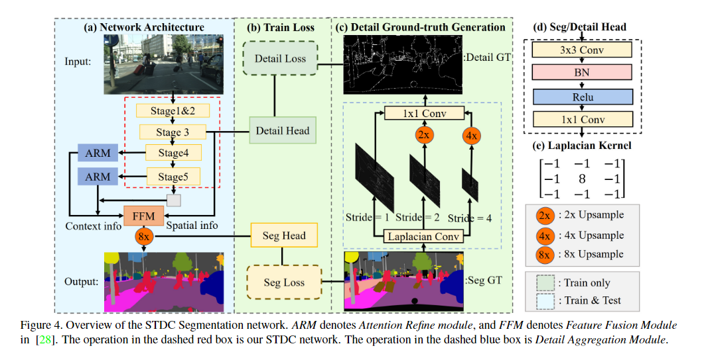

- [Real-Time Semantic Segmentation](#real-time-semantic-segmentation)
  - [1.Enet: A deep neural network architecture for real-time semantic segmentation(2016)](#1enet-a-deep-neural-network-architecture-for-real-time-semantic-segmentation2016)
  - [2.Erfnet: Efficient residual factorized convnet for real-time semantic segmentation(2017)](#2erfnet-efficient-residual-factorized-convnet-for-real-time-semantic-segmentation2017)
  - [3.ShelfNet for Fast Semantic Segmentation(2018)](#3shelfnet-for-fast-semantic-segmentation2018)
  - [4.Contextnet: Exploring context and detail for semantic segmentation in real-time(2018)](#4contextnet-exploring-context-and-detail-for-semantic-segmentation-in-real-time2018)
  - [5.Espnet: Efficient spatial pyramid of dilated convolutions for semantic segmentation(2018)](#5espnet-efficient-spatial-pyramid-of-dilated-convolutions-for-semantic-segmentation2018)
  - [6.Espnetv2: A light-weight, power efficient, and general purpose convolutional neural network(2019)](#6espnetv2-a-light-weight-power-efficient-and-general-purpose-convolutional-neural-network2019)
  - [7.Fast-scnn: Fast semantic segmentation network(2019)](#7fast-scnn-fast-semantic-segmentation-network2019)
  - [8.swiftnetRN:In defense of pre-trained imagenet architectures for real-time semantic segmentation of road-driving images(2019)](#8swiftnetrnin-defense-of-pre-trained-imagenet-architectures-for-real-time-semantic-segmentation-of-road-driving-images2019)
  - [9.Dfanet: Deep feature aggregation for real-time semantic segmentation(2019)](#9dfanet-deep-feature-aggregation-for-real-time-semantic-segmentation2019)
  - [10.MSFNet:Real-time semantic segmentation via multiply spatial fusion network(2019)](#10msfnetreal-time-semantic-segmentation-via-multiply-spatial-fusion-network2019)
  - [11.Lednet: A lightweight encoder-decoder network for real-time semantic segmentation(2019)](#11lednet-a-lightweight-encoder-decoder-network-for-real-time-semantic-segmentation2019)
  - [12.CGNet: A Light-weight Context Guided Network for Semantic Segmentation(2020)](#12cgnet-a-light-weight-context-guided-network-for-semantic-segmentation2020)
  - [13.SFNet:Semantic flow for fast and accurate scene parsing(2020)](#13sfnetsemantic-flow-for-fast-and-accurate-scene-parsing2020)
  - [14.FANet:Real-time semantic segmentation with fast attention(2020)](#14fanetreal-time-semantic-segmentation-with-fast-attention2020)
  - [15.RegSeg:Rethink dilated convolution for real-time semantic segmentation(2021)](#15regsegrethink-dilated-convolution-for-real-time-semantic-segmentation2021)
  - [16.STDC:Rethinking BiSeNet For Real-time Semantic Segmentation(2021)](#16stdcrethinking-bisenet-for-real-time-semantic-segmentation2021)
  - [17.DDRNet:Deep dual-resolution networks for real-time and accurate semantic segmentation of road scenes(2021)](#17ddrnetdeep-dual-resolution-networks-for-real-time-and-accurate-semantic-segmentation-of-road-scenes2021)
  - [18.Pp-liteseg: A superior real-time semantic segmentation model(2022)](#18pp-liteseg-a-superior-real-time-semantic-segmentation-model2022)
  - [19.PIDNet: A Real-time Semantic Segmentation Network Inspired from PID Controller(2022)](#19pidnet-a-real-time-semantic-segmentation-network-inspired-from-pid-controller2022)
  - [20.SFNet-Lite: Faster, Accurate, and Domain Agnostic Semantic Segmentation via Semantic Flow(2022)](#20sfnet-lite-faster-accurate-and-domain-agnostic-semantic-segmentation-via-semantic-flow2022)
  - [21.TopFormer: Token pyramid transformer for mobile semantic segmentation(2022)](#21topformer-token-pyramid-transformer-for-mobile-semantic-segmentation2022)
  - [22.RTFormer: Efficient Design for Real-Time Semantic Segmentation with Transformer(2022)](#22rtformer-efficient-design-for-real-time-semantic-segmentation-with-transformer2022)
  - [23.FFNet:Simple and Efficient Architectures for Semantic Segmentation(2022)](#23ffnetsimple-and-efficient-architectures-for-semantic-segmentation2022)
  - [24.DWRSeg: Dilation-wise Residual Network for Real-time Semantic Segmentation(2022)](#24dwrseg-dilation-wise-residual-network-for-real-time-semantic-segmentation2022)
  - [25.SeaFormer: Squeeze-enhanced Axial Transformer for Mobile Semantic Segmentation(2023)](#25seaformer-squeeze-enhanced-axial-transformer-for-mobile-semantic-segmentation2023)
  - [26.AFFormer:Head-Free Lightweight Semantic Segmentation with Linear Transformer(2023)](#26afformerhead-free-lightweight-semantic-segmentation-with-linear-transformer2023)
  - [27.LETNet:Lightweight Real-time Semantic Segmentation Network with Efficient Transformer and CNN(2023)](#27letnetlightweight-real-time-semantic-segmentation-network-with-efficient-transformer-and-cnn2023)
  - [28.ISANet:Interlaced Sparse Self-Attention for Semantic Segmentation(2019)](#28isanetinterlaced-sparse-self-attention-for-semantic-segmentation2019)
  - [29.Denseaspp for semantic segmentation in street scenes(2018)](#29denseaspp-for-semantic-segmentation-in-street-scenes2018)

# Real-Time Semantic Segmentation
## 1.Enet: A deep neural network architecture for real-time semantic segmentation(2016)
[论文链接](https://arxiv.org/pdf/1606.02147.pdf)
设计了一个实时分割网络，使用了很多trick

- 减少下采样和上采样过程的分割精度丢失，用segnet的方法上采样
- 非对称的Encoder-Decoder结构，降低参数量
- 激活函数使用PReLU，而非ReLU
- 将标准卷积分解成两个带状卷积，残差链接的另一边不是恒等连接而是max pool
- 使用空洞卷积，正则化
- 改进了bottleneck的1\*1步长为2的卷积，换为了2\*2的；并在池化降低尺寸后，使用卷积提高维度
## 2.Erfnet: Efficient residual factorized convnet for real-time semantic segmentation(2017)
[论文链接](http://www.robesafe.com/personal/roberto.arroyo/docs/Romera17tits.pdf)

Enet虽然参数小，但精度太差。本文改进残差快，提出erfnet

- 原resnet提出两种残差块，而这参数和精度类似。bottleneck类型(b)因随深度增加，计算成本更小而广被使用；而一些论文中提到，随深度增加，(a)类准确性更高。
- Enet改进了(b)类，本文改进(a)类来提高精度。它提出了factorized residual layers分解卷积，是标准卷积的“低秩近似”

## 3.ShelfNet for Fast Semantic Segmentation(2018)
[论文链接](https://arxiv.org/pdf/1811.11254v6.pdf)
shelfnet中有多个encoder-decoder对，提高了精度，并通过降低通道数来减小计算负担

- 2，4相当于decoder，0、3相当于encoder。1的1\*1卷积将CNN提取的特征图降维4倍
- 为什么效果好？作者认为，shelfnet相当于多个FCN的集成，特征图尺寸有4种的segnet相当于4个FCN，而Shelfnet相当于29个（应该是组合数学的知识）；并且，shelfnet相当于deep和shallow路径的集成
- S-Block中的两个3\*3卷积共享权重，作者说借鉴了RNN，并且BN层是不同的，在不降低精度的同时大大减少参数
## 4.Contextnet: Exploring context and detail for semantic segmentation in real-time(2018)
[论文链接](https://arxiv.org/pdf/1805.04554)

双分支路径，分别输入分辨率不同的图片，应用了深度可分离卷积。

## 5.Espnet: Efficient spatial pyramid of dilated convolutions for semantic segmentation(2018)
[论文链接](http://openaccess.thecvf.com/content_ECCV_2018/papers/Sachin_Mehta_ESPNet_Efficient_Spatial_ECCV_2018_paper.pdf)

将标准卷积分解为1\*1（降维）和空间空洞卷积金字塔（捕捉多感受野特征），因为降维所以即使金字塔参数也不多。

Esp模块先降维到N/K，再并行使用K个不同扩张率的空洞卷积，得到K个N/K维的输出，如果直接连接起来会有伪影（？，感觉是grid problem），所以使用HFF(Hierarchical feature fusion)先两两融合。

## 6.Espnetv2: A light-weight, power efficient, and general purpose convolutional neural network(2019)
[论文链接](http://openaccess.thecvf.com/content_CVPR_2019/papers/Mehta_ESPNetv2_A_Light-Weight_Power_Efficient_and_General_Purpose_Convolutional_Neural_CVPR_2019_paper.pdf)

在Esp块的基础上，将空洞卷积改为深度可分离的，将组卷积引入1\*1，从而提出EESP块，并以此为主要组成部分提出一个通用主干网络Espnet v2

## 7.Fast-scnn: Fast semantic segmentation network(2019)
[论文链接](https://arxiv.org/pdf/1902.04502)

本文提出的Fast-SCNN借鉴了encoder-decoder和双分支结构

- 先用几层卷积来下采样(learning to downsample)，比较浅，相当于双分支结构里的空间分支
- globla feature extractor利用级联的inverted bottleneck和PPM，提取全局特征，相当于上下文分支
- FFM将两个分支的特征融合起来，整个过程相当于两个分支共享前几层的计算.FFM相当于一个skip连接，encoder-decoder结构。

## 8.swiftnetRN:In defense of pre-trained imagenet architectures for real-time semantic segmentation of road-driving images(2019)
[论文链接](http://openaccess.thecvf.com/content_CVPR_2019/papers/Orsic_In_Defense_of_Pre-Trained_ImageNet_Architectures_for_Real-Time_Semantic_Segmentation_CVPR_2019_paper.pdf)

本文认为，利用轻量级的通用语义分割模型+横向连接+简单的解码器可以实现效果和效率的均衡。之前的许多实时分割模型认为预训练没用，本文证明了其作用

训练时使用image金字塔，encoder共享权重，通过金字塔融合和SPP实现扩大感受野
## 9.Dfanet: Deep feature aggregation for real-time semantic segmentation(2019)
[论文链接](http://openaccess.thecvf.com/content_CVPR_2019/papers/Li_DFANet_Deep_Feature_Aggregation_for_Real-Time_Semantic_Segmentation_CVPR_2019_paper.pdf)

在大大加速和减少参数量的同时，保持精度基本不变。

主干网络Xception引入非线性层注意力（SE），多个backbone来编码，为了让高语义特征在多个backbone中细化，并收集丰富的多感受野信息

## 10.MSFNet:Real-time semantic segmentation via multiply spatial fusion network(2019)
[论文链接](https://arxiv.org/pdf/1911.07217)
降低网络深度会降低感受野，降低通道数会限制特征表示空间，因此希望可以扩大感受野，而且可以恢复空间损失

- Multi-features Fusion Module：一个轻量高效的网络，通过SAP(Spatial Aware Pooling),在每个感受野级别都有很好的空间信息恢复，并且将不同感受野层次（不同残差块）相同分辨率的特征融合起来，并且在不增加计算成本的情况下大大提高了性能
- 提出了新的Class Boundary Supervision任务，对MFM收集到的特征进行两个并行独立的快速上采样，其中一个用来有监督的做边界预测，最终loss是加权和

## 11.Lednet: A lightweight encoder-decoder network for real-time semantic segmentation(2019)
[论文链接](https://arxiv.org/pdf/1905.02423)

使用了非对称的encoder-decoder，减少了参数，提出 split-shuffle-non-bottleneck(SS-nbt)

- SS-nbt:改进了残差块（无1\*1的那个），感觉融合了crfnet,shufflenet，并且对通道进行划分以减小计算量（之后的RegSeg应该借鉴了这个）。卷积分解，扩张卷积，并在最后进行通道混合
  
- 解码器使用了attention pyramid network (APN)，但其实不是标准的注意力。decoder利用了一个特征金字塔，不断细化encoder的输出的语义特征，最终得到一个注意力（或者说权重吧），加权到encoder的原始输出，并搞了个全局池化，加到APN的输出上
## 12.CGNet: A Light-weight Context Guided Network for Semantic Segmentation(2020)
[论文链接](https://arxiv.org/pdf/1811.08201)

本文旨在捕获所有阶段的上下文特征，专为分割设计的网络，提出GC block，进而以其为主干提出GCNet

- CG block中，loc提取局部特征，sur提取上下文特征，joi将两部分特征拼起来，glo借鉴se融合全局特征，从而实现在每个阶段都捕获上下文特征,扩展了non-local的概念。（其他模型往往在编码阶段过后才有上下文模块，如ASPP,SPP）
- CG block中只进行逐通道卷积(depth-wise)，实验表明如果加个1\*1，效果降低很多，给出的可能的解释为"the local
feature and the surrounding context feature need to maintain channel independence"

## 13.SFNet:Semantic flow for fast and accurate scene parsing(2020)
[论文链接](https://arxiv.org/pdf/2002.10120)
文中认为不同层的语义之间存在gap，借鉴光流（两帧之间的动作差异？），认为不同分辨率的特征图可看作语义流，我们通过学习流场，可以统一语义信息的level，减小在融合不同分辨率的特征图时减小信息损失，提出了 Flow Alignment Module，并将其应用到FPN结构中，得到SFNet

- 融合两个分辨率的特征图h(高分辨率),l时，先将l双线性采样（按照h分辨率的标准网格采样）到高分辨率，再conca作为输入，得到流场（预测的是每个像素点的偏移）。使用流场修正h分辨率的标准网格（采样点的位置变了），再次采样l得到h分辨率的特征图，和原h相加得到输出（这类似于一个残差）
- FAM模块可以广泛应用到融合不同分辨率特征的模块中
- 在主干的FPN网络中，他还将top-down路径中的各特征图统一到最终的特征图中，一起进行预测
- 整个FAM只用到几个1\*1和3\*3，其他都是无需学习的变换，参数量很小

## 14.FANet:Real-time semantic segmentation with fast attention(2020)
[论文链接](https://ieeexplore.ieee.org/ielaam/7083369/9223766/9265219-aam.pdf)

自注意力广泛应用，但时间消耗太大，本文提出了fast attention，用来捕获非局部的上下文信息。为了适应高分辨率输入，主干网络中加入了额外的下采样，因fast attention的全局信息而精度下降很少。

将注意力计算中的softmax换为L2正则化，在减少计算量的同时也提高了效果，从而只需要矩阵乘法即可计算注意力，进而交换计算顺序，先算K和V，将复杂度由n\*n\*c降低到n\*c\*c。

## 15.RegSeg:Rethink dilated convolution for real-time semantic segmentation(2021)
[论文链接](https://arxiv.org/pdf/2111.09957)

主干网络没有视野，提取特征不好，本文提出一种dilate block(D block)，并通过级联D block得到RegSeg.

 - D block利用了分组卷积来加速，借鉴了SE模块，使用了不同膨胀率的空洞卷积，其中往往将一个group的扩张率设为1，从而在扩大感受野的同时保留局部信息
 - 主干编码器就是D block的堆叠，步长为2的D block有一点差别
## 16.STDC:Rethinking BiSeNet For Real-time Semantic Segmentation(2021)
[论文链接](http://openaccess.thecvf.com/content/CVPR2021/papers/Fan_Rethinking_BiSeNet_for_Real-Time_Semantic_Segmentation_CVPR_2021_paper.pdf)

优化Bisenet的双路径注意力的冗余，并提出了细节分支（可以应用到所有框架中，只在训练使用，算个辅助任务），STDC是后来常被用的轻量级主干
- 首先是STDC(Short-Term Dense Concatenate Module)块
  
上图为步长为1的STDC块，将输入输入级联的block，在这个过程中获得不同尺度的感受野，并且维度不断降低（因为语义信息更集中），并且可证明（文中有）block的数量对参数的影响很小（本质大概是因为通道数是指数级递减的，block多了之后的参数很少），最终将不同block的特征图连接起来。通过STDC块，我们得到多尺度的特征，并可以通过改变block数量获得可扩展的感受野
- 通过级联STDC块作为网络主干，提出STDC网络
	  
  每个stage下采样两倍，stage 1&2由一个卷积块组成，后面都由1个步长为2的STDC块和N个步长为1的组成。将stage3的输出作为空间分支，将stage4&5的输出和最后的全局池化结果作为上下文分支，接入ARM(和SE相似)，最终将两条路径的特征接入FFM(也和SE相似)
- 在训练时引入辅助任务，在测试时不用，因此在实时分割中可泛化。将空间分支的结果接入detail head，将输出与细节GT做二元交叉熵，细节GT由步长不同的拉普拉斯卷积核+可学习的1\*1卷积，并取阈值得到GT细节图，GT细节图和预测使用了二元交叉熵和Dice的联合损失（细节所占的比例较细小）。原理我认为是，拉普拉斯卷积核是一种可以提取边缘信息的卷积核，可以找到突变，从图形化角度。
## 17.DDRNet:Deep dual-resolution networks for real-time and accurate semantic segmentation of road scenes(2021)
[论文链接](https://arxiv.org/pdf/2101.06085)

本文优化了双边结构，提出一个新的主干网络DDRNet，除了共享前几层下采样，还进行了多次双边信息融合，并且提出了一个新的上下文模块DASPP，捕捉多尺度且扩大有效感受野。
- DASPP:使用大内核和大步长的池化，在低分辨率的特征图上及进行多尺度的池化，并且将不同尺度的特征融合，获得比过去SPP模块更强的特征表征。因为DASPP作用于最低分辨率的特征图，所以增加的卷积层不太影响推理速度。

- DDRNet:精心设计了双边信息融合模块，在上下文分支最后使用了DASPP，再上采样融合进行预测。训练时引入辅助loss。最终效果很好。

## 18.Pp-liteseg: A superior real-time semantic segmentation model(2022)
[论文链接](https://arxiv.org/pdf/2204.02681)
提出了几个新的模块，一个特征融合模块Unified Attention Fusion Module，一个聚合全局上下文信息的Simple Pyramid Pooling Module（简化了SPP），得到一个新网络Pp-liteseg

- UAFM：利用空间注意力（沿通道做均值和max，对4\*H\*W做变换得到H\*W的分数$\alpha$）和通道注意力（对特征图做最大池化和平均池化，做变换得到C维分数$\alpha$）增强特征表示，用$\alpha$加权得到$out=\alpha up+(1-\alpha)high$，和一般意义的注意力不一样

- SPPM:简化了SPP，减小过程中和输出的通道数，减少分支数，删去shortcut(残差连接)，将连接换为相加
- Flexible and Lightweight Decoder,其实就是随着解码降低维度
## 19.PIDNet: A Real-time Semantic Segmentation Network Inspired from PID Controller(2022)
[论文链接](https://arxiv.org/pdf/2206.02066.pdf?trk=public_post_comment-text)

双分支结构在实时语义分割领域应用广泛，但细节分支和空间分支特征融合时可能因level不同而有损失。本文用传统控制领域的PID来解释，空间分支相当于P，细节分支不断聚合特征相当于I，只用PI可能产生超调，因此加入D分支（P的微分，即边界分支）来抑制超调，具体说，用边界分支直到空间和上下文分支的特征融合。由此，提出了一个三分支网络PIDNet

- 引入辅助任务。在空间分支引入分割loss，在D分支，或者说Auxiliary Derivative Branch (ADB) ，引入边界二元损失(Dice以减轻类别不平衡)，并引入boundary-aware的分割损失（只统计ADB输入（概率）大于某个阈值的像素点的分割损失）。
- 改进了DDRNet的DAPPM模块，认为它太复杂而不能很好的并行，并且超过轻量级模型的表征能力了

- Pag(Pixel-attention-guided fusion module):在向P分支融入I分支特征时，计算注意力（广义的）来指导融合

- Bag(Boundary-attention-guided fusion module):用边界特征来指导细节特征和上下文特征的融合

> 有一些细节需要看代码（如果有必要），比如$\sigma$只是一个标量？答：是逐像素的（2维），也可设置为3维的。Pag中两个矩阵怎么做乘法的？先都映射到设定好的embed维度，再逐点
## 20.SFNet-Lite: Faster, Accurate, and Domain Agnostic Semantic Segmentation via Semantic Flow(2022)
[论文链接](https://arxiv.org/pdf/2207.04415)

在原SFNet的基础上进一步优化，提出了更好的融合不同尺度特征的模块GD-FAM
- 主干网络使用了最新的STDC
- 将FAM优化为GD-FAM，引入门控。计算出流场(H\*W\*4,维度翻倍)后，分别warp两边的特征图。将经1\*1卷积后的原特征图取最大池化和平均池化为特征，输出门控图（每个像素点一个[0,1]的值），来加权两个尺寸特征图的融合。

- 解码器只留了两个尺寸，减小了开销，网络最终精度和速度都很大优化

- 训练时用了OHEM，深度监督（辅助loss）等trick

## 21.TopFormer: Token pyramid transformer for mobile semantic segmentation(2022)
[论文链接](http://openaccess.thecvf.com/content/CVPR2022/papers/Zhang_TopFormer_Token_Pyramid_Transformer_for_Mobile_Semantic_Segmentation_CVPR_2022_paper.pdf)

结合CNN和transformer，提出轻量级分割架构TopFormer。

- 先使用级联的mobilenet块生成层次特征图，快速下采样和token金字塔。下采样到统一尺寸后连接作为transformer的输入，从而大大减小输入token的数量，减小了开销。
- CNN的层次结构后，将不同尺度的特征结合，经过transformer（内含残差连接），会生成scale-aware的特征。含丰富语义信息的输出按尺寸，经SIM( Semantics Injection Module)注入语义信息到相应token，最后一起用于预测

## 22.RTFormer: Efficient Design for Real-Time Semantic Segmentation with Transformer(2022)
[论文链接](https://arxiv.org/pdf/2210.07124)

本文改进了transformer中的自注意力，一方面借鉴EA(外部注意力)提出GFA(GPU友好attention)，实现线性复杂度；另一方面，仅在高分辨率特征图上做自注意力可能不能最好的提取长距关系，因为每个位置的感受也都比较小，由此提出一个跨分辨率注意力模块，实现了一个高效双分辨率网络RTFormer
- GFA:EA中用Double Normalization代替softmax实现归一化，并可以实现多头注意力；GFA使用了分组Double Normalization，在第二步归一化时分组，间接实现多头的效果。一方面，避免了多头，集成了矩阵乘法，从而对GPU友好，可以将外部参数的维度提升到M\*H，可学习的能力提升了；另一方面，分组Double Normalization保持了多头的优势

- 引入了跨分辨率注意力模块，交叉分辨率注意力通过传播从低分辨率分支中学到的高级知识来更有效地收集高分辨率分支的全局上下文信息。
- 主干网络中还利用了DDRNet中的DAPPM作为上下文模块

## 23.FFNet:Simple and Efficient Architectures for Semantic Segmentation(2022)
[论文链接](https://openaccess.thecvf.com/content/CVPR2022W/ECV/papers/Mehta_Simple_and_Efficient_Architectures_for_Semantic_Segmentation_CVPRW_2022_paper.pdf)

本文认为目前的sota模型设计太复杂了，对加速不友好，提出了一个极简的基于简单encoder-decoder和FPN的以ResNet类似为backbone的FFNet。作者认为，更简单的CNN架构在语义分割和其他任务方面有着更大的潜力

网络比较显然，stem就是FPN前的东西（比如一两个卷积层），FFNet的一大灵活性在于其通用性：FFNet架构可以自由更改网络backbone的类型、宽度和深度，特征尺寸大小，head的类型和head宽度

## 24.DWRSeg: Dilation-wise Residual Network for Real-time Semantic Segmentation(2022)
[论文链接](https://arxiv.org/pdf/2212.01173)

本文认为选择合适的感受野大小对提取特征的效率很重要，在浅层需要较小的感受野来捕捉局部特征，而高层需要更大的感受野捕捉语义特征；并且，在高层使用扩张率大的空洞卷积没有意义，因为卷积几乎不可能在很大的空间维度上建立特征之间的联系。因此，本文针对感受野设计了随网络深度变化的block，浅层用SIR（简化的反转瓶颈残差块），高层用DWR
- SIR：即将反转瓶颈块去掉一个1\*1，在低层使用SIR，使感受野缓慢变大，减少细节损失，更平滑
- DWR:多路径block，分别使用不通过的扩张率，获得不同感受野的特征。其中，最低扩张率路径的维度是两倍，因为小感受野的特征提取在每一层都很重要

- 网络结构：stem将原图下采样4倍，之后先接SIR，再接DWR，最终结合多尺度特征图进行预测

## 25.SeaFormer: Squeeze-enhanced Axial Transformer for Mobile Semantic Segmentation(2023)
[论文链接](https://arxiv.org/pdf/2301.13156)

本文也是简化transformer中的自注意力，提出一种通用注意力块Sea attention(squeeze-enhanced Axial attention)，将复杂度降到O(HW)，与特征图大小呈线性
- 应用了Sea block提出了SeaFormer。主干网络为mobile v2块，共享前几层的双分支结构，过程中上下文分支多次与空间分支融合，用语义信息加权空间分支的特征图。

- Sea block:由Sea自注意力和FFN组成

  - squeeze-enhanced Axial，顾名思义，压缩维度，计算压缩后的自注意力。将原始K(H\*W\*C)分别沿水平和垂直方向压缩为H\*C和W\*C(取平均值，文中的公式就是表达取均值的意思)，Q/V同理，再分别计算多头自注意力。文中为引入位置信息，在压缩后的kqv分别加入位置嵌入，让他知道自己沿哪个方向压缩的（？）
  - 虽然显著降低复杂度，但丢失了很多细节信息，因此增加了Detail enhancement kernel，将KQV连接起来输入一个深度可分离3\*3和1\*1
## 26.AFFormer:Head-Free Lightweight Semantic Segmentation with Linear Transformer(2023)
[论文链接](https://arxiv.org/pdf/2301.04648)

论文里给出的结果很强，提出了一种没有解码头的轻量级语义分割特定架构AFFormer，从频率的角度解释，复杂度为 O(n)

- 文中通过聚类将特征图H\*W\*C转为原型特征（3\*3局部的融合信息）的特征图h\*w\*C，对原型特征图通过PL( prototype learning)进行特征提取（基于transformer的），其中自注意力被替换成AFF，复杂度为$O(hwC^2)；再经过PD(pixel descriptor)将变换后的原型特征恢复为H\*W\*C
- AFF(Adaptive Frequency Filter):文中认为人眼对频率鲁棒性很强，而模型比较敏感，需要增强对多种频率信息的利用。AFF包括三个模块

  - FSK:将KQV分组，进行一种attention计算，目的是通过计算相关性增强对分割更有益的频率
  - DLF:低通滤波，使用的是平均池化，Bin的大小不同，最后一起上采样
  - DHF:高通滤波，使用的是卷积
- 一方面，没有decoder大大减少参数，且将attention优化为线性，且将token由HW降到hw；另一方面，提出的AFF从频率角度学习聚类原型的局部描述表示，而不是直接学习所有像素嵌入特征，使精度很有保证
> 效果太好了，说实话很多地方没太看懂，还得去看代码，真不知道为什么能这么work。代码用mmsegmentation写的，所以很方便！
## 27.LETNet:Lightweight Real-time Semantic Segmentation Network with Efficient Transformer and CNN(2023)
[论文链接](https://arxiv.org/pdf/2302.10484)

提出了一个超轻量级的网络LETNet

-  Lightweight Dilated Bottleneck:使用分解卷积和深度可分离卷积，SE注意力，最后还shuffle了一下通道
-  efficient Transformer:其实就是在算KQV前降一下维
-  提出一个特征加强模块FE：分别在通道和空间方向算SE注意力（类似的），最后加起来
-  最后加了一个ixel Attention (PA)，也是和SE差不多的

## 28.ISANet:Interlaced Sparse Self-Attention for Semantic Segmentation(2019)
[论文链接](https://arxiv.org/pdf/1907.12273.pdf(%C3%A6%C2%AD%C2%A3%C3%A5%C5%93%C2%A8%C3%A9%CB%9C%E2%80%A6%C3%A8%C2%AF%C2%BB%C3%A7%C5%A1%E2%80%9E%C3%A4%C2%B8%E2%82%AC%C3%A7%C2%AF%E2%80%A1))

简化自注意力的计算，提出了一种交错稀疏自注意力，将原稠密的亲和矩阵O($N^2$)分解为两个稀疏的亲和矩阵计算，大大减小了内存/FLOPs/耗时。

具体来说，将H\*W的输入划分成m\*n个h\*w的方格(H=mh,W=nw)，先计算“长距依赖”，将每个小方格相同位置的元素拿出来，组成新的方格（大小为m\*n），计算自注意力；再计算“短距依赖”，将第一步得到的特征图恢复原形状，在计算每个h\*w方格内部的自注意力。总的来说，每个位置的元素都可以得到其他所有位置元素传播来的信息。

论文中直接给出了一段简洁的pytorch代码，我对其实现方式迷惑，发现对pytorch中permute函数不熟悉，梳理如下：

>关于pytorch中的reshape和permute函数
- reshape/view:相当于将原张量按行拉直，再填入新的形状
- permute:对于高维张量，改变的规则是什么呢？
~~~
从三维角度直观理解，对一个长宽高固定的长方体，permute只是从不同角度去看他，导致长宽高发生了改变，其实还是同一个长方体，但是view会直接改变长方体的长宽高，相当于一个没变形，一个变形了
~~~
以下面6*8张量为例
~~~py
tensor([[0.5855, 0.9252, 0.7436, 0.0545, 0.1243, 0.2341, 0.4057, 0.8889],
        [0.1092, 0.4451, 0.2793, 0.1091, 0.5837, 0.2935, 0.5816, 0.9718],
        [0.9975, 0.9356, 0.9426, 0.4008, 0.3347, 0.1301, 0.1406, 0.5253],
        [0.0612, 0.1610, 0.5503, 0.5757, 0.5057, 0.8157, 0.1558, 0.5449],
        [0.8162, 0.8662, 0.8467, 0.5890, 0.9397, 0.1468, 0.9264, 0.9635],
        [0.7283, 0.6237, 0.3733, 0.4426, 0.3941, 0.9812, 0.6998, 0.7632]])
~~~
为了实现“取每个2\*2小方块的同一位置，组成3\*4方块计算自注意力”，先用reshape转为3*2*4*2
~~~py
tensor([[[[0.5855, 0.9252],
          [0.7436, 0.0545],
          [0.1243, 0.2341],
          [0.4057, 0.8889]],

         [[0.1092, 0.4451],
          [0.2793, 0.1091],
          [0.5837, 0.2935],
          [0.5816, 0.9718]]],

        [[[0.9975, 0.9356],
          [0.9426, 0.4008],
          [0.3347, 0.1301],
          [0.1406, 0.5253]],

         [[0.0612, 0.1610],
          [0.5503, 0.5757],
          [0.5057, 0.8157],
          [0.1558, 0.5449]]],

        [[[0.8162, 0.8662],
          [0.8467, 0.5890],
          [0.9397, 0.1468],
          [0.9264, 0.9635]],

         [[0.7283, 0.6237],
          [0.3733, 0.4426],
          [0.3941, 0.9812],
          [0.6998, 0.7632]]]])
~~~
可以看出是按行填充的。  
再进行permute(1,3,0,2)，转为2\*2\*3\*4形状，此时为
~~~py
tensor([[[[0.5855, 0.7436, 0.1243, 0.4057],
          [0.9975, 0.9426, 0.3347, 0.1406],
          [0.8162, 0.8467, 0.9397, 0.9264]],

         [[0.9252, 0.0545, 0.2341, 0.8889],
          [0.9356, 0.4008, 0.1301, 0.5253],
          [0.8662, 0.5890, 0.1468, 0.9635]]],

        [[[0.1092, 0.2793, 0.5837, 0.5816],
          [0.0612, 0.5503, 0.5057, 0.1558],
          [0.7283, 0.3733, 0.3941, 0.6998]],

         [[0.4451, 0.1091, 0.2935, 0.9718],
          [0.1610, 0.5757, 0.8157, 0.5449],
          [0.6237, 0.4426, 0.9812, 0.7632]]]])
~~~
这是有迹可循的。按最开始的空间立方体理解方法，我们按维度依次去看这个张量，
- 第一个维度是2个4\*2方块中的第一个2，我们固定它，从这个角度来看原张量为3\*4\*2的方块，例如，第一个这样的方块如下
  ~~~py
  [[[0.5855, 0.9252],
    [0.7436, 0.0545],
    [0.1243, 0.2341],
    [0.4057, 0.8889]],
    [[0.9975, 0.9356],
    [0.9426, 0.4008],
    [0.3347, 0.1301],      
    [0.1406, 0.5253]],      
    [[0.8162, 0.8662],
    [0.8467, 0.5890],
    [0.9397, 0.1468],
    [0.9264, 0.9635]]]
   ~~~

- 第二个维度为原4\*2方块中的2，我们固定它，看到的为3\*4方块，第一个这样的方块如下
  ~~~py
  [[0.5855, 0.7436, 0.1243, 0.4057],
    [0.9975, 0.9426, 0.3347, 0.1406],
    [0.8162, 0.8467, 0.9397, 0.9264]]
  ~~~
- 第三个和第四个维度就显然了

OK，这样分析完，实现“取每个2\*2小方块的同一位置，组成3\*4方块计算自注意力”的思路就显现出来了。

先将6\*8张量按2\*2方块划分，变为3\*2\*4\*2，这个过程没有改变数据的位置；先将3\*2中的2提到最前，相当于按行每隔2抽取一行，变为3\*4\*2；再将4\*2中的2提到最前，相当于按列每隔2列抽一列，变为3\*4。总的来说，实现了每隔两行两列取一个元素。

-----
最后一个问题，怎么将打乱的方块换回原位（即3\*2\*4\*2）？首先将3提到最前，此时剩下的第一个2\*2\*4为打乱顺序的原前两行；再将第一个2提到最前，此时的第一个2\*4为打乱顺序的原第一行，即2\*2方格中的11和12位置；再将4提到最前，相当于转置，原属于同一个方格的两个元素到了一起，得到4\*2。

因此，只需permute(2,0,3,1)即可。

## 29.Denseaspp for semantic segmentation in street scenes(2018)
[论文链接](http://openaccess.thecvf.com/content_cvpr_2018/papers/Yang_DenseASPP_for_Semantic_CVPR_2018_paper.pdf)
没啥新东西，相当于Densenet里的那些密集链接，换成不同膨胀率的空洞卷积。意义在于：得到更大感受野范围的同时，覆盖更密集的尺度范围。

