- [Semantic Segmentation](#semantic-segmentation)
  - [1.FCN:Fully Convolutional Networks for Semantic Segmentation(2015)](#1fcnfully-convolutional-networks-for-semantic-segmentation2015)
  - [2.U-Net: Convolutional Networks for Biomedical Image Segmentation(2015)](#2u-net-convolutional-networks-for-biomedical-image-segmentation2015)
  - [3.Segnet: A deep convolutional encoder-decoder architecture for image segmentation(2016)](#3segnet-a-deep-convolutional-encoder-decoder-architecture-for-image-segmentation2016)
  - [4.PSPNet:Pyramid scene parsing network(2017)](#4pspnetpyramid-scene-parsing-network2017)
  - [5.Deeplab: Semantic image segmentation with deep convolutional nets, atrous convolution, and fully connected crfs(2017)](#5deeplab-semantic-image-segmentation-with-deep-convolutional-nets-atrous-convolution-and-fully-connected-crfs2017)
  - [6.RefineNet: Multi-Path Refinement Networks for High-Resolution Semantic Segmentation(2017)](#6refinenet-multi-path-refinement-networks-for-high-resolution-semantic-segmentation2017)
  - [7.SERT:Rethinking Semantic Segmentation from a Sequence-to-Sequence Perspective with Transformers(2021)](#7sertrethinking-semantic-segmentation-from-a-sequence-to-sequence-perspective-with-transformers2021)
  - [8.Deeplab v3:Rethinking atrous convolution for semantic image segmentation(2017)](#8deeplab-v3rethinking-atrous-convolution-for-semantic-image-segmentation2017)
  - [9.Bisenet: Bilateral segmentation network for real-time semantic segmentation(2018)](#9bisenet-bilateral-segmentation-network-for-real-time-semantic-segmentation2018)
  - [10.Psanet: Point-wise spatial attention network for scene parsing(2018)](#10psanet-point-wise-spatial-attention-network-for-scene-parsing2018)
  - [11.Deeplab v3+:Encoder-decoder with atrous separable convolution for semantic image segmentation(2018)](#11deeplab-v3encoder-decoder-with-atrous-separable-convolution-for-semantic-image-segmentation2018)
  - [12.Icnet:Icnet for real-time semantic segmentation on high-resolution images(2018)](#12icneticnet-for-real-time-semantic-segmentation-on-high-resolution-images2018)
  - [13.Non-local neural networks(2018)](#13non-local-neural-networks2018)
  - [14.EncNet:Context encoding for semantic segmentation(2018)](#14encnetcontext-encoding-for-semantic-segmentation2018)
  - [15.DANet:Dual attention network for scene segmentation(2019)](#15danetdual-attention-network-for-scene-segmentation2019)
  - [16.CCNet: Criss-Cross Attention for Semantic Segmentation(2019)](#16ccnet-criss-cross-attention-for-semantic-segmentation2019)
  - [17.ANN:Asymmetric non-local neural networks for semantic segmentation(2019)](#17annasymmetric-non-local-neural-networks-for-semantic-segmentation2019)
  - [18.Gcnet: Non-local networks meet squeeze-excitation networks and beyond(2019)](#18gcnet-non-local-networks-meet-squeeze-excitation-networks-and-beyond2019)
  - [19.OCRNet:Object-contextual representations for semantic segmentation(2020)](#19ocrnetobject-contextual-representations-for-semantic-segmentation2020)
  - [20.Pointrend: Image segmentation as rendering(2020)](#20pointrend-image-segmentation-as-rendering2020)
  - [21.Bisenet v2: Bilateral network with guided aggregation for real-time semantic segmentation(2021)](#21bisenet-v2-bilateral-network-with-guided-aggregation-for-real-time-semantic-segmentation2021)
  - [22.DPT:Vision Transformer for Dense Prediction(2021)](#22dptvision-transformer-for-dense-prediction2021)
  - [23.Segmenter: Transformer for semantic segmentation(2021)](#23segmenter-transformer-for-semantic-segmentation2021)
  - [24.SegFormer: Simple and Efficient Design for Semantic Segmentation with Transformers(2021)](#24segformer-simple-and-efficient-design-for-semantic-segmentation-with-transformers2021)

# Semantic Segmentation
## 1.FCN:Fully Convolutional Networks for Semantic Segmentation(2015)
[论文链接](https://openaccess.thecvf.com/content_cvpr_2015/papers/Long_Fully_Convolutional_Networks_2015_CVPR_paper.pdf)

本文使用全卷积网络实现了pixel-pixel,端到端的语义分割模型，还提出了一种利用多尺度特征的方法
- 背景：分类网络CNN取得了很好的效果，想迁移到语义分割任务――去掉分类层、将FC换为conv、加入上采样实现dense predict。非线性层使CNN只能接受固定尺寸的输入，而每个FC可以等效为一个卷积层，因此使用FCN可以接受任意尺寸的输入。
- 分类任务中，卷积网络在提取特征的过程中会不断地下采样，使特征图尺寸不断下降，这使top层的特征分辨率较低不适应于pixel-wise的语义分割任务，需要让分类网络适应dense predict。本文检验了overFeat中提出的shift-and-stitch方法（没使用），最终使用了上采样方法――反卷积/双线性插值（最后一次上采样将反卷积初始化为双线性插值，再学习），和pixel loss实现了dense predict
- 结合高分辨率浅层和低分辨率高层的语义特征，FPN应该是对此有所借鉴。在对top层（第五层）上采样32倍时，FCN-8s将第五层先2倍上采样再与经过1\*卷积的第四层相连接，将结果2倍上采样，再与经过1\*1卷积的第三层相加，将结果8倍上采样得到与原图尺寸一致的输出，从而结合了多个尺度的特征图。（如果融合更low的层收益递减）
- top特征图的通道数为C（类别数），因此相当于特征图的每个点为C维张量（每个类的得分），信息太少了！不利于后面大尺度的上采样，这在U-net中进行了改进，在上采样部分仍保留了丰富的特征通道

## 2.U-Net: Convolutional Networks for Biomedical Image Segmentation(2015)
[论文链接](https://arxiv.org/pdf/1505.04597.pdf%EF%BC%89)

这是一篇用于医学图像的语义分割论文，但提出的U-net是一个广泛取得优秀结果的模型
- U-net也采用了全卷积网络，与FCN相似。先前向传递一个CNN获得下采样的一系列特征图，将top层特征图经过两个3\*3卷积层后，进行一系列上采样(\*2)，每次上采样后，将结果与**下采样过程中对应的特征图**裁剪后拼在一起(concatenation)，经过两个3\*3卷积层后进行下一次上采样，最后一次上采样后使用1\*1卷积层后的每个像素的分类。上采样和下采样过程比较对称，形成一个U型结构（论文中的图片很清晰）
- 一个比较重要的点。U-net中绝大部分使用的是3\*3卷积层，没有pad！所以每经过一次卷积层，特征图尺寸都会-2，因为这个原因上采样和下采样对应的特征图尺寸有所区别，需要将下采样的特征图裁剪后concatenation。文中认为在边缘pad会使边缘像素的特征随深度增加而越来越模糊，特征图尺寸下降也与下述overlap-tile策略有关
- 也许是医学图像的问题（分辨率太大），也可能是当时的设备限制（内存小），也可能是因为数据量小（切片增加数据量），U-net使用了overlap-tile策略，将图片切片成m\*m的patch，并对patch进行padding（即取patch周围的上下文像素），使padding后的patch经过U-net后（尺寸会降低）尺寸恰为m\*m。对于图片边缘的patch，可能有些方向没有上下文来padding，这时使用镜像padding，用patch作镜面对称。通过这种方式，可以实现对任意大图像进行无缝切割后进行预测，每个patch也获得了上下文信息。
- 与FCN在上采样有一个不同，FCN上采样时直接对分类分数上采样，显然很不准；U-net在上采样时保留丰富的特征，在最后才用1\*1卷积层分类
> FCN在结合下采样特征图时将其1\*1卷积后直接相加，U-net先concatenation再经过3\*3卷积融合，FPN将其经过1\*1卷积后相加再经过3\*3卷积融合
- 为了提高对“接触的目标”的区分，本文使用了加权交叉熵损失，使用了一个公式（见论文），在训练前对每个GT图计算权重图，这种方法会使目标间的小背景具有较高的权重
- 医学图像分割任务的一个挑战为有标注数据很少，本文使用了数据增强，其中随即弹性形变的效果最好

## 3.Segnet: A deep convolutional encoder-decoder architecture for image segmentation(2016)
[论文链接](https://ieeexplore.ieee.org/iel7/34/4359286/07803544.pdf)

网络结构与U-net类似，先下采样再上采样最后分类，提出了一种新的上采样方法，减小内存。虽然文章很长，但创新点有限
- Segnet的动机是实现高效的场景理解结构，更注重于优化时间和内存消耗，同时在各项指标上具有竞争力。
- SegNet应用了encoder-decoder结构（下采样和上采样阶段），encoder为FCN，卷积+BN+ReLU+最大池化得到该尺寸的特征图，decoder先上采样再接卷积层再BN再ReLU，最终实现像素级分类
- 关键点：在encoder中，只记录特征图max pooling时最大值的索引，从而使需要记录的特征信息大大降维。上采样时用了max pooling indices，根据encoder中对应特征图池化时的最大索引，实现上采样（对应索引取值，其余置零）。上采样后的特征图是稀疏的，后接三个（卷积层再BN再ReLU）得到稠密的特征图用于下一阶段的上采样。上采样不需要学习也提高了效率。
- 实验表明，使用全部encoder时的特征图可以得到最好的效果，但在内存受限时SegNet可以提高表现

## 4.PSPNet:Pyramid scene parsing network(2017)
[论文链接](https://openaccess.thecvf.com/content_cvpr_2017/papers/Zhao_Pyramid_Scene_Parsing_CVPR_2017_paper.pdf)

本文提出了应用了Pyramid pooling module的PSPNet，可以聚合不同区域的上下文特征，并加入了一个辅助loss来训练深度ResNet
- 背景：全局信息和上下文关系对场景分析（语义分割）是重要的，简单的使用全局池化会损失空间关系而导致歧义，因此提供了一种金字塔池化，从而建立全局场景的先验。
- 将图片输入主干网络得到top特征图，将其按照不同尺寸池化，池化后有N\*N个bin(N=1,2,3,6)，N=1时便为最一般的全局池化，这样可以得到不同尺度子区域的representation，不同水平的上下文信息。对每个池化后的context representation，用一个1\*1卷积层将N\*N尺寸的维度降为1\N，从而保持个水平全局特征之间的权重。之后分别进行上采样（双线性插值），使尺寸恢复为原特征图大小，再将这四个与原特征图concatenation，进行卷积以得到最后预测
- 对于主干网络，使用了ResNet和扩张卷积，在训练时，除了对最后一层的特征图进行预测，还加入了一个辅助损失，在res4b22残差块进行预测，共同反向传播更新网络，帮助优化学习过程。（前者的权重更大）
> 感觉PSP和目标检测中的SPP思想基本一样

## 5.Deeplab: Semantic image segmentation with deep convolutional nets, atrous convolution, and fully connected crfs(2017)
[论文链接](https://arxiv.org/pdf/1606.00915)

本文提出了Deeplab v2，在v1的基础上改进，因为v1的论文没看，所以读的有些粗糙，一些细节没弄清楚，之后若用到再细研究
- Deeplab的主要特点为：应用了空洞卷积(atrous concolution)；使用ASPP模块(atrous spatial pyramid pooling)；使用了CRF(Conditional Random Field)，这个方法在后续版本被抛弃
- 背景：应用于分类任务的CNN建构对空间变换具有一定的鲁棒性，这对分割问题不利――降低了分辨率、处理不同尺度物体、定位精度下降，第一条的三个特点分别解决这三个挑战
- 空洞卷积：空洞卷积可以在保持特征图视野大小的同时矿大感受野。为了扩大感受野，过去会增加步长或池化，会降低特征图视野大小，本Deeplab应用了空洞卷积，将Resnet第五个池化层及之后的池化换为步长为2的空洞卷积，从而由原来的下采样32倍变为下采样8倍。之后再用双线性插值上采样8倍，恢复原图像尺寸进行预测
> 空洞卷积可能导致grid problem，即感受野扩大，但某些最邻近的像素被忽略，可以通过连续使用不同尺寸的空洞卷积来时感受野铺满
- ASPP：在预测时，为了获得多尺度特征，对特征图进行了4个尺度下的空洞卷积，后分别又接了卷积层，将得到的4个输出和一个全局池化值（先全局池化再插值，细节不清楚）五部分concatenation起来，进行最后的预测
> 因为没时间读v1的论文了（大概也不太重要吧，而且现在是transformer时代了），可能一些细节没搞懂，以后再说

## 6.RefineNet: Multi-Path Refinement Networks for High-Resolution Semantic Segmentation(2017)
[论文链接](http://openaccess.thecvf.com/content_cvpr_2017/papers/Lin_RefineNet_Multi-Path_Refinement_CVPR_2017_paper.pdf)

本文也是为了解决下采样过程中导致的分辨率下降问题，提出RefineNet利用下采样过程中的所有信息来细化富含语义信息的top层特征图，且帮助其上采样，还提出一种链式残差池化
- 背景：分辨率下降是语义分割任务常见的挑战，一种方法为下采样后通过反卷积等方式上采样，但其实没有利用细粒度特征；另一种方法为Deeplab提出的空洞卷积，在保持视野大小的同时扩大感受野，但一方面会增加许多高维卷积占用很大内存，另一方面空洞卷积也是一种下采样，潜在的丢失一些信息。本文提出了RefineNet，使用下采样过程中的多尺度的、高分辨率特征图，细化帮助上采样时语义信息丰富、分辨率低的特征图，思想和FPN比较类似
- RefineNet下采样时使用的ResNet主体结构，利用了第二个池化层开始的特征图(1/4--1/32)。将1/32的特征图输入RefineNet4(这是一个block)，输出1/32的新特征图，再和1/16特征图一起输入RefineNet3，输出1/16的新特征图，依次下去，直到得到融合了细粒度特征的1/4特征图，做softmax再双线性插值
- RefineNet块里做了什么：先将1/2个特征图（对应Resnet块的特征图和上一个RefineNet块的输出）分别输入两个级联的RCU(残差卷积单元),每个RCU包括两个3\*3卷积和ReLU和残差链接，其中除了RefineNet4的输出维度为512其余为256（RCU的目的是将预训练的适用于分类的特征图适应于分割任务，一种解释罢了）；将输出进行multi-resolution fusion，分别输入3\*3卷积（将维度统一为最低的）和上采样（将尺寸统一为最大的），再相加；将输出进行Chained Residual Pooling，将输入进行级联的带残差链接的池化+卷积块，也就是每进行一次池化+卷积，都与这次的输入相加再输入到下一个池化+卷积（这样可以得到丰富的不同尺度的池化特征，并通过卷积权重加起来，认为这样可以有效捕捉背景上下文特征）；将输出通过一个RCU得到最终输出。
- 在整个网络中，应用了丰富的残差思想，既有短程（块内）的残差连接，又在上采样时与下采样时的特征图连接，是梯度更容易的传到靠前的参数中，有利于端对端训练

## 7.SERT:Rethinking Semantic Segmentation from a Sequence-to-Sequence Perspective with Transformers(2021)
[论文链接](https://arxiv.org/pdf/2012.15840.pdf)

将纯transformer结构应用到语义分割任务，使用encoder-decoder架构，提出SETR，创新点不大
- 预处理：和ViT一样，先分成patch，再映射到patch embedding，加上position embedding作为输入
- encoder:24个tranformer encoder块，相应的有24张特征图
- decoder:语义分割的难点在于，将特征图的尺寸恢复到原图分辨率，本文提出了三种decoder方式
  - Naive:将encoder最后一层特征图reshape成3D后，先用卷积层将维度转为类别数，在双线性插值到原尺寸
  - PUP:将encoder最后一层特征图reshape成3D后，交替上采样\*2和卷积层
  - MLA(multi-Level feature Aggregation):和FPN类似，取M个encoder的特征图，先reshape成3D，再分别经过卷积层和4倍上采样，再加入一个横向连接，分别经过卷积层，再按维度concatenation,最后经过卷积层和4倍上采样得到原尺寸

## 8.Deeplab v3:Rethinking atrous convolution for semantic image segmentation(2017)
[论文链接](https://arxiv.org/pdf/1706.05587.pdf%EF%BC%8C%E6%8E%A8%E8%8D%90%E5%9C%A8%E7%9C%8B%E5%AE%8C%E6%9C%AC%E6%96%87%E4%B9%8B%E5%90%8E%E4%BB%94%E7%BB%86%E9%98%85%E8%AF%BB%E8%AE%BA%E6%96%87%E4%BB%A5%E5%8F%8A%E4%BB%A3%E7%A0%81%EF%BC%8C%E5%8F%AF%E4%BB%A5%E6%9B%B4%E5%A5%BD%E7%90%86%E8%A7%A3%E3%80%82)

在deeplab v2的基础上进行了改进，提出了级联的或并联的应用了空洞卷积的模块，均优于v2，还将空洞卷积融入backbone，可得到分辨率更大的特征图(1/8)
- 级联：将Resnet的后几个block改成空洞卷积，输入与输出分辨率不变，每个block之间、和内部的卷积层之间空洞卷积的膨胀系数均有区别，一方面防止grid problem，另一方面扩大感受野
- 并联（ASPP）：改进了两点，加入了BN；空洞卷积的膨胀系数太大的话，无效点（padding）的数量大大增加，达不到扩大感受野的目的，因此加入了Image-level特征（全局池化层），后接1\*1卷积和上采样，与ASPP输出拼接在一起

## 9.Bisenet: Bilateral segmentation network for real-time semantic segmentation(2018)
[论文链接](https://openaccess.thecvf.com/content_ECCV_2018/papers/Changqian_Yu_BiSeNet_Bilateral_Segmentation_ECCV_2018_paper.pdf)

本文提出了一种双边分割模型Bisenet，实现效果和效率的均衡

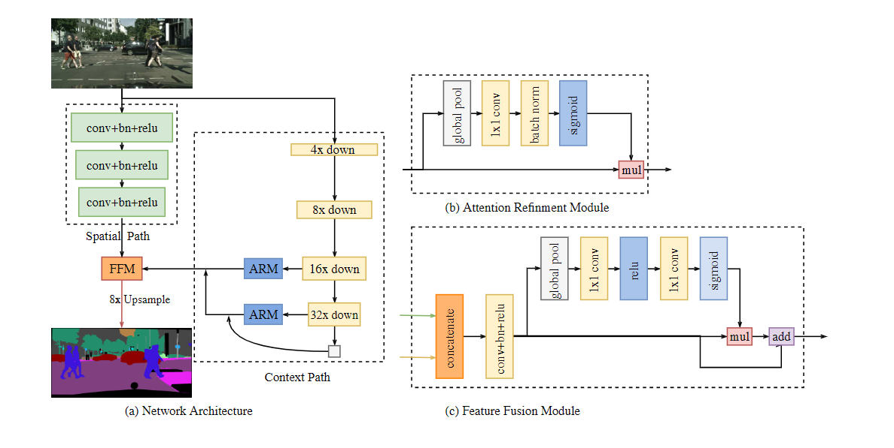

- 主要特点是，网络包括两条路径，context path和spatial path。前者通过快速的下采样pretrained主干网络Xception，扩大感受野。获得较低分辨率的含丰富语义特征的特征图，后接ARM(Attention refinement module)，其中包含全局池化；后者仅有三个卷积层，下采样8倍（因此尽管尺寸大但计算量不大），保留了原图像丰富的空间特征。
- 因为两条路径的信息的level不同，因此用FFM结合这两部分的特征，BN统一尺度，类SE模块选择特征。

## 10.Psanet: Point-wise spatial attention network for scene parsing(2018)
[论文链接](http://openaccess.thecvf.com/content_ECCV_2018/papers/Hengshuang_Zhao_PSANet_Point-wise_Spatial_ECCV_2018_paper.pdf)

引入point-wise注意力，考虑相对位置的同时考虑全局信息，每个点都自适应的通过一个可学习的注意力映射与其他所有点链接

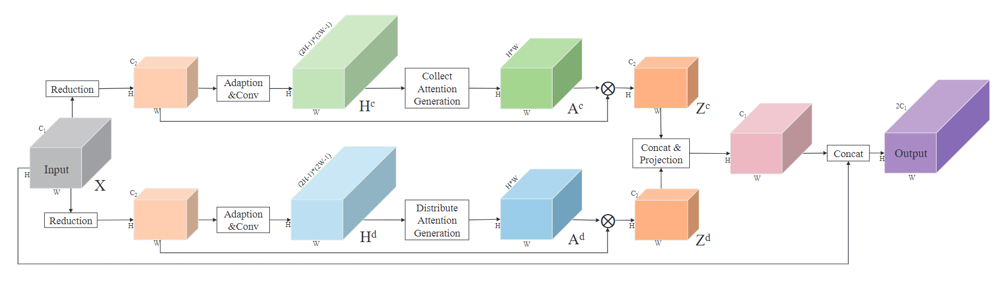

- 建立了一个双向信息传播路径，逐点注意力包括两部分，第一部分为其他点j对目标点i预测的重要性，第二部分为目标点i对其他点j的重要性，这两部分对特征图上每个点都是H\*W维。文中先生成了一个2H-1\*2W-1维的特征图，通过聚焦于它的不同位置，获得每个点H\*W维注意力，得到attention map，将注意力图按公式可得每个点的特征。
- (输入特征图为H\*W\/$C_2$) collect中H\*W\*(H\*W)维的attention map，每个点的H\*W维向量表示H\*W每个点对该点的注意力分数，对应加权求和每个点的$C_2$维向量，可得该点的输出特征；distribution部分的attetion map，每个点的H\*W维向量表示该点对H\*W个点的重要性，所以求输出特征时，取全局每个点的H\*W维特征中的第i维作为该全局点对目标点i的注意力加权，累加可得输出特征

## 11.Deeplab v3+:Encoder-decoder with atrous separable convolution for semantic image segmentation(2018)
[论文链接](http://openaccess.thecvf.com/content_ECCV_2018/papers/Liang-Chieh_Chen_Encoder-Decoder_with_Atrous_ECCV_2018_paper.pdf)

为了在保证分辨率的同时加入语义信息，deeplab v3使用空洞卷积替代池化，从而保证尺寸的同时扩大了感受野，但是这种方法不如encoder-decoder对边界信息更细节。因此，deeplav v3+结合了encoder-decoder结构，将v3作为一个强大的encoder，之后加了一个简单的decoder，还探索了深度可分离空洞卷积（应用在ASPP和decoder）

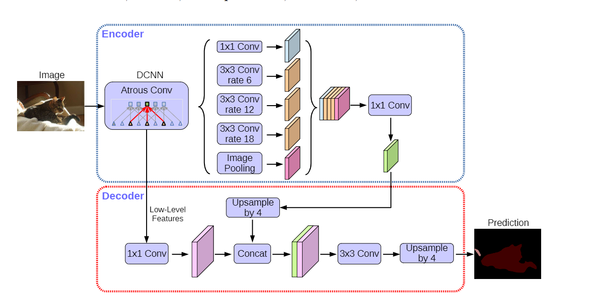

## 12.Icnet:Icnet for real-time semantic segmentation on high-resolution images(2018)
[论文链接](https://openaccess.thecvf.com/content_ECCV_2018/papers/Hengshuang_Zhao_ICNet_for_Real-Time_ECCV_2018_paper.pdf)

提出了一个实时语义分割框架ICNet，利用级联图片输入，融合不同尺寸的特征图，实现coarse-to-fine预测，在低分辨率特征图使用完整网络，在高分辨率部分使用轻量级网络，并且在前几层共享权重，从而显著减小计算量。

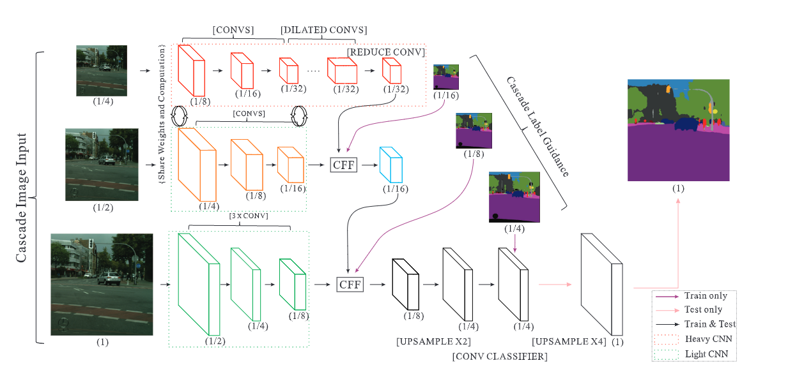

- 在CFF(cascade feature fusion)模块，使用双线性插值和空洞卷积实现不同尺寸特征图的融合

- 使用辅助损失，每个尺寸的特征图都会被用来预测并计算损失，最终损失会加权

## 13.Non-local neural networks(2018)
[论文链接](http://openaccess.thecvf.com/content_cvpr_2018/papers/Wang_Non-Local_Neural_Networks_CVPR_2018_paper.pdf)

本文提出一种 non-local 操作，和一个通用的non-local block，将self-attention统一到non-local的范式中，并提出了一些其他可能的选择。

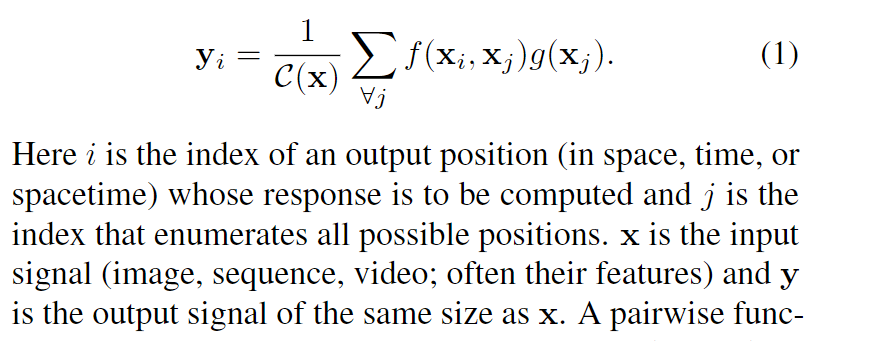

## 14.EncNet:Context encoding for semantic segmentation(2018)
[论文链接](http://openaccess.thecvf.com/content_cvpr_2018/papers/Zhang_Context_Encoding_for_CVPR_2018_paper.pdf)

提出了 Context Encoding Module,编码上下文信息，类似于SENet，对特征图的每个通道加权

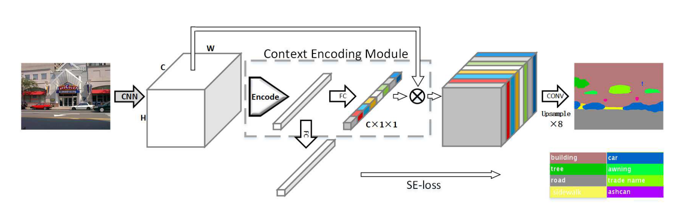

- ENC模块中的encoder layer，通过传统方法得到K个语义词，利用softmax加权得到每个像素对每个语义词的残差特征，累加得整张图对每个语义词的残差特征
- 将encoder layer的输出input全连接层，得到每个通道的权重
- 引入了辅助任务，SE-loss，GT可以从分割GT中获得，每个类别的二元交叉熵

## 15.DANet:Dual attention network for scene segmentation(2019)
[论文链接](https://openaccess.thecvf.com/content_CVPR_2019/papers/Fu_Dual_Attention_Network_for_Scene_Segmentation_CVPR_2019_paper.pdf)

为了更好的捕捉上下文信息（全局信息）和通道间的联系，本文提出了一种双注意力网络DANet，使用两个注意力模块来得到更好的特征表示

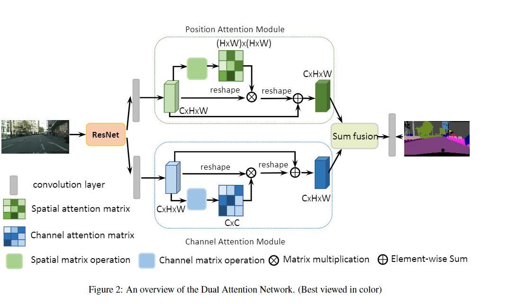

position attention module，计算特征图H\*W维度的自注意力，得到(H\*W)\*(H\*W)的注意力分数矩阵，计算加权值；channel attention module，计算特征图通道维度的自注意力，得到C\*C的注意力分数矩阵，再计算加权值。最后将二者融合。

## 16.CCNet: Criss-Cross Attention for Semantic Segmentation(2019)
[论文链接](http://openaccess.thecvf.com/content_ICCV_2019/papers/Huang_CCNet_Criss-Cross_Attention_for_Semantic_Segmentation_ICCV_2019_paper.pdf)

最近利用上下文信息的注意力模块/non-local模块，都需要生成尺寸很大的注意力分数矩阵(H\*W)\*(H\*W)，计算量和占用内存大。本文提出一种新的聚合全局特征的注意力模块CCA，每个点仅在当前行和列计算注意力，注意力分数矩阵为H\*W\*(H+W-1)，大大减小。并通过循环输入CCA，获取全局信息

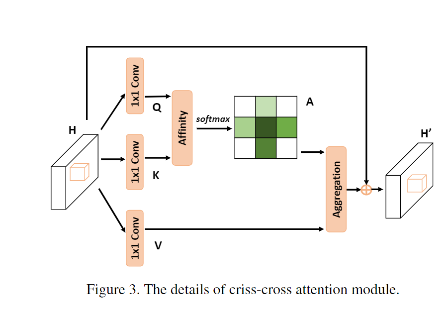

## 17.ANN:Asymmetric non-local neural networks for semantic segmentation(2019)
[论文链接](http://openaccess.thecvf.com/content_ICCV_2019/papers/Zhu_Asymmetric_Non-Local_Neural_Networks_for_Semantic_Segmentation_ICCV_2019_paper.pdf)
和CCNet一样，本文针对non-local的弊端，提出了ANN，应用了也基于注意力的APNB(Asymmetric Pyramid Non-local Block)和AFNB(symmetric Fusion Non-local Block)，前者提取全局特征，后者融合多尺度特征

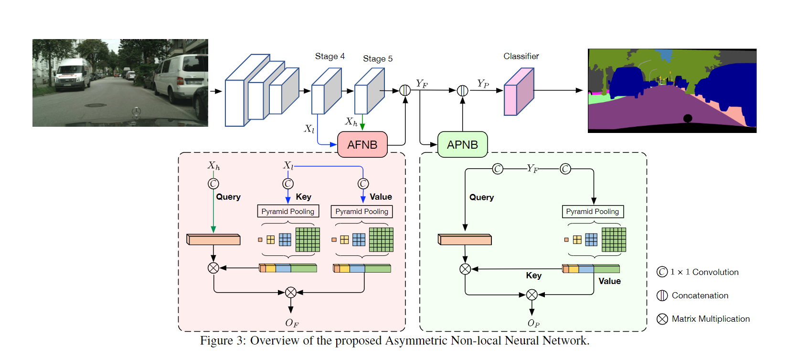

APNB和AFNB区别在于，将注意力模块的key和query的维度通过采样由C\*HW降到了C\*S，其中S远小于HW，采样方式为SPP模块，这样也融合了多尺度特征。

## 18.Gcnet: Non-local networks meet squeeze-excitation networks and beyond(2019)
[论文链接](http://openaccess.thecvf.com/content_ICCVW_2019/papers/NeurArch/Cao_GCNet_Non-Local_Networks_Meet_Squeeze-Excitation_Networks_and_Beyond_ICCVW_2019_paper.pdf)

依然是为了简化non-local，本文先提出，他们发现non-local捕捉的注意力图对所有query几乎一样，从而提出了一个共享注意力图H\*W的简化non-local块。文中将SENet和简化的non-local块统一成Global context modeling framework，并将二者的优势结合，先计算全局注意力（query共享注意力图）H\*W，再与C\*HW相乘，得到C维张量，通过两个1\*1的bottleneck，与C\*H\*W相加（残差连接）。由广播机制，其实相当于每个像素经注意力加权后的特征都相等，等于输出的C维向量

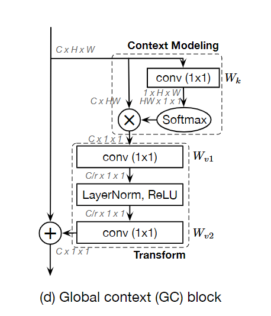

## 19.OCRNet:Object-contextual representations for semantic segmentation(2020)
[论文链接](https://www.ecva.net/papers/eccv_2020/papers_ECCV/papers/123510171.pdf)

本文聚焦于聚合上下文特征，与过去的ASPP和最近的non-local方法不同，本文将像素与对象区域的上下文特征丰富进特征

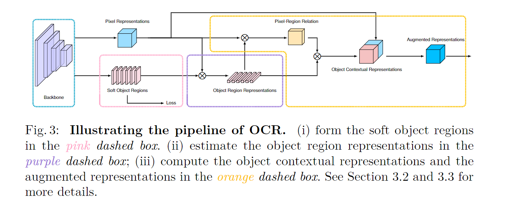

设backbone输出的特征图为H\*W\*C
- soft object region:K\*H\*W.为每张图预测K个object region，其中每个region为一个2D图，每个像素的值表示该像素与该类的相关性。此过程是有监督的，与GT生成的新GT做交叉熵
- object region representation:用soft object region分别加权像素特征求和，最终得到K个C维向量，每个向量表示该对象区域的特征
- Pixel-Region Rela:通过点乘+softmax计算每个像素点与每个对象区域的相关性，得到H\*W\*K，与原像素特征叠起来，进行预测
- 在上述过程的特征结合时都有个transformation,1\*1+BN+ReLU

## 20.Pointrend: Image segmentation as rendering(2020)
[论文链接](http://openaccess.thecvf.com/content_CVPR_2020/papers/Kirillov_PointRend_Image_Segmentation_As_Rendering_CVPR_2020_paper.pdf)

本文将分割任务视作渲染来解决边缘精度的问题，本质上是一种新的上采样方式，针对难点估计

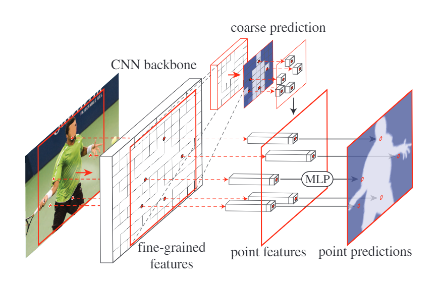

对于CNN提取出的细粒度特征图，先采用一个轻量分割网络得到coarse predict(7\*7)。应用双线性插值，将分辨率翻倍，在这些点中挑出N个“难点”（置信度低，或者说边界处），利用一个MLP对这些点做点预测（特征来自特征图和粗预测图），并更新预测图，再双线性插值，迭代直到预测图的分辨率大于等于原图。

## 21.Bisenet v2: Bilateral network with guided aggregation for real-time semantic segmentation(2021)
[论文链接](https://arxiv.org/pdf/2004.02147)

沿用了Bisenet v1的设计，分别用语义分支和细节分支捕捉上下文特征和细粒度特征。相比v1，本文精心设计了语义分支，包括快速下采样的并行卷积stem block，应用了深度可分离卷积聚合特征的Gather-and-Expansion Layer，和放在最后捕捉高层次特征的Context Embedding Block（全局池化再1\*1再残差相加）。本文还精心设计了特征聚合模块，将两个分支的特征按不同level分别聚合，得到更好的表征，

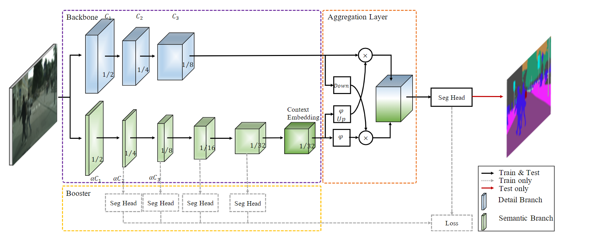

## 22.DPT:Vision Transformer for Dense Prediction(2021)
[论文链接](http://openaccess.thecvf.com/content/ICCV2021/papers/Ranftl_Vision_Transformers_for_Dense_Prediction_ICCV_2021_paper.pdf)

提出用于密集预测的vision transformer DPT，加入了更多卷积特性。

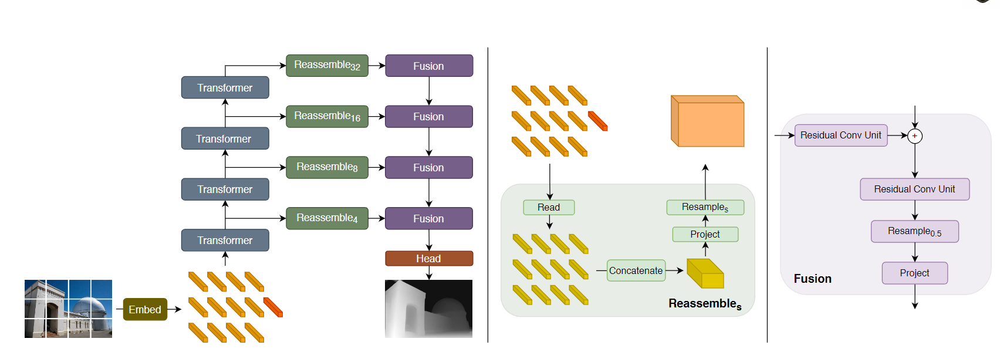

- encoder部分和ViT一样，加入了一个用于分类的readout token，该token在read操作中被忽略/作为全局特征融合。
- decoder：对不同transformer块的输出组装成**不同分辨率**的类似于图像的形式，这是通过bottleneck和上/下采样，其中较low的transformer块会被组装成更大分辨率的表示，因为其中包含更多细粒度特征。之后还使用了类似于refinenet的方式，融合多尺度的特征图

## 23.Segmenter: Transformer for semantic segmentation(2021)
[论文链接](https://openaccess.thecvf.com/content/ICCV2021/papers/Strudel_Segmenter_Transformer_for_Semantic_Segmentation_ICCV_2021_paper.pdf)

本文提出了一种新的mask transformer decoder，从而提出Segmenter模型

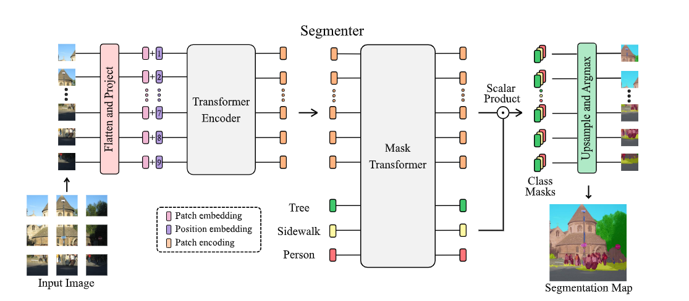

- encoder和ViT一样
- 将encoder输出的K个patch encoding和可学习的随机初始化的K个class嵌入一起输入mask transformer，维度均为D。将输出的每个patch嵌入和类嵌入做点积，(N\*D)\*(D\*K)=N\*K，从而得到每个patch的类掩码，再reshape和上采样得到预测图

## 24.SegFormer: Simple and Efficient Design for Semantic Segmentation with Transformers(2021)
[论文链接](https://proceedings.neurips.cc/paper/2021/file/64f1f27bf1b4ec22924fd0acb550c235-Paper.pdf)

本文提出了一种简单高效的基于transformer的语义分割模型Segmenter，层次编码器和轻量级解码器

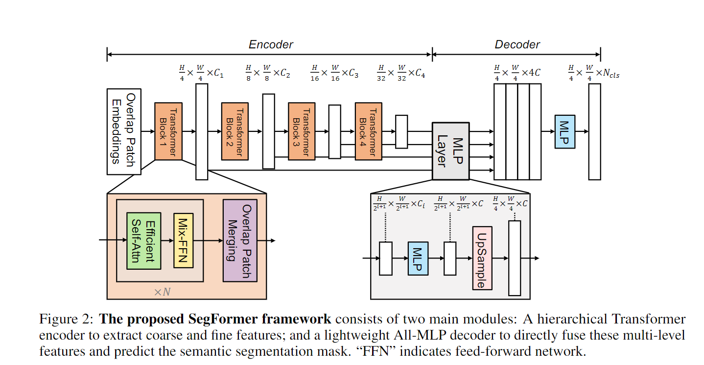

- 类似于Swin transformer，在encoder中通过合并补丁来获得不同分辨率的特征图，区别在于，Segmenter合并的是重叠的补丁，来保持合并后的局部连续性
- 通过在encoder的FFN中加入3\*3深度卷积，可以提供足够的位置信息，从而省略了位置编码
- 使用了一个轻量级的ALL-MLP的decoder，先将不同分辨率的特征图统一维度和尺寸，再通过MLP预测。可以这样做的关键是，encoder提供的多尺度特征图的信息很丰富，感受野更大