- [Semi-supervised semantic segmentation](#semi-supervised-semantic-segmentation)
  - [1.Guided Collaborative Training for Pixel-wise Semi-Supervised Learning(2020 eccv)](#1guided-collaborative-training-for-pixel-wise-semi-supervised-learning2020-eccv)
  - [2. Mean teachers are better role models:Weight-averaged consistency targets improve semi-supervised deep learning results(2018 nips)](#2-mean-teachers-are-better-role-modelsweight-averaged-consistency-targets-improve-semi-supervised-deep-learning-results2018-nips)
  - [3.Semi-Supervised Semantic Image Segmentation with Self-correcting Networks(2020 cvpr)](#3semi-supervised-semantic-image-segmentation-with-self-correcting-networks2020-cvpr)
  - [4.Semi-Supervised Semantic Segmentation with Cross-Consistency Training(2020 cvpr)](#4semi-supervised-semantic-segmentation-with-cross-consistency-training2020-cvpr)
  - [5.Semi-supervised semantic segmentation needs strong, varied perturbations(2020 BMVC)](#5semi-supervised-semantic-segmentation-needs-strong-varied-perturbations2020-bmvc)
  - [6.ClassMix: Segmentation-Based Data Augmentation for Semi-Supervised Learning(2021 WACV)](#6classmix-segmentation-based-data-augmentation-for-semi-supervised-learning2021-wacv)
  - [7.Semi-Supervised Semantic Segmentation via Adaptive Equalization Learning (2021 NIPS)](#7semi-supervised-semantic-segmentation-via-adaptive-equalization-learning-2021-nips)
  - [8.Semi-supervised semantic segmentation with cross pseudo supervision(2021 cvpr)](#8semi-supervised-semantic-segmentation-with-cross-pseudo-supervision2021-cvpr)
  - [9.Semi-supervised Semantic Segmentation with Directional Context-aware Consistency(2021 cvpr)](#9semi-supervised-semantic-segmentation-with-directional-context-aware-consistency2021-cvpr)
  - [10.PseudoSeg: Designing Pseudo Labels for Semantic Segmentation(2021 iclr)](#10pseudoseg-designing-pseudo-labels-for-semantic-segmentation2021-iclr)
  - [11.ST++: Make Self-training Work Better for Semi-supervised Semantic Segmentation(2022 cvpr)](#11st-make-self-training-work-better-for-semi-supervised-semantic-segmentation2022-cvpr)
  - [12.Semi-Supervised Semantic Segmentation Using Unreliable Pseudo-Labels(2022 cvpr)](#12semi-supervised-semantic-segmentation-using-unreliable-pseudo-labels2022-cvpr)
  - [13.Perturbed and Strict Mean Teachers for Semi-supervised Semantic Segmentation(2022 cvpr)](#13perturbed-and-strict-mean-teachers-for-semi-supervised-semantic-segmentation2022-cvpr)
  - [14.Semi-supervised Semantic Segmentation with Error Localization Network(2022 cvpr)](#14semi-supervised-semantic-segmentation-with-error-localization-network2022-cvpr)
  - [15.Bootstrapping Semantic Segmentation with Regional Contrast(2022 iclr)](#15bootstrapping-semantic-segmentation-with-regional-contrast2022-iclr)
  - [16.Dmt: Dynamic mutual training for semi-supervised learning(2022 pr)](#16dmt-dynamic-mutual-training-for-semi-supervised-learning2022-pr)
  - [17.Revisiting Weak-to-Strong Consistency in Semi-Supervised Semantic Segmentation(2023 cvpr)](#17revisiting-weak-to-strong-consistency-in-semi-supervised-semantic-segmentation2023-cvpr)
  - [18.Augmentation Matters: A Simple-yet-Effective Approach to Semi-supervised Semantic Segmentation(2023 cvpr)](#18augmentation-matters-a-simple-yet-effective-approach-to-semi-supervised-semantic-segmentation2023-cvpr)
  - [19.Instance-specific and Model-adaptive Supervision for Semi-supervised Semantic Segmentation(2023 cvpr)](#19instance-specific-and-model-adaptive-supervision-for-semi-supervised-semantic-segmentation2023-cvpr)
  - [20.Conflict-Based Cross-View Consistency for Semi-Supervised Semantic Segmentation(2023 cvpr)](#20conflict-based-cross-view-consistency-for-semi-supervised-semantic-segmentation2023-cvpr)
  - [21.Fuzzy Positive Learning for Semi-supervised Semantic Segmentation(2023 cvpr)](#21fuzzy-positive-learning-for-semi-supervised-semantic-segmentation2023-cvpr)

# Semi-supervised semantic segmentation
## 1.Guided Collaborative Training for Pixel-wise Semi-Supervised Learning(2020 eccv)
本文提出了一种适用于逐像素任务的SSL框架GCL，一致性训Paper/Semi-Supervised_Semantic_Segmentation/image/21.png)

T1和T2为任务模型（task specific），具有不同的初始化，输出T1(x)和T2(x)的目标为标注y；F为“缺陷探测器”，输入为x和Tk(x)连接起来，输出为H\*W的概率图，为Tk每个像素点（预测错误）是缺陷的概率；C为一个图片处理pipeline，膨胀+模糊+正则化。

- 训练的第一阶段：固定F，训练T1,T2。对于有标注的数据，用MSE（平方）损失有监督的训练。对无标注的数据，有两个约束来学习其中的知识。
  - Dynamic Consistency Constraint，类似于伪标签方法，集成两个任务模型的知识。设置一个阈值$\xi$，将F输出的缺陷概率图中概率大于$\xi$的像素点置1。再以T1为例，若F输出的缺陷概率图中，某像素T1缺陷概率大于T2，则以T2的值为“伪标签”，用MSE计算T1损失。T2同理。
  - Flaw Correction Constraint，希望Tk的输出使F的输出趋向于0。若某像素点在T1和T2中的缺陷概率都大于$\xi$，则用MSE以0为目标计算F输出的损失（F为固定的）。
- 训练的第二阶段：固定Tk，训练F。希望检测器F的输出趋向|Tk-y|，但后者通常稀疏且sharp，较难学习。因此，我们将|Tk-y|输入C，膨胀+模糊+正则化，将输出作为F的真值，用MSE训练。

## 2. Mean teachers are better role models:Weight-averaged consistency targets improve semi-supervised deep learning results(2018 nips)
本文是半监督学习的“一致性正则化”方法，根据聚类假设（数据分布由由低密度区域分隔的均匀类样本簇组成），如果对一个未标记的数据应用实际的扰动，则预测不应发生显著变化。

首先回顾两篇这类方法的文章。

- Temporal Ensembling for Semi-Supervised Learning(2017)：提出Pi模型。对于有标签数据进行监督学习；对于无标签数据，每次进行两次前向推理，由于数据增强的随机性和dropout，这两个结果肯定不同，使用MSE损失约束。随着训练进行，无标签数据的MSE损失占的权重减小。
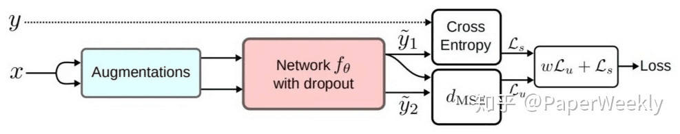

- Temporal Ensembling for Semi-Supervised Learning(2017)：在 Pi-Model 的基础上进一步提出了Temporal Ensembling。只进行一次前向推理，将当前预测结果与历史预测结果的平均值做均方差计算，历史预测结果由EMA(exponential moving average，指数滑动平均)计算：$y'=\alpha y'+(1-\alpha)y$
- 
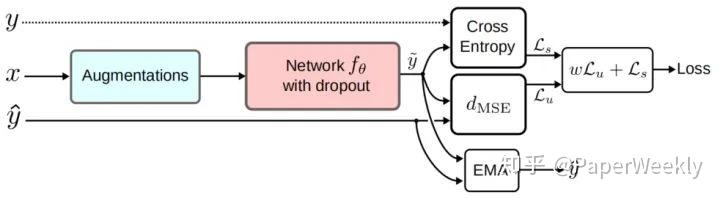

Mean Teachers则是Temporal Ensembling 的改进版，Temporal Ensembling 对模型的预测值进行 EMA，需要在训练时维护所有数据的EMA预测值，而Mean Teachers 采用了对模型权重进行 EMA，每个batch更新即可。
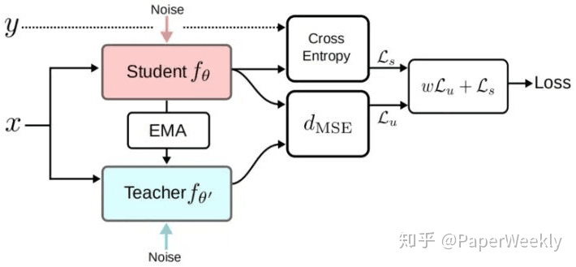
先进行监督学习，将模型参数复制为学生和老师模型。对于无标签数据，分别加入噪声后输入学生和老师模型，计算两者的MSE损失来训练学生模型，在一个batch训练完（反向传播完），使用学生模型权重计算老师模型权重的EMA并更新。

## 3.Semi-Supervised Semantic Image Segmentation with Self-correcting Networks(2020 cvpr)
本文面对的场景为：小部分语义mask标注的样本，大部分目标bbox标注。

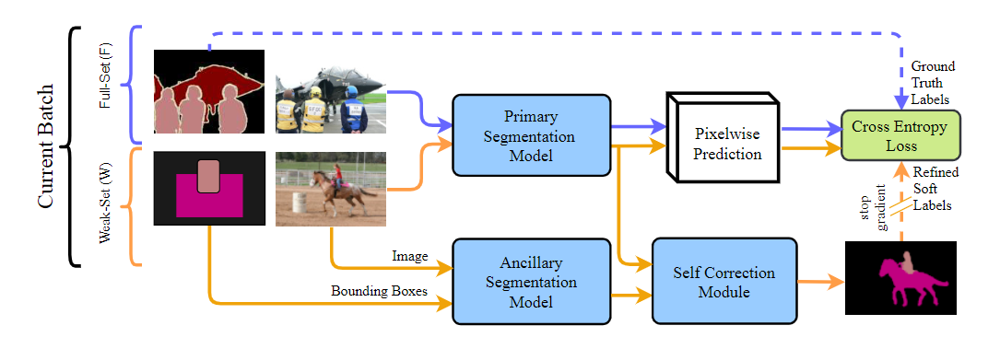

- Ancillary Segmentation Model:输入为图片和bbox(实际上为三维张量H\*W\*(C+1)，在bbox内的像素点，对应的类别通道置1)，输出为分割掩码图。训练开始时使用全标注样本进行训练，之后便固定参数，在初期对弱监督样本精度较高。
- Primary segmentation model:主要模型，有标注样本监督训练，无标注样本以Self-correction module的输出为真值进行训练。
- Linear Self-Correction:以最小化输出分布与Ancillary Segmentation Model和Primary segmentation model的KL散度之（加权）和为目标，该分布有解析解。训练初期，Ancillary Segmentation Model占权重高，逐渐降低。
- Convolutional Self-Correction:使用卷积网络建模学习自校正，将前两者模型的logit输出叠起来作为输入。对于有标注的样本，监督训练Primary segmentation model和Convolutional Self-Correction，对于无标注样本，用Convolutional Self-Correction的输出作为真值算交叉熵损失（此损失不传播到Convolutional Self-Correction）。初始化时，用一半有标注数据训练Ancillary Segmentation Model防止精度太高，导致Convolutional Self-Correction只采用它的，留下更多的数据让Convolutional Self-Correction学会怎么结合Ancillary和primary

## 4.Semi-Supervised Semantic Segmentation with Cross-Consistency Training(2020 cvpr)
针对语义分割任务提出的半监督方法，一致性训练。本文认为，原始输入的分布没有表现出分隔类别的低密度区域，而隐藏层表示更符合聚类假设，适合进行一致性训练。

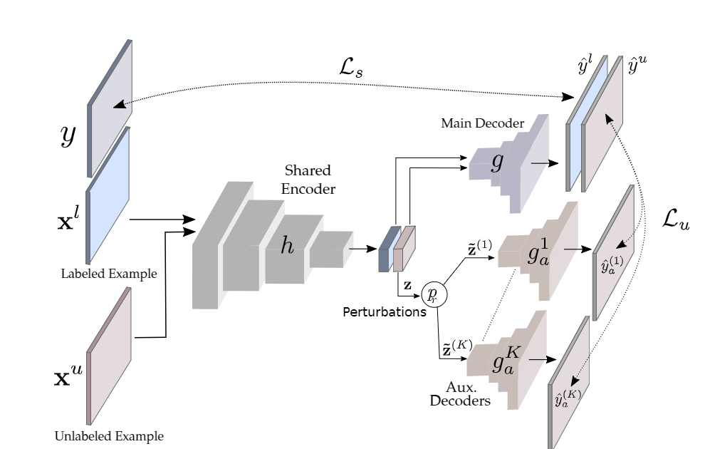

- 首先是一个共享编码器，顶层接一个main解码器和多个辅助解码器。损失由主解码器的监督损失和无标记样本损失组成，无标注样本经过共享编码器后，隐藏表示z直接输入主解码器，增加随机扰动后分别输入辅助解码器，计算主解码器结果和各辅助解码器结果的交叉熵损失。其中，主解码器只由有标注样本训练。
- 每个迭代采样1：1的有标注/无标注样本，为了避免过拟合有标注样本，使用了类似于OHEM的方法
- 本文提出了几种不同的，对隐藏表示加入扰动的方法
- 该框架还可以应用到弱监督任务，和多个域的任务（在共享编码器后，接特定于域的主解码器和辅助解码器，对应域的样本训练对应的解码器）。

## 5.Semi-supervised semantic segmentation needs strong, varied perturbations(2020 BMVC)
本文是将一致性正则化应用到语义分割的最早的几篇文章，将监督学习中的增强方法Cutout和CutMix应用到SSL作为扰动。

- 本文的大部分篇幅在理论分析，与上一篇的思想类似，认为“原始输入的分布没有表现出分隔类别的低密度区域”，一般的一致性正则化方法不适用于分割任务。但是我没大看懂，分析了一番扰动/决策边界之类的。
- CutOut大概是，随机选输入图片里的矩形区域，置为0；CutMix是，找两张输入图片，在一张图片里取矩形掩码，和另一张图的其余部分拼在一起，作为输入，计算损失时的GT也要同样拼接。
- 本文中，使用了Mean Teacher的师生框架，将CutMix后的图片作为学生网络的输入，将原图片在老师网络的输出为真值，拼接后作为学生网络的伪标签。

## 6.ClassMix: Segmentation-Based Data Augmentation for Semi-Supervised Learning(2021 WACV)

依然是一致性正则化方法，本文提出了一种新的针对无标记样本的数据增强方法Classmix。

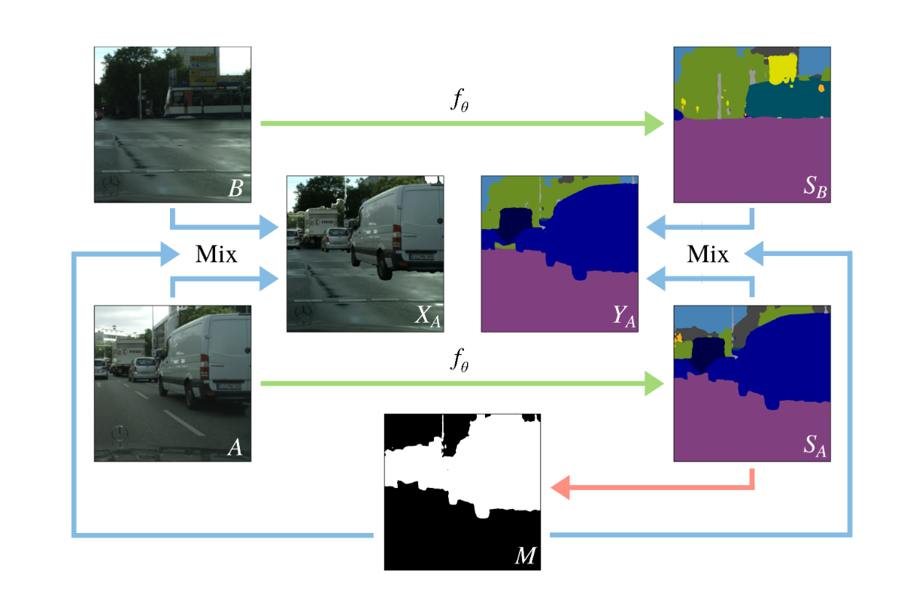

- Classmix：随机采样两张无标签输入图片A,B，对A的预测概率图取argmax后，随机取一般类别，将这些类别对应的原图像素点cut下来，粘到B上，得到增强后的图片，增强后图片的GT由A,B的预测概率图取argmax后拼接而成。
- 本文使用了Mean teacher框架，对教师网络的权重总用EMA更新。对于A,B先用教师网络推理，用增强后的图片训练并更新学生网络的参数。
- 伪标签的思想，对A,B的预测概率图取argmax，鼓励网络执行置信的预测，消减边界的不确定性，锐化，减小污染。
- 每次训练取一半有标记，损失函数由监督部分和增强部分组成，增强部分的损失占的权重由初期的很小慢慢变大。

## 7.Semi-Supervised Semantic Segmentation via Adaptive Equalization Learning (2021 NIPS)
本文针对SSL语义分割中表现不佳的特定类别，提出了adaptive equalization learning (AEL)。经典的伪标签/一致性正则化方法预测不准确，甚至可能损害这些类别的表现。

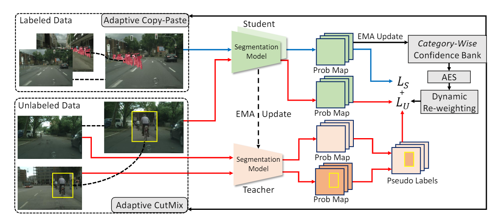

- 本文使用了Mean teacher框架，提出了两种数据增强方法，来增加表现不佳样本在训练批次中出现的频率。教师模型给出无标签样本的伪标签，并由学生模型的参数计算EMA更新；学生模型给出样本的预测，其中有标记样本的预测用来计算类别的置信度，并指导无标记样本的损失计算。
- Confidence Bank:在训练过程中，通过有标记样本的表现来维护每个类别的置信度。文中提出了多个指标，最终采用了$Conf^ {c} =  \frac {1}{N_ {l}}  \sum _ {i=1}^ {Nl} \frac {1}{N_ {i}^ {c}} \sum _ {i=1}^ {Nc}p_ {ij}^ {c} ,c \in {1,\cdots ,C}$，并且在每次训练后计算EMA更新每个类的置信度。
- Adaptive CutMix:这是针对无标注数据的数据增强方法，与原CutMix的区别在于，两张图片将按据类别置信度来采样。
- Adaptive Copy-Paste:这是针对有标注数据的数据增强方法，按照置信度计算概率，采样类别，复制源图像中属于采样类别的所有像素并将它们粘贴到目标图像上。
- Adaptive Equalization Sampling:根据置信度计算一个类别的采样率，不是使用所有像素来计算无监督损失，而是根据像素的预测对像素随机采样一个子集。
- Dynamic Re-Weighting:伪标签的质量有显著影响，本文为无标签样本的每个像素点计算权重，使置信度（此处为softmax后的最大值）高的像素点的损失具有更高的权重。

## 8.Semi-supervised semantic segmentation with cross pseudo supervision(2021 cvpr)
在论文里看是很简单的一篇文章，一致性约束方法，但能实现SOTA，也许具体训练时有些trick。

- 两个网络（可以相同或不同），随机初始化。对于有标记样本监督训练；对于无标记样本，同时输入两个网络（用相同的增强方法），将网络输出的分割置信图转化为one-hot，再作为另一张图片伪标签计算损失并反向传播。具体的，还使用了CutMix增强方法。
- 文中和其他方法进行了对比讨论，我感觉大家trick都差不多，但这篇既然是SOTA，说明有其价值。
- 在初期互相伪监督训练不会越来越错吗？即使两个网络对某个像素的分类都是错误的，也极大概率是两个（错误的）类别，互相有些抵消折中，而非越训越错。实验表明，结果是逐渐提升的。

## 9.Semi-supervised Semantic Segmentation with Directional Context-aware Consistency(2021 cvpr)
很有趣的思路，也是一致性约束的方法，关于上下文的一致性。

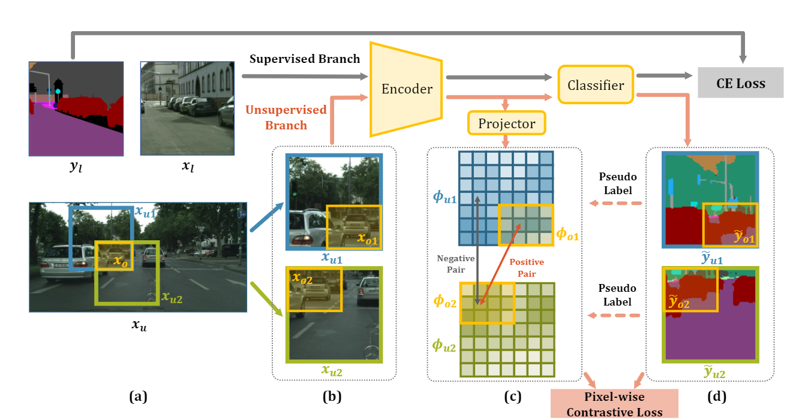

- 背景：在半监督环境中，模型很容易对相当有限的训练数据进行过度拟合，过度依赖上下文来进行预测，从而导致对训练期间未见过的场景的泛化能力较差。一般的弱增强方法也无法形成对上下文的一致性。
- Context-Aware Consistency:为了实现上下文一致性，对于无标签数据，裁剪出两个有overlap的patch作为输入，这两个patch可看作overlap部分具有不同上下文的增强方法。上下文一致性，即让模型对这两个patch的overlap部分一致。为避免模型在最终的预测中退化到忽略上下文信息，文中将encoder输出的特征经过映射器到低维特征后，进行一致性约束。
- Directional Contrastive Loss:为了保证两个patch重叠部分的representation对齐，l2损失太弱，无法在不将特征推离负样本的情况下使特征具有区分性。文中借助对比学习的方法，提出Directional Contrastive Loss，既增加正样本间的相似度，又减小与负样本的相似度。损失计算是逐像素的，每个（重叠区域）像素的正样本是另一张图片的对应位置，负样本为采样的。并且，将这两个patch通过分类器后，可以得到每个像素的置信度，在计算损失时以该像素置信度更高的预测为标准（例如o1），让o2向o1对齐（计算o2的负样本，只传播o2的梯度）。
- Negative Sampling:随机采样负样本的效果并不好，可能选到与自身同属同一类别的像素点。文中根据分类器的输出，作为伪标签，只采样负类样本。
- Positive Filtering：如果overlap部分置信度更高的像素点，置信度仍小于某一阈值，不计算其损失。

## 10.PseudoSeg: Designing Pseudo Labels for Semantic Segmentation(2021 iclr)
非常trick的一篇文章，人工设计了很多公式，比较难绷，提出了一种计算伪标签的方法。
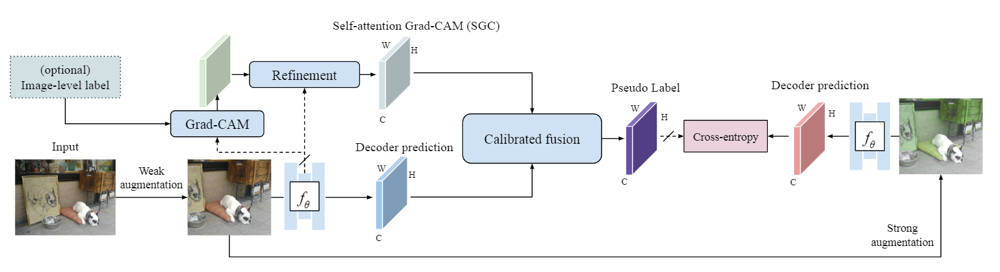
- 首先，涉及到 Class activation map (CAM)，原本的作用是定位，感觉类似于热力图，认为它可以生成更加局部一致的mask，得到H\*W\*C维的特征。
- 利用模型后两层卷积的特征图，拼起来作为富含信息的特征，后接两个不同的1\*1卷积，作为K,Q计算自注意力，再以CAM为V加权，得到SGC 
- 最终，通过校准融合（一个自己设计的数学公式），将SGC和解码器输出结合起来得到伪标签。

## 11.ST++: Make Self-training Work Better for Semi-supervised Semantic Segmentation(2022 cvpr)
本文提出了基于self-training的方法，发现应用了强数据增强后效果很好。
- 经典自训练：监督训练教师模型；打伪标签；所有样本（无标签样本使用弱增强）一起训练新的学生模型。但是，有标记样本太少导致伪标签质量不佳；学生模型可能过拟合教师模型，而学不到新东西。
- ST：将有标记样本过采样到与无标记样本一样规模，一起进行训练，避免了为每个小批次重复分配伪标签；在训练学生模型时，应用弱数据增强后再应用强数据增强SDA。
- ST++：优先考虑可靠的未标记样本进行训练，而非一视同仁。为了避免超参数（设置阈值），提出了一种选择策略，在监督训练过程中，储存K个检查点，将每个检查点的伪标签和最终的检查点计算meanIoU,并计算每张图片所有检查点的均值。在训练学生模型时，先使用标记样本和meanIoU最高的R个无标记样本（越高说明越稳定，也就越可靠）训练，给剩下的无标记样本重新打伪标签，最后用所有样本训练一个新的学生模型。

## 12.Semi-Supervised Semantic Segmentation Using Unreliable Pseudo-Labels(2022 cvpr)
很有意思的思路，idea的产生很自然。在一般的自训练/伪标签方法中，为了保证伪标签的质量，大多只取预测置信度高的像素训练，而忽略大部分其余像素。置信度低的像素可能在top_k类别的预测混淆（概率差不多），但是在“最不可能的类别”上往往判断准确（比如，对人和骑手困惑的像素，往往很确定不是建筑物），具有一定的信息。本文提出了一种利用不可信伪标签的方法。

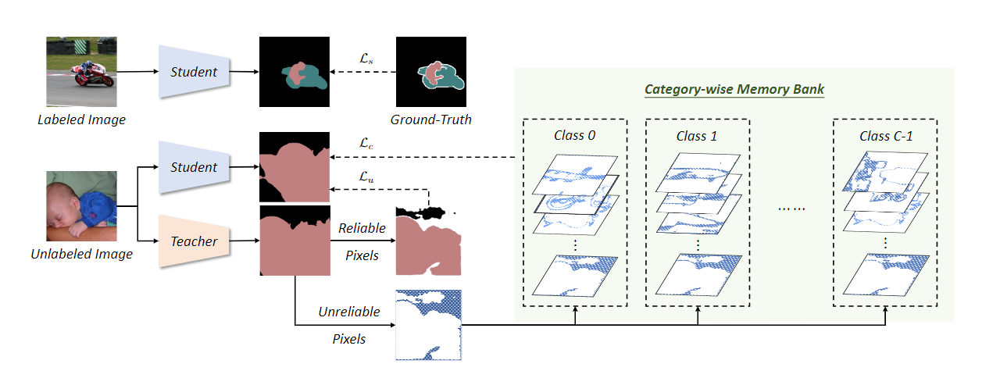

- 本文使用师生框架，教师框架EMA更新，学生框架由监督+无监督+对比损失训练
- 对于无标记样本，计算教师网络预测的逐像素熵，根据阈值（阈值会随时间而减小）分为可靠/不可靠伪标签，可靠伪标签直接计算无监督损失
- 利用不可靠像素(U2PL)：对每个类，采样目标像素/正例/负例，根据隐藏表征计算对比损失
  - anchor像素：（伪）标记的类别为C且预测置信度大于某一阈值
  - 正例：从anchor像素中采样
  - 负例：对于有标记样本，标记不为C，且预测为C的置信度为top_k；对于无标记样本，不可信，预测为C的概率既不是最可能的也不是最不可能的
  - 由于长尾分布，有些类别的负例较少，维护了一个内存库

## 13.Perturbed and Strict Mean Teachers for Semi-supervised Semantic Segmentation(2022 cvpr)
本文的出发点也很有意思。在一致性约束中，伪标签（老师模型）的正确性很重要，错误的伪标签会使学生模型对strong增强的图片偏向错误的约束。
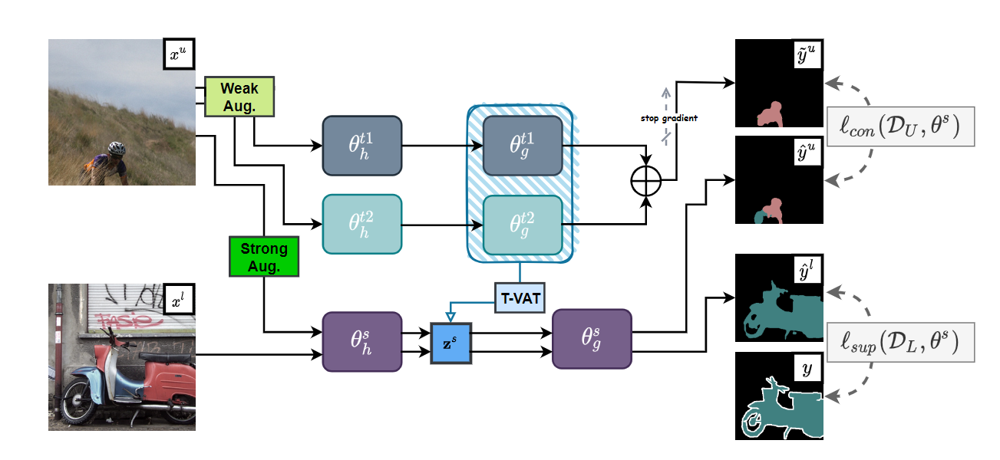
- 本文基于Mean teacher框架，使用交叉熵损失，引入了多种扰动。
- 网络扰动。有两个教师模型，取二者输出的均值做softmax作为软标签，取onehot作为硬标签，在训练时只用EMA更新其中一个的参数。
- 特征扰动。对于学生模型编码器输出的隐藏表示施加扰动，该扰动是通过T-VAT对教师模型的虚拟对抗训练得到的，没大看懂怎么操作的
- 输入扰动：弱/强增强
- 无监督损失使用onfidence-weighted CE loss，其实就是加了个置信度权重，伪标签类别对应的softmax值大于阈值时为权重，否则为零。

## 14.Semi-supervised Semantic Segmentation with Error Localization Network(2022 cvpr)
和上一篇动机有些类似，聚焦于伪标签的质量问题，提出了ELN(Error Localization Network)。与之前的ECN(纠错网络)相比，后者任务更复杂，更容易过拟合，ELN是类别无关任务，并且只需要预测二值掩码，泛化性能更好。

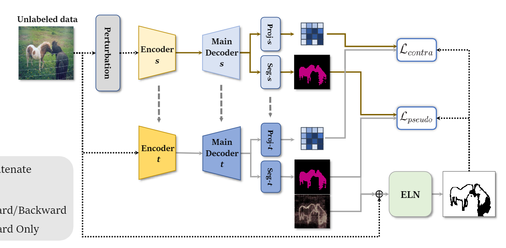

- 使用Mean teacher框架，在解码器头上还接了个映射器，得到特征进行对比学习
- 使用有标记样本：监督训练学生网络（编码器+主解码器）；训练K个辅助解码器，只计算损失大于某个阈值的解码器的损失（只优化损失很大的网络），以得到似是而非的错误预测；计算ELN损失，将K+1个解码器的输出分别与输入和逐像素熵图连接起来，输入ELN网络得到二值掩码，计算加权交叉熵损失（值为1的正确样本比例较大，根据1/0的像素比例加权）。此为训练的第一阶段。
- 无标记样本：根据教师网络主解码器的预测计算ELN，掩码为0的像素伪标签视为无效，与学生网络的输出计算监督损失；计算对比损失，以学生网络输出的表征为目标，在老师网络输出特征中寻找正例和负例

## 15.Bootstrapping Semantic Segmentation with Regional Contrast(2022 iclr)
和12出发点一样，使用对比学习(ReCo损失)利用不可信像素。

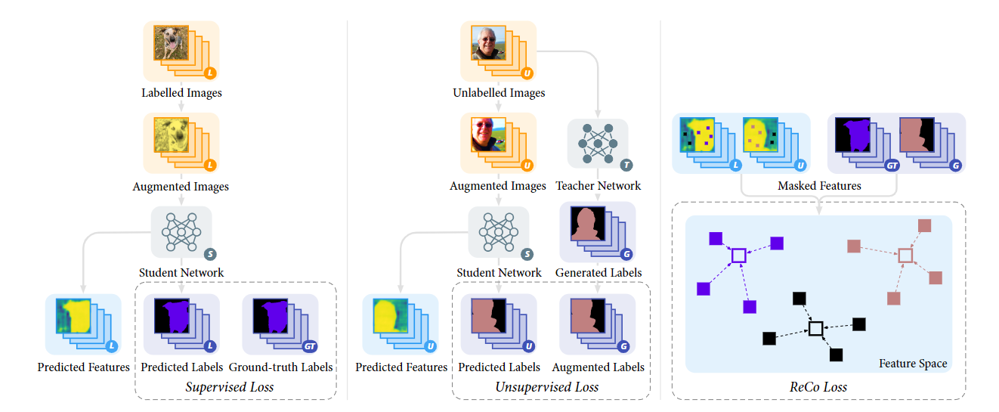
- Mean teacher框架，在编码器后接表征网络计算特征，以进行对比学习，ReCo损失把对比损失里的余弦相似度换成点积了，正类是minibatch中所有该类像素点的均值，query和负类为采样得来的。通过active sample，ReCo只需要对小于 5% 的 pixel 做 contrastive learning，节省内存，适应了分割任务。
- Active Key Sampling：我们希望采样与自身困惑的负类，在训练时动态维护一个C\*C矩阵，存储每两个类别之间的相似度（像素点均值之间的点积），softmax后根据该分布采样负类
- Active Query Sampling：给伪标签设置一个阈值，只采样置信度低的困难样本进行对比学习
- 只对置信度高（阈值与Active Query Sampling一致）的样本根据伪标签计算监督损失。

## 16.Dmt: Dynamic mutual training for semi-supervised learning(2022 pr)
本篇文章依然关注伪标签的质量问题，认为通过（教师）模型预测置信度筛选可能筛去低置信度正确标签/保留高置信度的错误标签，提出了 Dynamic Mutual Training方法，两个模型相互学习，并根据分歧判断预测的置信度，重新加权损失。

- Dynamic Mutual Training:对A监督训练，打伪标签后用所有数据训练B。对于每个像素点的交叉熵损失需要计算一个动态权重，当A的预测类别与B相同时，以B预测置信度(的$\gamma _1$次方)为权重；不同时，若A的预测置信度高，以B预测对于A伪标签类别的置信度的(的$\gamma _2$次方)为权重；不同且A的置信度低时，权重置零，认为伪标签不可信。
- 模型初始化：为了保证分割的两个模型有足够的差异，使用不同预训练数据集（分类数据集）；当有标记样本很少以至于预训练占比很大时，使用更好的预训练权重，再采样有标记样本的不同子集进行训练。
- 迭代训练框架：每次训练时，使用置信度最高的一定比例的伪标签；随着迭代加深，比例逐渐增加到100%。
- 感觉挺水的一篇文章，还硬造了个Difference maximized sampling方法，PR是这样的，不知道为啥引用量挺高的。

## 17.Revisiting Weak-to-Strong Consistency in Semi-Supervised Semantic Segmentation(2023 cvpr)

本文回顾了SSL由弱到强一致性约束方法，基于FixMatch(用弱增强的预测约束强增强，用同一个模型)，基线可以看作5的提升，10的简化，提出了一个新的扰动框架。
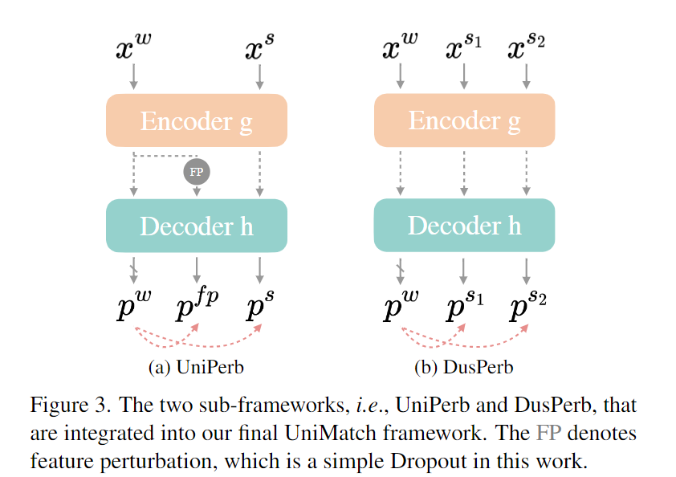
- Unified Perturbations for Images and Features:除了图像级的强增强，还引入了特征增强，简单的dropout即可得到很好的效果。将不同级别的扰动分成独立的前馈流，使学生能够更直接地在每个流中实现目标一致性。
- Dual-Stream Perturbations：对同一个弱增强输入，随机进行两个强增强，用共享的弱视图规范两个强视图也可以被视为强制这两个强视图之间的一致性。
- 将上边两个扰动组合起来就是UniMatch，四个独立的前馈，弱增强/两个强增强/特征扰动。

## 18.Augmentation Matters: A Simple-yet-Effective Approach to Semi-supervised Semantic Segmentation(2023 cvpr)
SSL语义分割SOTA逐渐复杂，本文提出了一种简单有效的框架，主要通过简化强数据增强，自适应地注入标记信息，使针对监督学习的数据增强方法适应半监督学习。

Mean teacher框架。监督损失+无监督损失。对于无标记样本，提出两种新的数据增强方式。
- Random Intensity-based Augmentations:将基于强度的增强放到一个池子里，随机采样强度，随机采样增强的数量（设了个最大值），再随机采样增强。文中认为，基于强度的增强是连续的，可以消除偏差，适合无监督学习。
- Adaptive Label-aided CutMix：将图片进行弱增强+基于强度的增强后，根据当前模型的预测计算每张图片的置信度，根据这一概率随机采样无标记图片与有标记图片mixup(置信度低的无标记图片，适合被有标记图片帮助)，置信度高的不用混合（？看图片是这样的），将混合（或不需混合的）后的图片再与无标记样本随机mix，得到最终增强的图片。

**下面一大部分由于电脑卡机，自动将GB 2312编码格式的文件存成了UTF，重新打开已经破坏了，上面的文件之前在github上同步过，下面的丢失了**
## 19.Instance-specific and Model-adaptive Supervision for Semi-supervised Semantic Segmentation(2023 cvpr)

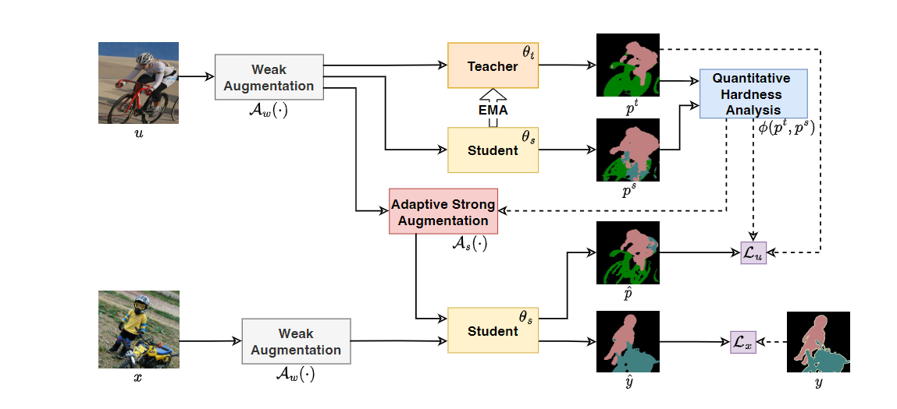
- 背景：当前SSS方法发展方向以引入额外的网络组件或额外的训练程序为代价。大多数方法对未标记数据一视同仁，完全忽略了未标记样本之间的差异和学习困难。随机的不加区别的扰动可能引入噪声，超出网络的拟合能力。
- 为了动态的衡量实例的困难程度，文中提出了一种类加权IoU（针对类别不平衡问题）$\frac {|z_ {1}(c)|}{H\times W} IoU( z_ {1} (c), z_ {2} (c))$
- 11$z_1(c)$，计算师生模型预测之间的wIoU，并以此计算样本的困难程度
$\gamma _i=\phi ( p_ {i}^ {t}  ,  p_ {i}^ {s} )=1-[  \frac {\rho _ {i}^ {s}}{2} wIOU( p_ {i}^ {s} , p_ {i}^ {t} )+ \frac {\rho _ {i}^ {t}}{2} wIOU(p_ {i}^ {t} , p_ {i}^ {s})]$

- Model-adaptive strong augmentations:文中认为不加区别的扰动可能造成信息损失，用上述困难程度来动态调整强增强（CutMix和基于强度的）的强度，有个公式
- Model-adaptive unsupervised：用$\gamma$动态调整样本的损失权重
## 20.Conflict-Based Cross-View Consistency for Semi-Supervised Semantic Segmentation(2023 cvpr)
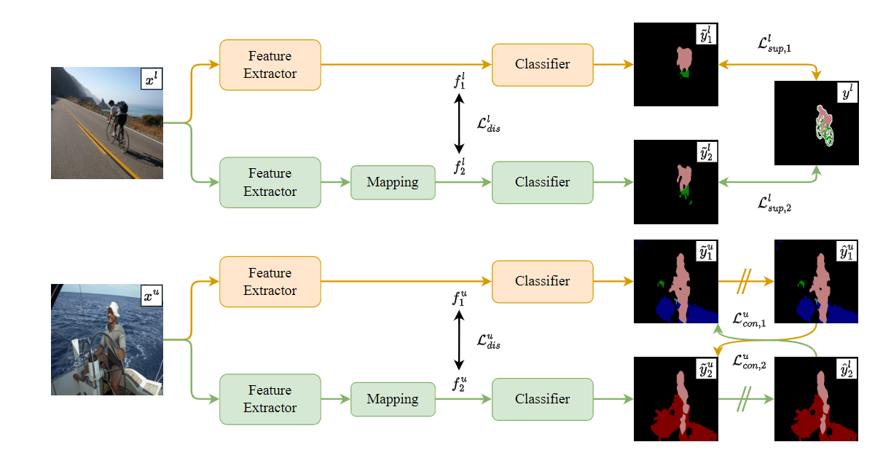
- 背景：当前SSS方法大多以加入人工扰动来防止子网络之间互相坍缩，但难以避免互相拟合，文中提出一种强制子网络学习不同视图特征的方法。
- 基于两分支的协同训练框架，两个初始化不同的网络，标记样本的监督损失+无标记样本的一致性损失（互为伪标签）+差异损失（最小化两个网络提取的特征的相似性）
- 差异损失：希望两个网络提取不同视图的特征，用余弦相似度来衡量特征之间的相似性，$c_ {dis}^ {\alpha }$ =1+ $\frac {f_ {1}^ {\alpha }\cdot \overline {f_ {2}}}{|f_ {1}||\times |f_ {2}|}$ ，1+相似度作为差异损失。
- Conflict-based pseudo-labelling(CPL)：在互相监督时，文中提出充分利用冲突标签，将其按置信度分情况进行了加权。
## 21.Fuzzy Positive Learning for Semi-supervised Semantic Segmentation(2023 cvpr)
本文针对伪标签的质量问题，提出模糊积极学习（FPL）诉诸于从多个可能正确的候选标签中穷尽信息语义。在本文中，我们引入，以即插即用的方式进行准确的 SSL 语义分割，目标是自适应地鼓励模糊积极预测并抑制高概率的消极预测。 FPL概念简单但实际上有效，可以显着减轻错误伪标签的干扰，并逐步实现清晰的像素级语义区分。
- Fuzzy Positive Assignment:设定一个阈值，将预测的置信度降序按类别累加，超过阈值前的为模糊正例
- Fuzzy Positive Regularization:第一遍读的时候就没大读明白，设计了许多公式，主要是针对模糊正例这种情形设计了一种损失函数，希望使模糊正例中的（置信度）最小值最大化，负例的最大值最小化