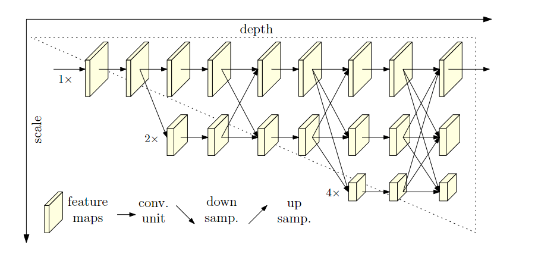
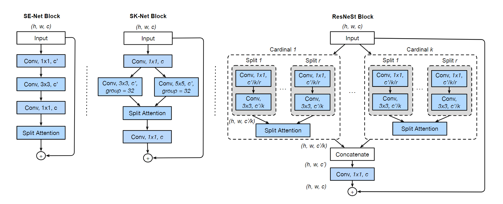
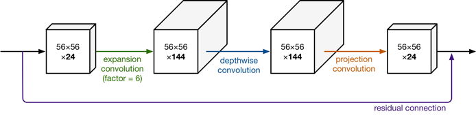
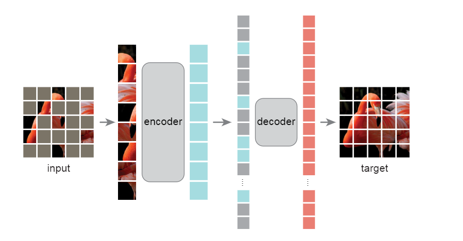
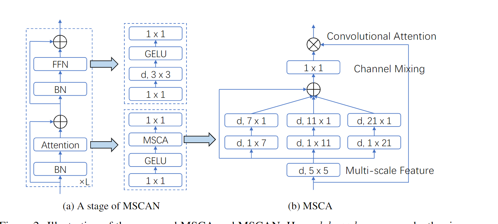
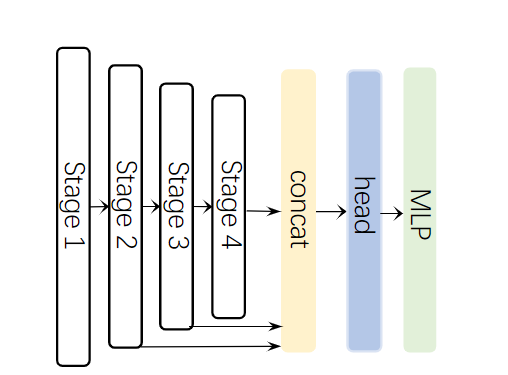
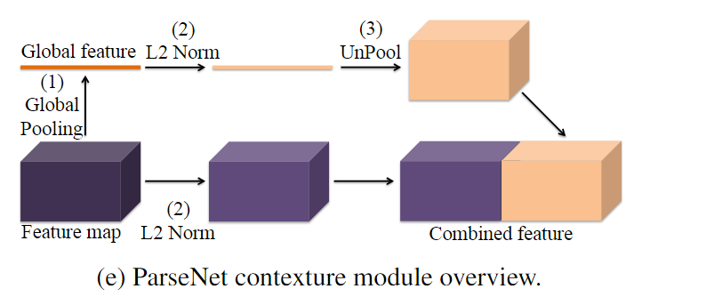
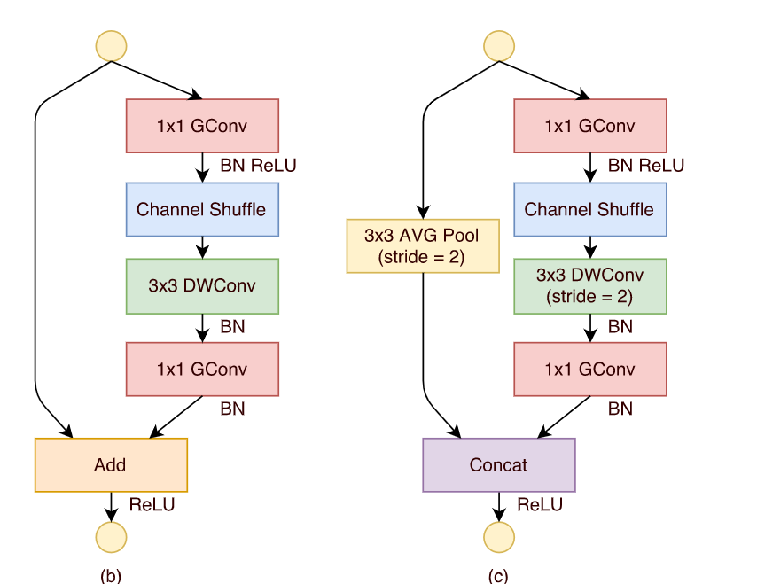
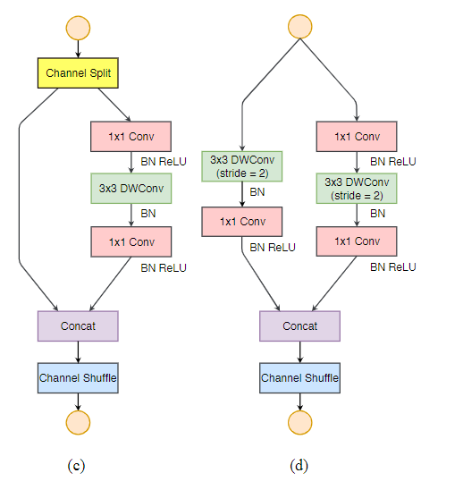

# Vision Backbone- [Vision Backbone](#vision-backbone)
- [Vision Backbone- Vision Backbone](#vision-backbone--vision-backbone)
  - [1.HRNet:Deep High-Resolution Representation Learning for Human Pose Estimation(2019)](#1hrnetdeep-high-resolution-representation-learning-for-human-pose-estimation2019)
  - [2.Resnest: Split-attention networks(2022)](#2resnest-split-attention-networks2022)
  - [3.Mobilenet v2: Inverted residuals and linear bottlenecks(2018)](#3mobilenet-v2-inverted-residuals-and-linear-bottlenecks2018)
  - [4.mobilenet v3:Searching for mobilenetv3(2019)](#4mobilenet-v3searching-for-mobilenetv32019)
  - [5.Beit: Bert pre-training of image transformers(2021)](#5beit-bert-pre-training-of-image-transformers2021)
  - [6.ConNext:A convnet for the 2020s(2022)](#6connexta-convnet-for-the-2020s2022)
  - [7.MAE:Masked autoencoders are scalable vision learners(2022)](#7maemasked-autoencoders-are-scalable-vision-learners2022)
  - [8.Segnext: Rethinking convolutional attention design for semantic segmentation(2022)](#8segnext-rethinking-convolutional-attention-design-for-semantic-segmentation2022)
  - [9.ViT:An image is worth 16x16 words: Transformers for image recognition at scale(2020)](#9vitan-image-is-worth-16x16-words-transformers-for-image-recognition-at-scale2020)
  - [10.Swin Transformer: Hierarchical Vision Transformer using Shifted Windows(2021)](#10swin-transformer-hierarchical-vision-transformer-using-shifted-windows2021)
  - [11.Xception: Deep Learning with Depthwise Separable Convolutions(2017)](#11xception-deep-learning-with-depthwise-separable-convolutions2017)
  - [12.Parsenet: Looking wider to see better(2015)](#12parsenet-looking-wider-to-see-better2015)
  - [13.Shufflenet: An extremely efficient convolutional neural network for mobile devices(2018)](#13shufflenet-an-extremely-efficient-convolutional-neural-network-for-mobile-devices2018)
  - [14.Shufflenet v2: Practical guidelines for efficient cnn architecture design(20)](#14shufflenet-v2-practical-guidelines-for-efficient-cnn-architecture-design20)

## 1.HRNet:Deep High-Resolution Representation Learning for Human Pose Estimation(2019)
[论文链接](http://openaccess.thecvf.com/content_CVPR_2019/papers/Sun_Deep_High-Resolution_Representation_Learning_for_Human_Pose_Estimation_CVPR_2019_paper.pdf)

在姿态估计任务中提出了一个提取多尺度特征的主干网络HRNet，在整个过程中保留了高分辨率特征，有利于密集预测（位置敏感），不过运算成本肯定不低。文中最终只用了最高分辨率的特征图进行预测，当然可以结合多尺度一起预测。

- 如图所示，其中融合不同分辨率特征的部分（箭头）称为exchange unit，用卷积层下采样或最邻近上采样接1\*1卷积（统一通道数），相加得到对应尺度特征图。
- 图例中，第一次产生更低分辨率特征图时用了其余所有尺度特征图，代码和论文中只用了最邻近尺度的特征图

## 2.Resnest: Split-attention networks(2022)
[论文链接](https://openaccess.thecvf.com/content/CVPR2022W/ECV/papers/Zhang_ResNeSt_Split-Attention_Networks_CVPRW_2022_paper.pdf)

借鉴了SENet中的channel-wise注意力，ResNext中的group convolution，和SKNet中的split-attention，提出了一种更强的Resnest，没有什么新的方法

## 3.Mobilenet v2: Inverted residuals and linear bottlenecks(2018)
[论文链接](https://openaccess.thecvf.com/content_cvpr_2018/papers/Sandler_MobileNetV2_Inverted_Residuals_CVPR_2018_paper.pdf)

在mobile v1的深度可分离卷积基础上，引入了Linear Bottleneck和Inverted residuals

- Linear Bottleneck:论文中认为，对输入X，每个激活空间BX的分布相当于一个兴趣流形，流形可以映射到低维空间（分布更密集），而ReLU在引入非线性的同时会破坏流形中的信息，例如，如果激活空间BX维度比较低，$B^{-1}ReLU(BX)$恢复的X破坏很严重，高维则还好。我们在设计高效网络时，希望尽可能地降低维度，又不希望ReLU破坏太多信息，因此尝试在低维度的卷积操作后去除非线性层，以保留完整信息，作为一个Linear bottleneck。
- Inverted residuals：如图所示，v2先将输入升维（为了在3\*3卷积时提取更丰富的特征），再进行深度可分离卷积，最后通过Linear Bottleneck（没ReLU）降维。因为整个bloc两头薄中间厚，和residual block相反，所以得名。很大程度缓解了depth-wise的正则化效应。

## 4.mobilenet v3:Searching for mobilenetv3(2019)
[论文链接](http://openaccess.thecvf.com/content_ICCV_2019/papers/Howard_Searching_for_MobileNetV3_ICCV_2019_paper.pdf)

在mobilenet v2的基础上提出v3，加入了很多trick，集大成者
- 引入SENet中的注意力机制，或者说自适应加权
- 使用NAS搜索最佳参数
- 引入了一种新的激活函数

## 5.Beit: Bert pre-training of image transformers(2021)
[论文链接](https://arxiv.org/pdf/2106.08254.pdf)

类似BERT，本文提出了image tensformer的自编码预训练模型BEIT
- 大致网络ViT差不多，image patch--40% mask--embedding(被mask的有专属标记)--add position--transformer encoder--predict Visual Token
- 训练过程：先训练一个dVAE,再根据MIM(Masked Image Modeling)任务训练
- 训练dVAE是希望获得每个patch的token(其实是就是一个索引，对一个大的表)，文中直接用的DELL-E的
- MIM任务，预测masked patch对应的Visual Token（softmax+对数）
- 文中使用dVAE的思想解释了BEIT的原理（损失函数），还验证了patch掩码比像素掩码效果好

## 6.ConNext:A convnet for the 2020s(2022)
[论文链接](https://openaccess.thecvf.com/content/CVPR2022/papers/Liu_A_ConvNet_for_the_2020s_CVPR_2022_paper.pdf)

本文借鉴ViT,将transformer的特性借鉴到CNN中，做了很充分的实验来改进网络，提出了一个集大成的纯CNN网络ConvNext，超过了Swin transformer
- 一个在ViT中讨论过的老问题，CNN的induced bias，比如translation equivariance。作者认为这依然是CNN的优势，因为Swin transformer里便借鉴了这一特性并超过ViT，由此认为纯CNN架构未免不能超过transformer，主要基于ResNet借鉴了以下特性来涨点
- 宏观设计：每个block的层数比例借鉴了ViT；Changing stem to “Patchify”，类似于SWin中的补丁化，用CNN做个步长为4，大小也为4的下采样
- 借鉴ResNeXt，引入深度可分离卷积和并行卷积
- 引入inverted bottleneck，并调整顺序，降低了参数量
- 将ReLU换成GELU，用更少的激活函数（非线性层），更少的正则化层，将BN换成LN,将下采样步骤独立出来（专门的一个卷积层）

## 7.MAE:Masked autoencoders are scalable vision learners(2022)
[论文链接](http://openaccess.thecvf.com/content/CVPR2022/papers/He_Masked_Autoencoders_Are_Scalable_Vision_Learners_CVPR_2022_paper.pdf)

借鉴BERT的mask+自编码方法，基于vision transformer的视觉表征预训练模型MAE

- 语言和视觉的信息密度有区别。语言具有丰富的语义特征，即使mask掉一小部分也可能有复杂的语言理解；而视觉的数据在空间上具有冗余性，为了克服与语言数据的gap，和克服冗余性更好的学到有用的信息，需要mask更大比率，如80%

- 只将没masked的patch输入编码器，因此可以构建较大的编码器；将统一的mask token插入编码器输入，输入解码器，输出对应patch的像素向量

## 8.Segnext: Rethinking convolutional attention design for semantic segmentation(2022)
[论文链接](https://arxiv.org/pdf/2209.08575.pdf?trk=public_post_comment-text)

本文提出了一个为了分割任务的简单卷积网络Segnext，结合了几个重要方法，如强大的encoder、多尺度特征、空间注意力
- encoder和transformer类似，但用卷积注意力替代了自注意力，文中说这种注意力更有效。其中还用了depth-wise的带状卷积，捕捉带状特征，感受野不变，减少参数

- decoder使用了多尺度特征图

## 9.ViT:An image is worth 16x16 words: Transformers for image recognition at scale(2020)
[论文链接](https://arxiv.org/pdf/2010.11929)

本文提出了Vision Transformer，将transformer架构应用到图片分类问题，除了预处理不同，其余就是一个用于分类的transformer编码器
- 想感慨的是，这篇论文是除了Yolo v3那个技术报告外读的最顺畅的一个。一方面，ViT尽量不改变transformer结构（为了方便的直接使用nlp领域已经在硬件上高效实现的transformer结构），另一方面attention is all you need是我读的第一篇论文，读的很仔细，还印象深刻了属于是。
- 预处理：为了得到序列输入，将一张图片分割为多个patch，维度为**patch数量\*(patch长\*宽\*通道数**\)，将一个patch的特征作为一个token，且通过可训练的线性映射得到D维patch embedding；为了保留位置信息，ViT也使用了1维position embedding（2维效果没啥提升）；为了实现分类任务，在序列开始加入了一个可训练的[class]token，其最终状态作为分类的特征
- inductive bias:文中认为，CNN具有translation equivariance和locality等inductive bias（这是模型自身的一种先验），这是优点但也会受限（不如模型自己学习到）。transformer的优势在于inductive bias更少（只有MLP和position embedding），空间关系必须从头开始学，因此在大数据集上训练时优于CNN（更好的先验）。 
- 微调：在微调时，remove预训练的分类头然后重新初始化进行训练。当训练的图像分辨率高于预训练时，为了保证预训练的position embedding有效，在保持patch-size不变的同时，根据patch的相对位置对embedding进行二维插值
- 论文中提到，当在中等数据集上训练时，transformer的表现不如CNN，但优势体现在数据集更大的时候。ViT通过在大型数据集上预训练，后微调得到了sota表现。
- 本文还提到一种混合模型，先用CNN提取patch的特征，再对其patch & position embedding作为输入

## 10.Swin Transformer: Hierarchical Vision Transformer using Shifted Windows(2021)
[论文链接](https://arxiv.org/pdf/2103.14030)

本文提出了一种新的vision transformer结构Swin transformer，利用shifted window降低计算复杂度，并通过patch merge获得多尺度特征图，后续可以类似于FPN或U-Net方法进行dense prediction任务
- 背景：本文认为，将transformer应用于Vision时需要考虑两个域之间的两个差别，一为视觉实体具有不同的尺寸，二为视觉任务多需要高分辨率输入，而transformer对输入为平方复杂度。为了解决这两个问题，Swin transformer分别使用了层次特征图和计算局部self-attention的方法
- 结构：预处理与ViT类似，将图片分为patch后计算embedding（在这里无需加入position embedding），输入两个级联的Swin transformer block后进行patch merge，即令相邻的patch(2*2=4个)concatenation成4d张量后经线性层降为2d，从而使特征图长宽变为一半，相当于步长为2的下采样，将结果再输入两个级联的Swin transformer block，重复这个过程
- Swin transformer block包括级联的两部分，他们的多头自注意力层(MSA)不同。首先将输入第一个transformer block，其MSA为w-MSA，对每个无重叠的window(每个window包含M\*M个patch)分别计算自注意力；将第一个block的结果输入第二个，其MSA为SW-MSA，对特征图进行shifted window（不再是规则的windows）分割，后对新的window计算自注意力
- w-MSA使自注意力的计算转为线性复杂度，SW-MSA建立w-MSA的不同window之间的关系，丰富了全局特征。
- 论文中提出了一种高效mask方法计算shifted window的自注意力，具体看论文
- 本文使用了相对位置偏差，在计算自注意力时加入。因为$M^2$与$M^2$的patch之间有(2M-1)\*(2M-1)种相对位置关系（每个维度2M-1），所以训练一个(2M-1)\*(2M-1)维度的bias矩阵，计算时从中取值即可
## 11.Xception: Deep Learning with Depthwise Separable Convolutions(2017)

[论文链接](https://openaccess.thecvf.com/content_cvpr_2017/papers/Chollet_Xception_Deep_Learning_CVPR_2017_paper.pdf)

从Inception模块出发，推导出深度可分离卷积的概念，分别在空间和通道维度进行卷积，利用深度可分离卷积设计神经网络Xception，改进了resnet和inception，应用bottleneck降维和depthwise

## 12.Parsenet: Looking wider to see better(2015)

[论文链接](https://arxiv.org/pdf/1506.04579.pdf)

融合全局特征的Parsenet，L2 norm是为了统一范数差距太大的特征，上采样是为了增大全局特征的影响

## 13.Shufflenet: An extremely efficient convolutional neural network for mobile devices(2018)
[论文链接](http://openaccess.thecvf.com/content_cvpr_2018/papers/Zhang_ShuffleNet_An_Extremely_CVPR_2018_paper.pdf)

mobilenet将bottleneck(1\*1+3\*3+1\*1)中的3\*3卷积优化成深度可分离卷积，大大减小了开销。但是，此时bottleneck中1\*1卷积的计算开销占了90+%，shufflenet引入分组卷积，优化了1\*1卷积的部分。因为级联的分组卷积会导致组间特征不交流，本文引入了可学习的channel shuffle，从而使组间特征交流。

## 14.Shufflenet v2: Practical guidelines for efficient cnn architecture design(20)
[论文链接](https://openaccess.thecvf.com/content_ECCV_2018/papers/Ningning_Light-weight_CNN_Architecture_ECCV_2018_paper.pdf)

本文提出，使用FLOPs设计轻量级网络是一种间接指标，提出了四条原则，并以此改进shuffle v1
- 同等通道大小最小化内存访问量。输入和输出通道数相等时内存访问量最小，因此将v1中的botleneck变为输入与输出通道数相等
- 过量使用组卷积会增加MAC。分组不宜过多，将v1中的组卷积恢复成正常卷积
- 网络碎片化会降低并行度。分组是一种碎片化，因此取消了
- 不能忽略元素级操作（如ADD,Relu）。取消v1的残差连接，换为concatation

- 具体实现时，先将channel分组，其中一部分使用恒等映射并与另一部分的输出concatation起来，并进行shuffle