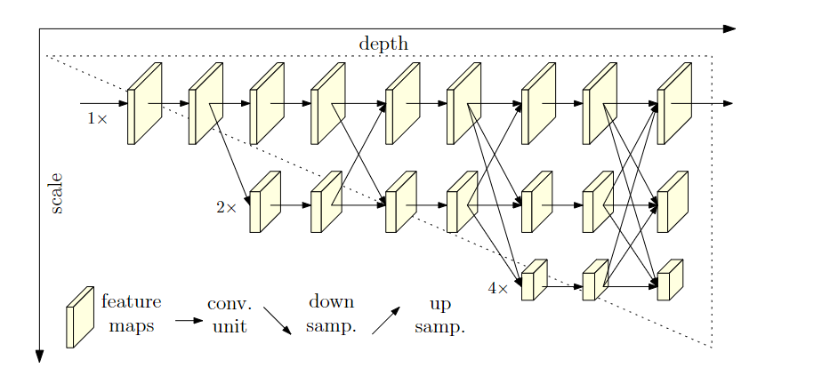
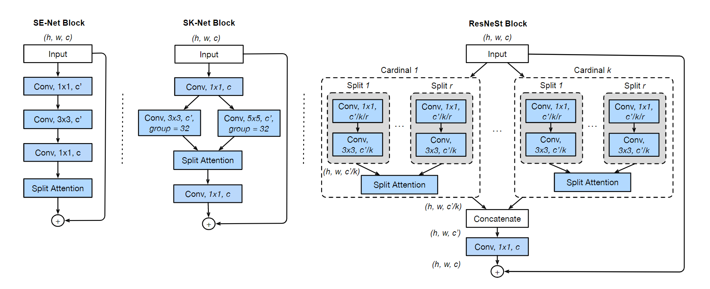
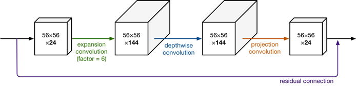
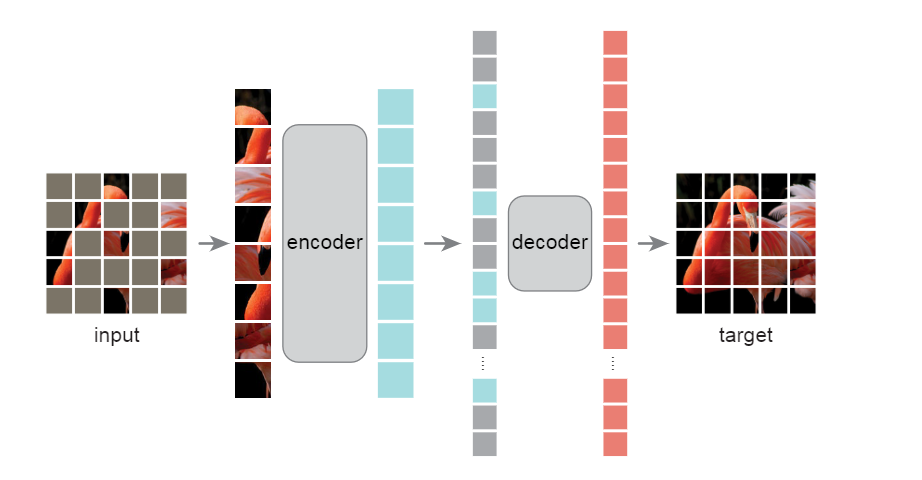
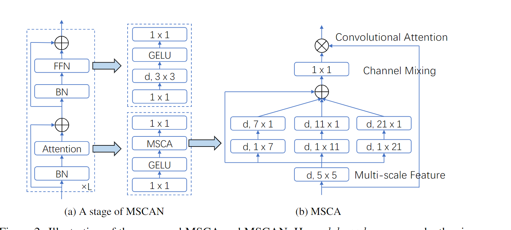
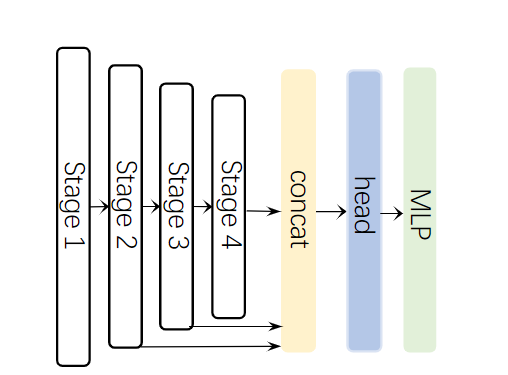

- [Backbone](#backbone)
  - [1.HRNet:Deep High-Resolution Representation Learning for Human Pose Estimation(2019)](#1hrnetdeep-high-resolution-representation-learning-for-human-pose-estimation2019)
  - [2.Resnest: Split-attention networks(2022)](#2resnest-split-attention-networks2022)
  - [3.Mobilenet v2: Inverted residuals and linear bottlenecks(2018)](#3mobilenet-v2-inverted-residuals-and-linear-bottlenecks2018)
  - [4.mobilenet v3:Searching for mobilenetv3(2019)](#4mobilenet-v3searching-for-mobilenetv32019)
  - [5.Beit: Bert pre-training of image transformers(2021)](#5beit-bert-pre-training-of-image-transformers2021)
  - [6.ConNext:A convnet for the 2020s(2022)](#6connexta-convnet-for-the-2020s2022)
  - [7.MAE:Masked autoencoders are scalable vision learners(2022)](#7maemasked-autoencoders-are-scalable-vision-learners2022)
  - [8.Segnext: Rethinking convolutional attention design for semantic segmentation(2022)](#8segnext-rethinking-convolutional-attention-design-for-semantic-segmentation2022)
- [Semantic Segmentation](#semantic-segmentation)
  - [1.Deeplab v3:Rethinking atrous convolution for semantic image segmentation(2017)](#1deeplab-v3rethinking-atrous-convolution-for-semantic-image-segmentation2017)
  - [2.Bisenet: Bilateral segmentation network for real-time semantic segmentation(2018)](#2bisenet-bilateral-segmentation-network-for-real-time-semantic-segmentation2018)
  - [3.Psanet: Point-wise spatial attention network for scene parsing(2018)](#3psanet-point-wise-spatial-attention-network-for-scene-parsing2018)
  - [4.Deeplab v3+:Encoder-decoder with atrous separable convolution for semantic image segmentation(2018)](#4deeplab-v3encoder-decoder-with-atrous-separable-convolution-for-semantic-image-segmentation2018)
  - [5.Icnet:Icnet for real-time semantic segmentation on high-resolution images(2018)](#5icneticnet-for-real-time-semantic-segmentation-on-high-resolution-images2018)
  - [6.Non-local neural networks(2018)](#6non-local-neural-networks2018)
  - [7.EncNet:Context encoding for semantic segmentation(2018)](#7encnetcontext-encoding-for-semantic-segmentation2018)
  - [8.DANet:Dual attention network for scene segmentation(2019)](#8danetdual-attention-network-for-scene-segmentation2019)
  - [9.CCNet: Criss-Cross Attention for Semantic Segmentation(2019)](#9ccnet-criss-cross-attention-for-semantic-segmentation2019)
  - [10.ANN:Asymmetric non-local neural networks for semantic segmentation(2019)](#10annasymmetric-non-local-neural-networks-for-semantic-segmentation2019)
  - [13.Gcnet: Non-local networks meet squeeze-excitation networks and beyond(2019)](#13gcnet-non-local-networks-meet-squeeze-excitation-networks-and-beyond2019)
  - [14.OCRNet:Object-contextual representations for semantic segmentation(2020)](#14ocrnetobject-contextual-representations-for-semantic-segmentation2020)
  - [15.Pointrend: Image segmentation as rendering(2020)](#15pointrend-image-segmentation-as-rendering2020)
  - [16.Bisenet v2: Bilateral network with guided aggregation for real-time semantic segmentation(2021)](#16bisenet-v2-bilateral-network-with-guided-aggregation-for-real-time-semantic-segmentation2021)
  - [17.DPT:Vision Transformer for Dense Prediction(2021)](#17dptvision-transformer-for-dense-prediction2021)
  - [18.Segmenter: Transformer for semantic segmentation(2021)](#18segmenter-transformer-for-semantic-segmentation2021)
  - [19.SegFormer: Simple and Efficient Design for Semantic Segmentation with Transformers(2021)](#19segformer-simple-and-efficient-design-for-semantic-segmentation-with-transformers2021)

# Backbone
## 1.HRNet:Deep High-Resolution Representation Learning for Human Pose Estimation(2019)
[论文链接](http://openaccess.thecvf.com/content_CVPR_2019/papers/Sun_Deep_High-Resolution_Representation_Learning_for_Human_Pose_Estimation_CVPR_2019_paper.pdf)

在姿态估计任务中提出了一个提取多尺度特征的主干网络HRNet，在整个过程中保留了高分辨率特征，有利于密集预测（位置敏感），不过运算成本肯定不低。文中最终只用了最高分辨率的特征图进行预测，当然可以结合多尺度一起预测。

- 如图所示，其中融合不同分辨率特征的部分（箭头）称为exchange unit，用卷积层下采样或最邻近上采样接1\*1卷积（统一通道数），相加得到对应尺度特征图。
- 图例中，第一次产生更低分辨率特征图时用了其余所有尺度特征图，代码和论文中只用了最邻近尺度的特征图

## 2.Resnest: Split-attention networks(2022)
[论文链接](https://openaccess.thecvf.com/content/CVPR2022W/ECV/papers/Zhang_ResNeSt_Split-Attention_Networks_CVPRW_2022_paper.pdf)

借鉴了SENet中的channel-wise注意力，ResNext中的group convolution，和SKNet中的split-attention，提出了一种更强的Resnest，没有什么新的方法

## 3.Mobilenet v2: Inverted residuals and linear bottlenecks(2018)
[论文链接](https://openaccess.thecvf.com/content_cvpr_2018/papers/Sandler_MobileNetV2_Inverted_Residuals_CVPR_2018_paper.pdf)

在mobile v1的深度可分离卷积基础上，引入了Linear Bottleneck和Inverted residuals

- Linear Bottleneck:论文中认为，对输入X，每个激活空间BX的分布相当于一个兴趣流形，流形可以映射到低维空间（分布更密集），而ReLU在引入非线性的同时会破坏流形中的信息，例如，如果激活空间BX维度比较低，$B^{-1}ReLU(BX)$恢复的X破坏很严重，高维则还好。我们在设计高效网络时，希望尽可能地降低维度，又不希望ReLU破坏太多信息，因此尝试在低维度的卷积操作后去除非线性层，以保留完整信息，作为一个Linear bottleneck。
- Inverted residuals：如图所示，v2先将输入升维（为了在3\*3卷积时提取更丰富的特征），再进行深度可分离卷积，最后通过Linear Bottleneck（没ReLU）降维。因为整个bloc两头薄中间厚，和residual block相反，所以得名

## 4.mobilenet v3:Searching for mobilenetv3(2019)
[论文链接](http://openaccess.thecvf.com/content_ICCV_2019/papers/Howard_Searching_for_MobileNetV3_ICCV_2019_paper.pdf)

在mobilenet v2的基础上提出v3，加入了很多trick，集大成者
- 引入SENet中的注意力机制，或者说自适应加权
- 使用NAS搜索最佳参数
- 引入了一种新的激活函数

## 5.Beit: Bert pre-training of image transformers(2021)
[论文链接](https://arxiv.org/pdf/2106.08254.pdf)

类似BERT，本文提出了image tensformer的自编码预训练模型BEIT
- 大致网络ViT差不多，image patch--40% mask--embedding(被mask的有专属标记)--add position--transformer encoder--predict Visual Token
- 训练过程：先训练一个dVAE,再根据MIM(Masked Image Modeling)任务训练
- 训练dVAE是希望获得每个patch的token(其实是就是一个索引，对一个大的表)，文中直接用的DELL-E的
- MIM任务，预测masked patch对应的Visual Token（softmax+对数）
- 文中使用dVAE的思想解释了BEIT的原理（损失函数），还验证了patch掩码比像素掩码效果好

## 6.ConNext:A convnet for the 2020s(2022)
[论文链接](https://openaccess.thecvf.com/content/CVPR2022/papers/Liu_A_ConvNet_for_the_2020s_CVPR_2022_paper.pdf)

本文借鉴ViT,将transformer的特性借鉴到CNN中，做了很充分的实验来改进网络，提出了一个集大成的纯CNN网络ConvNext，超过了Swin transformer
- 一个在ViT中讨论过的老问题，CNN的induced bias，比如translation equivariance。作者认为这依然是CNN的优势，因为Swin transformer里便借鉴了这一特性并超过ViT，由此认为纯CNN架构未免不能超过transformer，主要基于ResNet借鉴了以下特性来涨点
- 宏观设计：每个block的层数比例借鉴了ViT；Changing stem to “Patchify”，类似于SWin中的补丁化，用CNN做个步长为4，大小也为4的下采样
- 借鉴ResNeXt，引入深度可分离卷积和并行卷积
- 引入inverted bottleneck，并调整顺序，降低了参数量
- 将ReLU换成GELU，用更少的激活函数（非线性层），更少的正则化层，将BN换成LN,将下采样步骤独立出来（专门的一个卷积层）

## 7.MAE:Masked autoencoders are scalable vision learners(2022)
[论文链接](http://openaccess.thecvf.com/content/CVPR2022/papers/He_Masked_Autoencoders_Are_Scalable_Vision_Learners_CVPR_2022_paper.pdf)

借鉴BERT的mask+自编码方法，基于vision transformer的视觉表征预训练模型MAE

- 语言和视觉的信息密度有区别。语言具有丰富的语义特征，即使mask掉一小部分也可能有复杂的语言理解；而视觉的数据在空间上具有冗余性，为了克服与语言数据的gap，和克服冗余性更好的学到有用的信息，需要mask更大比率，如80%

- 只将没masked的patch输入编码器，因此可以构建较大的编码器；将统一的mask token插入编码器输入，输入解码器，输出对应patch的像素向量

## 8.Segnext: Rethinking convolutional attention design for semantic segmentation(2022)
[论文链接](https://arxiv.org/pdf/2209.08575.pdf?trk=public_post_comment-text)

本文提出了一个为了分割任务的简单卷积网络Segnext，结合了几个重要方法，如强大的encoder、多尺度特征、空间注意力
- encoder和transformer类似，但用卷积注意力替代了自注意力，文中说这种注意力更有效。其中还用了depth-wise的带状卷积，捕捉带状特征，感受野不变，减少参数

- decoder使用了多尺度特征图

# Semantic Segmentation
## 1.Deeplab v3:Rethinking atrous convolution for semantic image segmentation(2017)
[论文链接](https://arxiv.org/pdf/1706.05587.pdf%EF%BC%8C%E6%8E%A8%E8%8D%90%E5%9C%A8%E7%9C%8B%E5%AE%8C%E6%9C%AC%E6%96%87%E4%B9%8B%E5%90%8E%E4%BB%94%E7%BB%86%E9%98%85%E8%AF%BB%E8%AE%BA%E6%96%87%E4%BB%A5%E5%8F%8A%E4%BB%A3%E7%A0%81%EF%BC%8C%E5%8F%AF%E4%BB%A5%E6%9B%B4%E5%A5%BD%E7%90%86%E8%A7%A3%E3%80%82)
在deeplab v2的基础上进行了改进，提出了级联的或并联的应用了空洞卷积的模块，均优于v2
- 级联：将Resnet的后几个block改成空洞卷积，输入与输出分辨率不变，每个block之间、和内部的卷积层之间空洞卷积的膨胀系数均有区别，一方面防止grid problem，另一方面扩大感受野
- 并联（ASPP）：改进了两点，加入了BN；空洞卷积的膨胀系数太大的话，无效点（padding）的数量大大增加，达不到扩大感受野的目的，因此加入了Image-level特征（全局池化层），后接1\*1卷积和上采样，与ASPP输出拼接在一起

## 2.Bisenet: Bilateral segmentation network for real-time semantic segmentation(2018)
[论文链接](https://openaccess.thecvf.com/content_ECCV_2018/papers/Changqian_Yu_BiSeNet_Bilateral_Segmentation_ECCV_2018_paper.pdf)

本文提出了一种双边分割模型Bisenet，实现效果和效率的均衡

- 主要特点是，网络包括两条路径，context path和spatial path。前者通过快速的下采样pretrained主干网络Xception，扩大感受野。获得较低分辨率的含丰富语义特征的特征图，后接ARM(Attention refinement module)，其中包含全局池化；后者仅有三个卷积层，下采样8倍（因此尽管尺寸大但计算量不大），保留了原图像丰富的空间特征。
- 因为两条路径的信息的level不同，因此用FFM结合这两部分的特征。

## 3.Psanet: Point-wise spatial attention network for scene parsing(2018)
[论文链接](http://openaccess.thecvf.com/content_ECCV_2018/papers/Hengshuang_Zhao_PSANet_Point-wise_Spatial_ECCV_2018_paper.pdf)

引入point-wise注意力，考虑相对位置的同时考虑全局信息，每个点都自适应的通过一个可学习的注意力映射与其他所有点链接

- 建立了一个双向信息传播路径，逐点注意力包括两部分，第一部分为其他点j对目标点i预测的重要性，第二部分为目标点i对其他点j的重要性，这两部分对特征图上每个点都是H\*W维。文中先生成了一个2H-1\*2W-1维的特征图，通过聚焦于它的不同位置，获得每个点H\*W维注意力，得到attention map，将注意力图按公式可得每个点的特征。
- (输入特征图为H\*W\/$C_2$) collect中H\*W\*(H\*W)维的attention map，每个点的H\*W维向量表示H\*W每个点对该点的注意力分数，对应加权求和每个点的$C_2$维向量，可得该点的输出特征；distribution部分的attetion map，每个点的H\*W维向量表示该点对H\*W个点的重要性，所以求输出特征时，取全局每个点的H\*W维特征中的第i维作为该全局点对目标点i的注意力加权，累加可得输出特征

## 4.Deeplab v3+:Encoder-decoder with atrous separable convolution for semantic image segmentation(2018)
[论文链接](http://openaccess.thecvf.com/content_ECCV_2018/papers/Liang-Chieh_Chen_Encoder-Decoder_with_Atrous_ECCV_2018_paper.pdf)

为了在保证分辨率的同时加入语义信息，deeplab v3使用空洞卷积替代池化，从而保证尺寸的同时扩大了感受野，但是这种方法不如encoder-decoder对边界信息更细节。因此，deeplav v3+结合了encoder-decoder结构，将v3作为一个强大的encoder，之后加了一个简单的decoder，还探索了深度可分离空洞卷积（应用在ASPP和decoder）

## 5.Icnet:Icnet for real-time semantic segmentation on high-resolution images(2018)
[论文链接](https://openaccess.thecvf.com/content_ECCV_2018/papers/Hengshuang_Zhao_ICNet_for_Real-Time_ECCV_2018_paper.pdf)

提出了一个实时语义分割框架ICNet，利用级联图片输入，融合不同尺寸的特征图，实现coarse-to-fine预测，在低分辨率特征图使用完整网络，在高分辨率部分使用轻量级网络，从而显著减小计算量。

- 在CFF(cascade feature fusion)模块，使用双线性插值和空洞卷积实现不同尺寸特征图的融合

使用辅助损失，每个尺寸的特征图都会被用来预测并计算损失，最终损失会加权

## 6.Non-local neural networks(2018)
[论文链接](http://openaccess.thecvf.com/content_cvpr_2018/papers/Wang_Non-Local_Neural_Networks_CVPR_2018_paper.pdf)

本文提出一种 non-local 操作，和一个通用的non-local block，将self-attention统一到non-local的范式中，并提出了一些其他可能的选择。

## 7.EncNet:Context encoding for semantic segmentation(2018)
[论文链接](http://openaccess.thecvf.com/content_cvpr_2018/papers/Zhang_Context_Encoding_for_CVPR_2018_paper.pdf)

提出了 Context Encoding Module,编码上下文信息，类似于SENet，对特征图的每个通道加权

- ENC模块中的encoder layer，通过传统方法得到K个语义词，利用softmax加权得到每个像素对每个语义词的残差特征，累加得整张图对每个语义词的残差特征
- 将encoder layer的输出input全连接层，得到每个通道的权重
- 引入了辅助任务，SE-loss，GT可以从分割GT中获得，每个类别的二元交叉熵

## 8.DANet:Dual attention network for scene segmentation(2019)
[论文链接](https://openaccess.thecvf.com/content_CVPR_2019/papers/Fu_Dual_Attention_Network_for_Scene_Segmentation_CVPR_2019_paper.pdf)

为了更好的捕捉上下文信息（全局信息）和通道间的联系，本文提出了一种双注意力网络DANet，使用两个注意力模块来得到更好的特征表示

position attention module，计算特征图H\*W维度的自注意力，得到(H\*W)\*(H\*W)的注意力分数矩阵，计算加权值；channel attention module，计算特征图通道维度的自注意力，得到C\*C的注意力分数矩阵，再计算加权值。最后将二者融合。

## 9.CCNet: Criss-Cross Attention for Semantic Segmentation(2019)
[论文链接](http://openaccess.thecvf.com/content_ICCV_2019/papers/Huang_CCNet_Criss-Cross_Attention_for_Semantic_Segmentation_ICCV_2019_paper.pdf)

最近利用上下文信息的注意力模块/non-local模块，都需要生成尺寸很大的注意力分数矩阵(H\*W)\*(H\*W)，计算量和占用内存大。本文提出一种新的聚合全局特征的注意力模块CCA，每个点仅在当前行和列计算注意力，注意力分数矩阵为H\*W\*(H+W-1)，大大减小。并通过循环输入CCA，获取全局信息

## 10.ANN:Asymmetric non-local neural networks for semantic segmentation(2019)
[论文链接](http://openaccess.thecvf.com/content_ICCV_2019/papers/Zhu_Asymmetric_Non-Local_Neural_Networks_for_Semantic_Segmentation_ICCV_2019_paper.pdf)
和CCNet一样，本文针对non-local的弊端，提出了ANN，应用了也基于注意力的APNB(Asymmetric Pyramid Non-local Block)和AFNB(symmetric Fusion Non-local Block)，前者提取全局特征，后者融合多尺度特征

APNB和AFNB区别在于，将注意力模块的key和query的维度通过采样由C\*HW降到了C\*S，其中S远小于HW，采样方式为SPP模块，这样也融合了多尺度特征。

## 13.Gcnet: Non-local networks meet squeeze-excitation networks and beyond(2019)
[论文链接](http://openaccess.thecvf.com/content_ICCVW_2019/papers/NeurArch/Cao_GCNet_Non-Local_Networks_Meet_Squeeze-Excitation_Networks_and_Beyond_ICCVW_2019_paper.pdf)

依然是为了简化non-local，本文先提出，他们发现non-local捕捉的注意力图对所有query几乎一样，从而提出了一个共享注意力图H\*W的简化non-local块。文中将SENet和简化的non-local块统一成Global context modeling framework，并将二者的优势结合，先计算全局注意力（query共享注意力图）H\*W，再与C\*HW相乘，得到C维张量，通过两个1\*1的bottleneck，与C\*H\*W相加（残差连接）。由广播机制，其实相当于每个像素经注意力加权后的特征都相等，等于输出的C维向量

## 14.OCRNet:Object-contextual representations for semantic segmentation(2020)
[论文链接](https://www.ecva.net/papers/eccv_2020/papers_ECCV/papers/123510171.pdf)

本文聚焦于聚合上下文特征，与过去的ASPP和最近的non-local方法不同，本文将像素与对象区域的上下文特征丰富进特征

设backbone输出的特征图为H\*W\*C
- soft object region:K\*H\*W.为每张图预测K个object region，其中每个region为一个2D图，每个像素的值表示该像素与该类的相关性。此过程是有监督的，与GT生成的新GT做交叉熵
- object region representation:用soft object region分别加权像素特征求和，最终得到K个C维向量，每个向量表示该对象区域的特征
- Pixel-Region Rela:通过点乘+softmax计算每个像素点与每个对象区域的相关性，得到H\*W\*K，与原像素特征叠起来，进行预测
- 在上述过程的特征结合时都有个transformation,1\*1+BN+ReLU

## 15.Pointrend: Image segmentation as rendering(2020)
[论文链接](http://openaccess.thecvf.com/content_CVPR_2020/papers/Kirillov_PointRend_Image_Segmentation_As_Rendering_CVPR_2020_paper.pdf)

本文将分割任务视作渲染来解决边缘精度的问题，本质上是一种新的上采样方式，针对难点估计

对于CNN提取出的细粒度特征图，先采用一个轻量分割网络得到coarse predict(7\*7)。应用双线性插值，将分辨率翻倍，在这些点中挑出N个“难点”（置信度低，或者说边界处），利用一个MLP对这些点做点预测（特征来自特征图和粗预测图），并更新预测图，再双线性插值，迭代直到预测图的分辨率大于等于原图。

## 16.Bisenet v2: Bilateral network with guided aggregation for real-time semantic segmentation(2021)
[论文链接](https://arxiv.org/pdf/2004.02147)

沿用了Bisenet v1的设计，分别用语义分支和细节分支捕捉上下文特征和细粒度特征。相比v1，本文精心设计了语义分支，包括快速下采样的并行卷积stem block，应用了深度可分离卷积聚合特征的Gather-and-Expansion Layer，和放在最后捕捉高层次特征的Context Embedding Block（全局池化再1\*1再残差相加）。本文还精心设计了特征聚合模块，将两个分支的特征按不同level分别聚合，得到更好的表征，

## 17.DPT:Vision Transformer for Dense Prediction(2021)
[论文链接](http://openaccess.thecvf.com/content/ICCV2021/papers/Ranftl_Vision_Transformers_for_Dense_Prediction_ICCV_2021_paper.pdf)

提出用于密集预测的vision transformer DPT，加入了更多卷积特性。

- encoder部分和ViT一样，加入了一个用于分类的readout token，该token在read操作中被忽略/作为全局特征融合。
- decoder：对不同transformer块的输出组装成**不同分辨率**的类似于图像的形式，这是通过bottleneck和上/下采样，其中较low的transformer块会被组装成更大分辨率的表示，因为其中包含更多细粒度特征。之后还使用了类似于refinenet的方式，融合多尺度的特征图

## 18.Segmenter: Transformer for semantic segmentation(2021)
[论文链接](https://openaccess.thecvf.com/content/ICCV2021/papers/Strudel_Segmenter_Transformer_for_Semantic_Segmentation_ICCV_2021_paper.pdf)

本文提出了一种新的mask transformer decoder，从而提出Segmenter模型

- encoder和ViT一样
- 将encoder输出的K个patch encoding和可学习的随机初始化的K个class嵌入一起输入mask transformer，维度均为D。将输出的每个patch嵌入和类嵌入做点积，(N\*D)\*(D\*K)=N\*K，从而得到每个patch的类掩码，再reshape和上采样得到预测图

## 19.SegFormer: Simple and Efficient Design for Semantic Segmentation with Transformers(2021)
[论文链接](https://proceedings.neurips.cc/paper/2021/file/64f1f27bf1b4ec22924fd0acb550c235-Paper.pdf)

本文提出了一种简单高效的基于transformer的语义分割模型Segmenter

- 类似于Swin transformer，在encoder中通过合并补丁来获得不同分辨率的特征图，区别在于，Segmenter合并的是重叠的补丁，来保持合并后的局部连续性
- 通过在encoder的FFN中加入3\*3深度卷积，可以提供足够的位置信息，从而省略了位置编码
- 使用了一个轻量级的ALL-MLP的decoder，先将不同分辨率的特征图统一维度和尺寸，再通过MLP预测。可以这样做的关键是，encoder提供的多尺度特征图的信息很丰富，感受野更大