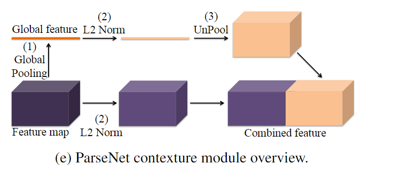
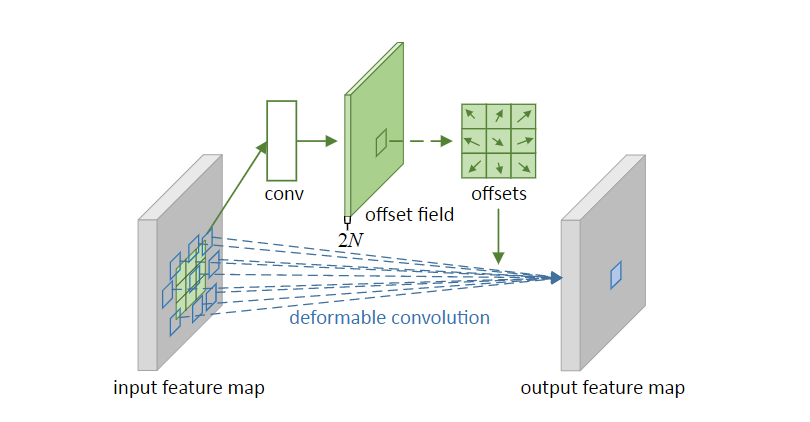

- [Backbone](#backbone)
  - [1.Xception: Deep Learning with Depthwise Separable Convolutions(2017)](#1xception-deep-learning-with-depthwise-separable-convolutions2017)
  - [2.Parsenet: Looking wider to see better(2015)](#2parsenet-looking-wider-to-see-better2015)
  - [3.Shufflenet: An extremely efficient convolutional neural network for mobile devices(2018)](#3shufflenet-an-extremely-efficient-convolutional-neural-network-for-mobile-devices2018)
  - [4.Shufflenet v2: Practical guidelines for efficient cnn architecture design(20)](#4shufflenet-v2-practical-guidelines-for-efficient-cnn-architecture-design20)
- [Portrait segmentation](#portrait-segmentation)
  - [1.PortraitNet: Real-time Portrait Segmentation Network for Mobile Device(2019)](#1portraitnet-real-time-portrait-segmentation-network-for-mobile-device2019)
  - [2.Boundary-sensitive network for portrait segmentation(2019)](#2boundary-sensitive-network-for-portrait-segmentation2019)
  - [3.Sinet: Extreme lightweight portrait segmentation networks with spatial squeeze module and information blocking decoder(2020)](#3sinet-extreme-lightweight-portrait-segmentation-networks-with-spatial-squeeze-module-and-information-blocking-decoder2020)
  - [4.PP-HumanSeg: Connectivity-Aware Portrait Segmentation with a Large-Scale Teleconferencing Video Dataset(0222)](#4pp-humanseg-connectivity-aware-portrait-segmentation-with-a-large-scale-teleconferencing-video-dataset0222)
- [Real-Time Semantic Segmentation](#real-time-semantic-segmentation)
  - [1.Enet: A deep neural network architecture for real-time semantic segmentation(2016)](#1enet-a-deep-neural-network-architecture-for-real-time-semantic-segmentation2016)
  - [2.Erfnet: Efficient residual factorized convnet for real-time semantic segmentation(2017)](#2erfnet-efficient-residual-factorized-convnet-for-real-time-semantic-segmentation2017)
  - [3.ShelfNet for Fast Semantic Segmentation(2018)](#3shelfnet-for-fast-semantic-segmentation2018)
  - [4.Contextnet: Exploring context and detail for semantic segmentation in real-time(2018)](#4contextnet-exploring-context-and-detail-for-semantic-segmentation-in-real-time2018)
  - [4.Espnet: Efficient spatial pyramid of dilated convolutions for semantic segmentation(2018)](#4espnet-efficient-spatial-pyramid-of-dilated-convolutions-for-semantic-segmentation2018)
  - [5.Espnetv2: A light-weight, power efficient, and general purpose convolutional neural network(2019)](#5espnetv2-a-light-weight-power-efficient-and-general-purpose-convolutional-neural-network2019)
  - [4.Fast-scnn: Fast semantic segmentation network(2019)](#4fast-scnn-fast-semantic-segmentation-network2019)
  - [5.swiftnetRN:In defense of pre-trained imagenet architectures for real-time semantic segmentation of road-driving images(2019)](#5swiftnetrnin-defense-of-pre-trained-imagenet-architectures-for-real-time-semantic-segmentation-of-road-driving-images2019)
  - [6.Dfanet: Deep feature aggregation for real-time semantic segmentation(2019)](#6dfanet-deep-feature-aggregation-for-real-time-semantic-segmentation2019)
  - [7.MSFNet:Real-time semantic segmentation via multiply spatial fusion network(2019)](#7msfnetreal-time-semantic-segmentation-via-multiply-spatial-fusion-network2019)
  - [8.CGNet: A Light-weight Context Guided Network for Semantic Segmentation(2020)](#8cgnet-a-light-weight-context-guided-network-for-semantic-segmentation2020)
  - [9.SFNet:Semantic flow for fast and accurate scene parsing(2020)](#9sfnetsemantic-flow-for-fast-and-accurate-scene-parsing2020)
  - [10.Real-time semantic segmentation with fast attention(2020)](#10real-time-semantic-segmentation-with-fast-attention2020)
  - [11.RegSeg:Rethink dilated convolution for real-time semantic segmentation(2021)](#11regsegrethink-dilated-convolution-for-real-time-semantic-segmentation2021)
  - [12.STDC:Rethinking BiSeNet For Real-time Semantic Segmentation(2021)](#12stdcrethinking-bisenet-for-real-time-semantic-segmentation2021)
  - [13.DDRNet:Deep dual-resolution networks for real-time and accurate semantic segmentation of road scenes(2021)](#13ddrnetdeep-dual-resolution-networks-for-real-time-and-accurate-semantic-segmentation-of-road-scenes2021)
  - [14.Pp-liteseg: A superior real-time semantic segmentation model(2022)](#14pp-liteseg-a-superior-real-time-semantic-segmentation-model2022)
  - [15.PIDNet: A Real-time Semantic Segmentation Network Inspired from PID Controller(2022)](#15pidnet-a-real-time-semantic-segmentation-network-inspired-from-pid-controller2022)
  - [SFNet: Faster, Accurate, and Domain Agnostic Semantic Segmentation via Semantic Flow(2022)](#sfnet-faster-accurate-and-domain-agnostic-semantic-segmentation-via-semantic-flow2022)
  - [16.DWRSeg: Dilation-wise Residual Network for Real-time Semantic Segmentation(2022)](#16dwrseg-dilation-wise-residual-network-for-real-time-semantic-segmentation2022)
  - [17.LETNet:Lightweight Real-time Semantic Segmentation Network with Efficient Transformer and CNN(2023)](#17letnetlightweight-real-time-semantic-segmentation-network-with-efficient-transformer-and-cnn2023)
- [Semantic segmentation](#semantic-segmentation)
  - [1.ISANet:Interlaced Sparse Self-Attention for Semantic Segmentation()](#1isanetinterlaced-sparse-self-attention-for-semantic-segmentation)
  - [2.FastFCN: Rethinking Dilated Convolution in the Backbone for Semantic Segmentation(2019)](#2fastfcn-rethinking-dilated-convolution-in-the-backbone-for-semantic-segmentation2019)
  - [3.Adaptive pyramid context network for semantic segmentation(2019)](#3adaptive-pyramid-context-network-for-semantic-segmentation2019)
  - [4.Expectation-maximization attention networks for semantic segmentation(2019)](#4expectation-maximization-attention-networks-for-semantic-segmentation2019)
  - [5.Dynamic Multi-scale Filters for Semantic Segmentation(2019)](#5dynamic-multi-scale-filters-for-semantic-segmentation2019)
  - [6.DNLNet:Disentangled non-local neural networks(2020)](#6dnlnetdisentangled-non-local-neural-networks2020)
  - [7.MaskFormer: Per-Pixel Classification is Not All You Need for Semantic Segmentation(2021)](#7maskformer-per-pixel-classification-is-not-all-you-need-for-semantic-segmentation2021)
  - [8.Mask2Former:Masked-attention mask transformer for universal image segmentation(2022)](#8mask2formermasked-attention-mask-transformer-for-universal-image-segmentation2022)
- [others](#others)
  - [1.Deformable Convolutional Networks(2017)](#1deformable-convolutional-networks2017)
  - [2.Deformable ConvNets v2: More Deformable, Better Results(2019)](#2deformable-convnets-v2-more-deformable-better-results2019)
# Backbone
## 1.Xception: Deep Learning with Depthwise Separable Convolutions(2017)

[论文链接](https://openaccess.thecvf.com/content_cvpr_2017/papers/Chollet_Xception_Deep_Learning_CVPR_2017_paper.pdf)

从Inception模块出发，推导出深度可分离卷积的概念，分别在空间和通道维度进行卷积，利用深度可分离卷积设计神经网络Xception，改进了resnet和inception，应用bottleneck降维和depthwise

## 2.Parsenet: Looking wider to see better(2015)

[论文链接](https://arxiv.org/pdf/1506.04579.pdf)

融合全局特征的Parsenet，L2 norm是为了统一范数差距太大的特征，上采样是为了增大全局特征的影响

## 3.Shufflenet: An extremely efficient convolutional neural network for mobile devices(2018)
[论文链接](http://openaccess.thecvf.com/content_cvpr_2018/papers/Zhang_ShuffleNet_An_Extremely_CVPR_2018_paper.pdf)

mobilenet将bottleneck(1\*1+3\*3+1\*1)中的3\*3卷积优化成深度可分离卷积，大大减小了开销。但是，此时bottleneck中1\*1卷积的计算开销占了90+%，shufflenet引入分组卷积，优化了1\*1卷积的部分。因为级联的分组卷积会导致组间特征不交流，本文引入了可学习的channel shuffle，从而使组间特征交流。

## 4.Shufflenet v2: Practical guidelines for efficient cnn architecture design(20)
[论文链接](https://openaccess.thecvf.com/content_ECCV_2018/papers/Ningning_Light-weight_CNN_Architecture_ECCV_2018_paper.pdf)

本文提出，使用FLOPs设计轻量级网络是一种间接指标，提出了四条原则，并以此改进shuffle v1
- 同等通道大小最小化内存访问量。输入和输出通道数相等时内存访问量最小，因此将v1中的botleneck变为输入与输出通道数相等
- 过量使用组卷积会增加MAC。分组不宜过多，将v1中的组卷积恢复成正常卷积
- 网络碎片化会降低并行度。分组是一种碎片化，因此取消了
- 不能忽略元素级操作（如ADD,Relu）。取消v1的残差连接，换为concatation

- 具体实现时，先将channel分组，其中一部分使用恒等映射并与另一部分的输出concatation起来，并进行shuffle

# Portrait segmentation
## 1.PortraitNet: Real-time Portrait Segmentation Network for Mobile Device(2019)
[论文链接](http://www.yongliangyang.net/docs/mobilePotrait_c&g19.pdf)

人像分割作为语义分割的一个子领域，面临着独有的挑战：1. 人像在图片中占的面积很大；2.模糊的边界条件和复杂的光照条件。本文提出了基于mobilenet v2的encoder-decoder模型PortraitNet，实现实时人像检测的精度和效率平衡，其中还使用了skip connection,depthwise conv和辅助loss

- 第一个辅助loss为边界loss，在decoder的最后一层特征图后，加了一个预测边界的卷积层，使用focal loss预测边界（因为边界占的正例占比很少），从而使分割对边界更敏感
- 一致约束loss：将原图片A和经过纹理增强（改变亮度、对比度、锐度，加入随机噪声等）的A'都输入网络，并预测。此时认为，A为更精细的分割，从而使用KL散度loss约束A'向A靠拢，这可以增强网络对复杂光照环境的鲁棒性

- 使用FLOPs，参数量来比较速度

## 2.Boundary-sensitive network for portrait segmentation(2019)
[论文链接](https://arxiv.org/pdf/1712.08675)

主干是Resnet+deeplab v2的分割框架，文中为了人像分割设计了对边界敏感的模块

- 将原图的GT转变为soft label，前景和背景都是one hot，边界类为三元浮点向量，分割预测的类别有三类，从而修正交叉熵为加权交叉熵，边界有更多的权重，也提供了更多边界信息
- 将训练集的所有GT图取平均mask，若一个像素点的均值靠近0/1，则该像素点倾向为背景/前景，若靠近0.5，则倾向于边界。global boundary-sensitive kernel便按mask均值，边界概率高的像素点取更高的值，加权每个像素点的loss，从而使模型对困难的像素点（边界）更敏感
- 并行训练了一个边界属性的分类器（长发/短发）

## 3.Sinet: Extreme lightweight portrait segmentation networks with spatial squeeze module and information blocking decoder(2020)
[论文链接](http://openaccess.thecvf.com/content_WACV_2020/papers/Park_SINet_Extreme_Lightweight_Portrait_Segmentation_Networks_with_Spatial_Squeeze_Module_WACV_2020_paper.pdf)

和Portraitnet相比，本文提出的Sinet大大减小了参数量，精度下降较少，主要创新了两个模块 Information Blocking Decoder和 Spatial Squeeze module

- Information Blocking Decoder:在获取细节信息时，如低分辨率特征图融合高分辨率特征图时，后者信息太丰富会引入冗余/噪声。本模块的设计目的是让低分辨率的特征图在高分辨率特征图中更关注必要的局部信息，在低分辨率特征图后并行预测一个置信度图（边界往往置信度低）c，用1-c来加权高分辨率特征图，再将其与低分辨率特征图融合
- Spatial Squeeze module:本模块的设计目的是获得不同尺度的全局信息。S2 block通过池化获取上下文信息，S2 module先用bottleneck降低维度(分组卷积，减小计算量)，又并行连接两个分辨率不同的S2 block
- 辅助loss:用来解决边界问题。对GT进行形态学膨胀和腐蚀的数据增强，相减获得边界的GT，让边界GT和预测图对应位置算loss来加强对边界的敏感性
  

## 4.PP-HumanSeg: Connectivity-Aware Portrait Segmentation with a Large-Scale Teleconferencing Video Dataset(0222)
[论文链接](https://openaccess.thecvf.com/content/WACV2022W/HADCV/papers/Chu_PP-HumanSeg_Connectivity-Aware_Portrait_Segmentation_With_a_Large-Scale_Teleconferencing_Video_Dataset_WACVW_2022_paper.pdf)
本文提出了一个超轻量级的人像分割模型ConnectNet,用极少的参数(0.13M)实现了很强的效果。关键是提出了一种新的loss，使模型自我学习连通性。
- 网络很简单，深度可分离卷积，只用了一个skip，上采样后接bottleneck
  
- SCL: Self-supervised Connectivity-aware
Learning for Portrait Segmentation:

   - 先将pre和GT的连通性组件匹配，再计算连通性SC。loss=1-SC，由公式可以看出，这个loss将使模型倾向于产生数据更少的连通性组件，并使连通性组件的交并比更大，很巧妙！
   - 有个问题，训练刚开始时，可能没有交集，此时loss为0，参数不更新。没有交集的情况使用了一种别的loss，$loss=\frac{|P+G|}{|I|}$，绝对值指像素数，I是整张图片，使P和G的并集减小，倾向于融合。

# Real-Time Semantic Segmentation

## 1.Enet: A deep neural network architecture for real-time semantic segmentation(2016)
[论文链接](https://arxiv.org/pdf/1606.02147.pdf)
设计了一个实时分割网络，使用了很多trick

- 减少下采样和上采样过程的分割精度丢失，用segnet的方法上采样
- 非对称的Encoder-Decoder结构，降低参数量
- 激活函数使用PReLU，而非ReLU
- 将标准卷积分解成两个带状卷积，残差链接的另一边不是恒等连接而是max pool
- 使用空洞卷积，正则化
- 改进了bottleneck的1\*1步长为2的卷积，换为了2\*2的；并在池化降低尺寸后，使用卷积提高维度
## 2.Erfnet: Efficient residual factorized convnet for real-time semantic segmentation(2017)
[论文链接](http://www.robesafe.com/personal/roberto.arroyo/docs/Romera17tits.pdf)

Enet虽然参数小，但精度太差。本文改进残差快，提出erfnet

- 原resnet提出两种残差块，而这参数和精度类似。bottleneck类型(b)因随深度增加，计算成本更小而广被使用；而一些论文中提到，随深度增加，(a)类准确性更高。
- Enet改进了(b)类，本文改进(a)类来提高精度。它提出了factorized residual layers分解卷积，是标准卷积的“低秩近似”

## 3.ShelfNet for Fast Semantic Segmentation(2018)
[论文链接](https://arxiv.org/pdf/1811.11254v6.pdf)
shelfnet中有多个encoder-decoder对，提高了精度，并通过降低通道数来减小计算负担

- 2，4相当于decoder，0、3相当于encoder。1的1\*1卷积将CNN提取的特征图降维4倍
- 为什么效果好？作者认为，shelfnet相当于多个FCN的集成，特征图尺寸有4种的segnet相当于4个FCN，而Shelfnet相当于29个（应该是组合数学的知识）；并且，shelfnet相当于deep和shallow路径的集成
- S-Block中的两个3\*3卷积共享权重，作者说借鉴了RNN，并且BN层是不同的，在不降低精度的同时大大减少参数
## 4.Contextnet: Exploring context and detail for semantic segmentation in real-time(2018)
[论文链接](https://arxiv.org/pdf/1805.04554)
## 4.Espnet: Efficient spatial pyramid of dilated convolutions for semantic segmentation(2018)
[论文链接](http://openaccess.thecvf.com/content_ECCV_2018/papers/Sachin_Mehta_ESPNet_Efficient_Spatial_ECCV_2018_paper.pdf)

## 5.Espnetv2: A light-weight, power efficient, and general purpose convolutional neural network(2019)
[论文链接](http://openaccess.thecvf.com/content_CVPR_2019/papers/Mehta_ESPNetv2_A_Light-Weight_Power_Efficient_and_General_Purpose_Convolutional_Neural_CVPR_2019_paper.pdf)

## 4.Fast-scnn: Fast semantic segmentation network(2019)
[论文链接](https://arxiv.org/pdf/1902.04502)

本文提出的Fast-SCNN借鉴了encoder-decoder和双分支结构

- 先用几层卷积来下采样(learning to downsample)，比较浅，相当于双分支结构里的空间分支
- globla feature extractor利用级联的inverted bottleneck和PPM，提取全局特征，相当于上下文分支
- FFM将两个分支的特征融合起来，整个过程相当于两个分支共享前几层的计算.FFM相当于一个skip连接，encoder-decoder结构。

## 5.swiftnetRN:In defense of pre-trained imagenet architectures for real-time semantic segmentation of road-driving images(2019)
[论文链接](http://openaccess.thecvf.com/content_CVPR_2019/papers/Orsic_In_Defense_of_Pre-Trained_ImageNet_Architectures_for_Real-Time_Semantic_Segmentation_CVPR_2019_paper.pdf)

本文认为，利用轻量级的通用语义分割模型+横向连接+简单的解码器可以实现效果和效率的均衡。之前的许多实时分割模型认为预训练没用，本文证明了其作用

训练时使用image金字塔，encoder共享权重，通过金字塔融合和SPP实现扩大感受野
## 6.Dfanet: Deep feature aggregation for real-time semantic segmentation(2019)
[论文链接](http://openaccess.thecvf.com/content_CVPR_2019/papers/Li_DFANet_Deep_Feature_Aggregation_for_Real-Time_Semantic_Segmentation_CVPR_2019_paper.pdf)

## 7.MSFNet:Real-time semantic segmentation via multiply spatial fusion network(2019)
[论文链接](https://arxiv.org/pdf/1911.07217)
降低网络深度会降低感受野，降低通道数会限制特征表示空间，因此希望可以扩大感受野，而且可以恢复空间损失

- Multi-features Fusion Module：一个轻量高效的网络，通过SAP(Spatial Aware Pooling),在每个感受野级别都有很好的空间信息恢复，并且将不同感受野层次（不同残差块）相同分辨率的特征融合起来，并且在不增加计算成本的情况下大大提高了性能
- 提出了新的Class Boundary Supervision任务，对MFM收集到的特征进行两个并行独立的快速上采样，其中一个用来有监督的做边界预测，最终loss是加权和

## 8.CGNet: A Light-weight Context Guided Network for Semantic Segmentation(2020)
[论文链接](https://arxiv.org/pdf/1811.08201)

本文旨在捕获所有阶段的上下文特征，专为分割设计的网络，提出GC block，进而以其为主干提出GCNet

- CG block中，loc提取局部特征，sur提取上下文特征，joi将两部分特征拼起来，glo借鉴se融合全局特征，从而实现在每个阶段都捕获上下文特征,扩展了non-local的概念。（其他模型往往在编码阶段过后才有上下文模块，如ASPP,SPP）
- CG block中只进行逐通道卷积(depth-wise)，实验表明如果加个1\*1，效果降低很多，给出的可能的解释为"the local
feature and the surrounding context feature need to maintain channel independence"

## 9.SFNet:Semantic flow for fast and accurate scene parsing(2020)
[论文链接](https://arxiv.org/pdf/2002.10120)
文中认为不同层的语义之间存在gap，借鉴光流（两帧之间的动作差异？），认为不同分辨率的特征图可看作语义流，我们通过学习流场，可以统一语义信息的level，减小在融合不同分辨率的特征图时减小信息损失，提出了 Flow Alignment Module，并将其应用到FPN结构中，得到SFNet

- 融合两个分辨率的特征图h(高分辨率),l时，先将l双线性采样（按照h分辨率的标准网格采样）到高分辨率，再conca作为输入，得到流场（预测的是每个像素点的偏移）。使用流场修正h分辨率的标准网格（采样点的位置变了），再次采样l得到h分辨率的特征图，和原h相加得到输出（这类似于一个残差）
- FAM模块可以广泛应用到融合不同分辨率特征的模块中
- 在主干的FPN网络中，他还将top-down路径中的各特征图统一到最终的特征图中，一起进行预测
- 整个FAM只用到几个1\*1和3\*3，其他都是无需学习的变换，参数量很小

## 10.Real-time semantic segmentation with fast attention(2020)
[论文链接](https://ieeexplore.ieee.org/ielaam/7083369/9223766/9265219-aam.pdf)

## 11.RegSeg:Rethink dilated convolution for real-time semantic segmentation(2021)
[论文链接](https://arxiv.org/pdf/2111.09957)

主干网络没有视野，提取特征不好，本文提出一种dilate block(D block)，并通过级联D block得到RegSeg.

 - D block利用了分组卷积来加速，借鉴了SE模块，使用了不同膨胀率的空洞卷积，其中往往将一个group的扩张率设为1，从而在扩大感受野的同时保留局部信息
 - 主干编码器就是D block的堆叠，步长为2的D block有一点差别
## 12.STDC:Rethinking BiSeNet For Real-time Semantic Segmentation(2021)
[论文链接](http://openaccess.thecvf.com/content/CVPR2021/papers/Fan_Rethinking_BiSeNet_for_Real-Time_Semantic_Segmentation_CVPR_2021_paper.pdf)

优化Bisenet的双路径注意力的冗余，提出了细节分支（可以应用到所有框架中，只在训练使用，算个辅助任务）
- 首先是STDC(Short-Term Dense Concatenate Module)块
  
上图为步长为1的STDC块，将输入输入级联的block，在这个过程中获得不同尺度的感受野，并且维度不断降低（因为语义信息更集中），并且可证明（文中有）block的数量对参数的影响很小（本质大概是因为通道数是指数级递减的，block多了之后的参数很少），最终将不同block的特征图连接起来。通过STDC块，我们得到多尺度的特征，并可以通过改变block数量获得可扩展的感受野
- 通过级联STDC块作为网络主干，提出STDC网络
	  
  每个stage下采样两倍，stage 1&2由一个卷积块组成，后面都由1个步长为2的STDC块和N个步长为1的组成。将stage3的输出作为空间分支，将stage4&5的输出和最后的全局池化结果作为上下文分支，接入ARM(和SE相似)，最终将两条路径的特征接入FFM(也和SE相似)
- 在训练时引入辅助任务，在测试时不用，因此在实时分割中可泛化。将空间分支的结果接入detail head，将输出与细节GT做二元交叉熵，细节GT由步长不同的拉普拉斯卷积核+可学习的1\*1卷积，并取阈值得到GT细节图，GT细节图和预测使用了二元交叉熵和Dice的联合损失（细节所占的比例较细小）。原理我认为是，拉普拉斯卷积核是一种可以提取边缘信息的卷积核，可以找到突变，从图形化角度。
## 13.DDRNet:Deep dual-resolution networks for real-time and accurate semantic segmentation of road scenes(2021)
[论文链接](https://arxiv.org/pdf/2101.06085)

本文优化了双边结构，提出一个新的主干网络DDRNet，除了共享前几层下采样，还进行了多次双边信息融合，并且提出了一个新的上下文模块DASPP，捕捉多尺度且扩大有效感受野。
- DASPP:使用大内核和大步长的池化，在低分辨率的特征图上及进行多尺度的池化，并且将不同尺度的特征融合，获得比过去SPP模块更强的特征表征。因为DASPP作用于最低分辨率的特征图，所以增加的卷积层不太影响推理速度。

- DDRNet:精心设计了双边信息融合模块，在上下文分支最后使用了DASPP，再上采样融合进行预测。训练时引入辅助loss。最终效果很好。

## 14.Pp-liteseg: A superior real-time semantic segmentation model(2022)
[论文链接](https://arxiv.org/pdf/2204.02681)
提出了几个新的模块，一个特征融合模块Unified Attention Fusion Module，一个聚合全局上下文信息的Simple Pyramid Pooling Module（简化了SPP），得到一个新网络Pp-liteseg

- UAFM：利用空间注意力（沿通道做均值和max，对4\*H\*W做变换得到H\*W的分数$\alpha$）和通道注意力（对特征图做最大池化和平均池化，做变换得到C维分数$\alpha$）增强特征表示，用$\alpha$加权得到$out=\alpha up+(1-\alpha)high$，和一般意义的注意力不一样

- SPPM:简化了SPP，减小过程中和输出的通道数，减少分支数，删去shortcut(残差连接)，将连接换为相加
- Flexible and Lightweight Decoder,其实就是随着解码降低维度
## 15.PIDNet: A Real-time Semantic Segmentation Network Inspired from PID Controller(2022)
[论文链接](https://arxiv.org/pdf/2206.02066.pdf?trk=public_post_comment-text)

## SFNet: Faster, Accurate, and Domain Agnostic Semantic Segmentation via Semantic Flow(2022)
[论文链接](https://arxiv.org/pdf/2207.04415)

## 16.DWRSeg: Dilation-wise Residual Network for Real-time Semantic Segmentation(2022)
[论文链接](https://arxiv.org/pdf/2212.01173)

## 17.LETNet:Lightweight Real-time Semantic Segmentation Network with Efficient Transformer and CNN(2023)
[论文链接](https://arxiv.org/pdf/2302.10484)

# Semantic segmentation
## 1.ISANet:Interlaced Sparse Self-Attention for Semantic Segmentation()
Ocnet: Object context network for scene parsing,
## 2.FastFCN: Rethinking Dilated Convolution in the Backbone for Semantic Segmentation(2019)
[论文链接](https://arxiv.org/pdf/1903.11816)

## 3.Adaptive pyramid context network for semantic segmentation(2019)
[论文链接](http://openaccess.thecvf.com/content_CVPR_2019/papers/He_Adaptive_Pyramid_Context_Network_for_Semantic_Segmentation_CVPR_2019_paper.pdf)

## 4.Expectation-maximization attention networks for semantic segmentation(2019)
[论文链接](https://openaccess.thecvf.com/content_ICCV_2019/papers/Li_Expectation-Maximization_Attention_Networks_for_Semantic_Segmentation_ICCV_2019_paper.pdf)

Denseaspp for semantic segmentation in street scenes
## 5.Dynamic Multi-scale Filters for Semantic Segmentation(2019)
[论文链接](http://openaccess.thecvf.com/content_ICCV_2019/papers/He_Dynamic_Multi-Scale_Filters_for_Semantic_Segmentation_ICCV_2019_paper.pdf)

## 6.DNLNet:Disentangled non-local neural networks(2020)
[论文链接](https://arxiv.org/pdf/2006.06668)

## 7.MaskFormer: Per-Pixel Classification is Not All You Need for Semantic Segmentation(2021)
[论文链接](https://proceedings.neurips.cc/paper/2021/file/950a4152c2b4aa3ad78bdd6b366cc179-Paper.pdf)

## 8.Mask2Former:Masked-attention mask transformer for universal image segmentation(2022)
[论文链接](http://openaccess.thecvf.com/content/CVPR2022/papers/Cheng_Masked-Attention_Mask_Transformer_for_Universal_Image_Segmentation_CVPR_2022_paper.pdf)
# others
## 1.Deformable Convolutional Networks(2017)

[论文链接](https://arxiv.org/pdf/1703.06211)

提出了可变形卷积，关键是以标准k\*k卷积提取特征图，得到每个像素点2\*k\*k个offset，来对标准卷积采样点进行调整（使用双线性插值来取整），从而自适应性地提取特征。还针对目标检测任务提出了 Deformable RoI Pooling和Position-Sensitive (PS) RoI Pooling 

## 2.Deformable ConvNets v2: More Deformable, Better Results(2019)

[论文链接](https://openaccess.thecvf.com/content_CVPR_2019/papers/Zhu_Deformable_ConvNets_V2_More_Deformable_Better_Results_CVPR_2019_paper.pdf)

在v1的基础上提出了 Modulated Deformable Modules，modulated指的是对每个像素点，除了预测两个oddset，还预测一个 modulation scalar，值在[0,1]，用来表示该像素点的重要程度。

