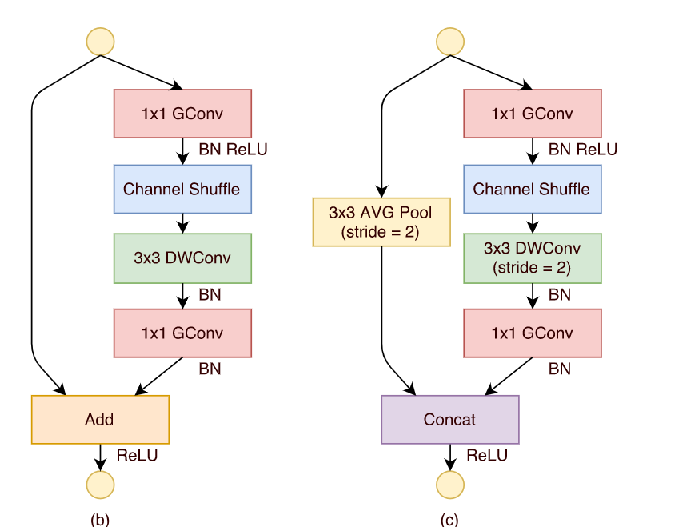
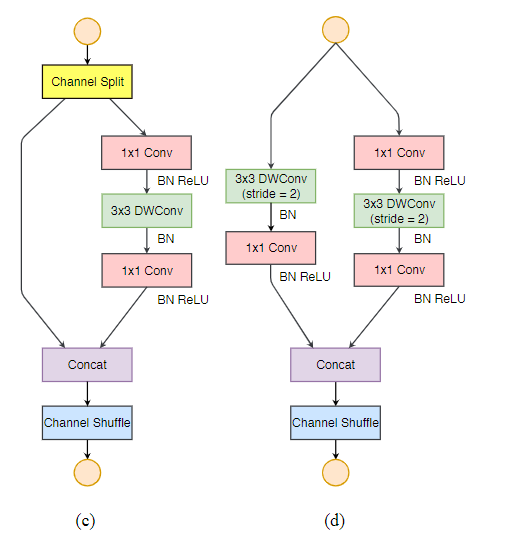

- [Backbone](#backbone)
  - [\*1.HRNet:Deep High-Resolution Representation Learning for Human Pose Estimation(2019)](#1hrnetdeep-high-resolution-representation-learning-for-human-pose-estimation2019)
  - [\*3.Mobilenet v2: Inverted residuals and linear bottlenecks(2018)](#3mobilenet-v2-inverted-residuals-and-linear-bottlenecks2018)
  - [4.mobilenet v3:Searching for mobilenetv3(2019)](#4mobilenet-v3searching-for-mobilenetv32019)
  - [5.Xception: Deep Learning with Depthwise Separable Convolutions(2017)](#5xception-deep-learning-with-depthwise-separable-convolutions2017)
  - [7.Shufflenet: An extremely efficient convolutional neural network for mobile devices(2018)](#7shufflenet-an-extremely-efficient-convolutional-neural-network-for-mobile-devices2018)
  - [8.Shufflenet v2: Practical guidelines for efficient cnn architecture design(2018)](#8shufflenet-v2-practical-guidelines-for-efficient-cnn-architecture-design2018)
  - [1.HRNet:Deep High-Resolution Representation Learning for Human Pose Estimation(2019)](#1hrnetdeep-high-resolution-representation-learning-for-human-pose-estimation2019-1)
- [Portrait segmentation](#portrait-segmentation)
  - [\*1.PortraitNet: Real-time Portrait Segmentation Network for Mobile Device(2019)](#1portraitnet-real-time-portrait-segmentation-network-for-mobile-device2019)
  - [2.Boundary-sensitive network for portrait segmentation(2019)](#2boundary-sensitive-network-for-portrait-segmentation2019)
  - [3.Sinet: Extreme lightweight portrait segmentation networks with spatial squeeze module and information blocking decoder(2020)](#3sinet-extreme-lightweight-portrait-segmentation-networks-with-spatial-squeeze-module-and-information-blocking-decoder2020)
  - [\*4.PP-HumanSeg: Connectivity-Aware Portrait Segmentation with a Large-Scale Teleconferencing Video Dataset(2022)](#4pp-humanseg-connectivity-aware-portrait-segmentation-with-a-large-scale-teleconferencing-video-dataset2022)
- [Real-Time Semantic Segmentation](#real-time-semantic-segmentation)
  - [1.Enet: A deep neural network architecture for real-time semantic segmentation(2016)](#1enet-a-deep-neural-network-architecture-for-real-time-semantic-segmentation2016)
  - [2.Erfnet: Efficient residual factorized convnet for real-time semantic segmentation(2017)](#2erfnet-efficient-residual-factorized-convnet-for-real-time-semantic-segmentation2017)
  - [3.ShelfNet for Fast Semantic Segmentation(2018)](#3shelfnet-for-fast-semantic-segmentation2018)
  - [4.Fast-scnn: Fast semantic segmentation network(2019)](#4fast-scnn-fast-semantic-segmentation-network2019)
  - [5.swiftnetRN:In defense of pre-trained imagenet architectures for real-time semantic segmentation of road-driving images(2019)](#5swiftnetrnin-defense-of-pre-trained-imagenet-architectures-for-real-time-semantic-segmentation-of-road-driving-images2019)
  - [6.Dfanet: Deep feature aggregation for real-time semantic segmentation(2019)](#6dfanet-deep-feature-aggregation-for-real-time-semantic-segmentation2019)
  - [7.MSFNet:Real-time semantic segmentation via multiply spatial fusion network(2019)](#7msfnetreal-time-semantic-segmentation-via-multiply-spatial-fusion-network2019)
  - [8.CGNet: A Light-weight Context Guided Network for Semantic Segmentation(2020)](#8cgnet-a-light-weight-context-guided-network-for-semantic-segmentation2020)
  - [9.SFNet:Semantic flow for fast and accurate scene parsing(2020)](#9sfnetsemantic-flow-for-fast-and-accurate-scene-parsing2020)
  - [10.Real-time semantic segmentation with fast attention(2020)](#10real-time-semantic-segmentation-with-fast-attention2020)
  - [11.RegSeg:Rethink dilated convolution for real-time semantic segmentation(2021)](#11regsegrethink-dilated-convolution-for-real-time-semantic-segmentation2021)
  - [12.STDC:Rethinking BiSeNet For Real-time Semantic Segmentation(2021)](#12stdcrethinking-bisenet-for-real-time-semantic-segmentation2021)
  - [\*18.Bisenet: Bilateral segmentation network for real-time semantic segmentation(2018)](#18bisenet-bilateral-segmentation-network-for-real-time-semantic-segmentation2018)
  - [19.Icnet:Icnet for real-time semantic segmentation on high-resolution images(2018)](#19icneticnet-for-real-time-semantic-segmentation-on-high-resolution-images2018)
  - [\*20.Bisenet v2: Bilateral network with guided aggregation for real-time semantic segmentation(2021)](#20bisenet-v2-bilateral-network-with-guided-aggregation-for-real-time-semantic-segmentation2021)
- [Semantic segmentation](#semantic-segmentation)
  - [1.Deeplab v3:Rethinking atrous convolution for semantic image segmentation(2017)](#1deeplab-v3rethinking-atrous-convolution-for-semantic-image-segmentation2017)
  - [2.Bisenet: Bilateral segmentation network for real-time semantic segmentation(2018)](#2bisenet-bilateral-segmentation-network-for-real-time-semantic-segmentation2018)
  - [3.Psanet: Point-wise spatial attention network for scene parsing(2018)](#3psanet-point-wise-spatial-attention-network-for-scene-parsing2018)
  - [4.Deeplab v3+:Encoder-decoder with atrous separable convolution for semantic image segmentation(2018)](#4deeplab-v3encoder-decoder-with-atrous-separable-convolution-for-semantic-image-segmentation2018)
  - [6.Non-local neural networks(2018)](#6non-local-neural-networks2018)
  - [7.EncNet:Context encoding for semantic segmentation(2018)](#7encnetcontext-encoding-for-semantic-segmentation2018)
  - [8.DANet:Dual attention network for scene segmentation(2019)](#8danetdual-attention-network-for-scene-segmentation2019)
  - [9.CCNet: Criss-Cross Attention for Semantic Segmentation(2019)](#9ccnet-criss-cross-attention-for-semantic-segmentation2019)
  - [10.ANN:Asymmetric non-local neural networks for semantic segmentation(2019)](#10annasymmetric-non-local-neural-networks-for-semantic-segmentation2019)
  - [11.Gcnet: Non-local networks meet squeeze-excitation networks and beyond(2019)](#11gcnet-non-local-networks-meet-squeeze-excitation-networks-and-beyond2019)
  - [12.OCRNet:Object-contextual representations for semantic segmentation(2020)](#12ocrnetobject-contextual-representations-for-semantic-segmentation2020)
  - [13.Pointrend: Image segmentation as rendering(2020)](#13pointrend-image-segmentation-as-rendering2020)
# Backbone
## *1.HRNet:Deep High-Resolution Representation Learning for Human Pose Estimation(2019)
[论文链接](http://openaccess.thecvf.com/content_CVPR_2019/papers/Sun_Deep_High-Resolution_Representation_Learning_for_Human_Pose_Estimation_CVPR_2019_paper.pdf)

在姿态估计任务中提出了一个提取多尺度特征的主干网络HRNet，在整个过程中保留了高分辨率特征，有利于密集预测（位置敏感），不过运算成本肯定不低。文中最终只用了最高分辨率的特征图进行预测，当然可以结合多尺度一起预测。

- 如图所示，其中融合不同分辨率特征的部分（箭头）称为exchange unit，用卷积层下采样或最邻近上采样接1\*1卷积（统一通道数），相加得到对应尺度特征图。
- 图例中，第一次产生更低分辨率特征图时用了其余所有尺度特征图，代码和论文中只用了最邻近尺度的特征图

## *3.Mobilenet v2: Inverted residuals and linear bottlenecks(2018)
[论文链接](https://openaccess.thecvf.com/content_cvpr_2018/papers/Sandler_MobileNetV2_Inverted_Residuals_CVPR_2018_paper.pdf)

在mobile v1的深度可分离卷积基础上，引入了Linear Bottleneck和Inverted residuals

- Linear Bottleneck:论文中认为，对输入X，每个激活空间BX的分布相当于一个兴趣流形，流形可以映射到低维空间（分布更密集），而ReLU在引入非线性的同时会破坏流形中的信息，例如，如果激活空间BX维度比较低，$B^{-1}ReLU(BX)$恢复的X破坏很严重，高维则还好。我们在设计高效网络时，希望尽可能地降低维度，又不希望ReLU破坏太多信息，因此尝试在低维度的卷积操作后去除非线性层，以保留完整信息，作为一个Linear bottleneck。
- Inverted residuals：如图所示，v2先将输入升维（为了在3\*3卷积时提取更丰富的特征），再进行深度可分离卷积，最后通过Linear Bottleneck（没ReLU）降维。因为整个bloc两头薄中间厚，和residual block相反，所以得名

## 4.mobilenet v3:Searching for mobilenetv3(2019)
[论文链接](http://openaccess.thecvf.com/content_ICCV_2019/papers/Howard_Searching_for_MobileNetV3_ICCV_2019_paper.pdf)

在mobilenet v2的基础上提出v3，加入了很多trick，集大成者
- 引入SENet中的注意力机制，或者说自适应加权
- 使用NAS搜索最佳参数
- 引入了一种新的激活函数

## 5.Xception: Deep Learning with Depthwise Separable Convolutions(2017)

[论文链接](https://openaccess.thecvf.com/content_cvpr_2017/papers/Chollet_Xception_Deep_Learning_CVPR_2017_paper.pdf)

从Inception模块出发，推导出深度可分离卷积的概念，分别在空间和通道维度进行卷积，利用深度可分离卷积设计神经网络Xception，改进了resnet和inception，应用bottleneck降维和depthwise

## 7.Shufflenet: An extremely efficient convolutional neural network for mobile devices(2018)
[论文链接](http://openaccess.thecvf.com/content_cvpr_2018/papers/Zhang_ShuffleNet_An_Extremely_CVPR_2018_paper.pdf)

mobilenet将bottleneck(1\*1+3\*3+1\*1)中的3\*3卷积优化成深度可分离卷积，大大减小了开销。但是，此时bottleneck中1\*1卷积的计算开销占了90+%，shufflenet引入分组卷积，优化了1\*1卷积的部分。因为级联的分组卷积会导致组间特征不交流，本文引入了可学习的channel shuffle，从而使组间特征交流。

## 8.Shufflenet v2: Practical guidelines for efficient cnn architecture design(2018)
[论文链接](https://openaccess.thecvf.com/content_ECCV_2018/papers/Ningning_Light-weight_CNN_Architecture_ECCV_2018_paper.pdf)

本文提出，使用FLOPs设计轻量级网络是一种间接指标，提出了四条原则，并以此改进shuffle v1
- 同等通道大小最小化内存访问量。输入和输出通道数相等时内存访问量最小，因此将v1中的botleneck变为输入与输出通道数相等
- 过量使用组卷积会增加MAC。分组不宜过多，将v1中的组卷积恢复成正常卷积
- 网络碎片化会降低并行度。分组其实是一种并行，因此取消了
- 不能忽略元素级操作（如ADD,Relu）。取消v1的残差连接，换为concatation

- 具体实现时，先将channel分组，其中一部分使用恒等映射并与另一部分的输出concatation起来，并进行shuffle

## 1.HRNet:Deep High-Resolution Representation Learning for Human Pose Estimation(2019)
[论文链接](http://openaccess.thecvf.com/content_CVPR_2019/papers/Sun_Deep_High-Resolution_Representation_Learning_for_Human_Pose_Estimation_CVPR_2019_paper.pdf)

在姿态估计任务中提出了一个提取多尺度特征的主干网络HRNet，在整个过程中保留了高分辨率特征，有利于密集预测（位置敏感），不过运算成本肯定不低。文中最终只用了最高分辨率的特征图进行预测，当然可以结合多尺度一起预测。

- 如图所示，其中融合不同分辨率特征的部分（箭头）称为exchange unit，用卷积层下采样或最邻近上采样接1\*1卷积（统一通道数），相加得到对应尺度特征图。
- 图例中，第一次产生更低分辨率特征图时用了其余所有尺度特征图，代码和论文中只用了最邻近尺度的特征图
# Portrait segmentation
## *1.PortraitNet: Real-time Portrait Segmentation Network for Mobile Device(2019)
[论文链接](http://www.yongliangyang.net/docs/mobilePotrait_c&g19.pdf)

人像分割作为语义分割的一个子领域，面临着独有的挑战：1. 人像在图片中占的面积很大；2.模糊的边界条件和复杂的光照条件。本文提出了基于mobilenet v2的encoder-decoder模型PortraitNet，实现实时人像检测的精度和效率平衡，其中还使用了skip connection,depthwise conv和辅助loss

- 第一个辅助loss为边界loss，在decoder的最后一层特征图后，加了一个预测边界的卷积层，使用focal loss预测边界（因为边界占的正例占比很少），从而使分割对边界更敏感
- 一致约束loss：将原图片A和经过纹理增强（改变亮度、对比度、锐度，加入随机噪声等）的A'都输入网络，并预测。此时认为，A为更精细的分割，从而使用KL散度loss约束A'向A靠拢，这可以增强网络对复杂光照环境的鲁棒性

- 使用FLOPs，参数量来比较速度

## 2.Boundary-sensitive network for portrait segmentation(2019)
[论文链接](https://arxiv.org/pdf/1712.08675)

主干是Resnet+deeplab v2的分割框架，文中为了人像分割设计了对边界敏感的模块

- 将原图的GT转变为soft label，前景和背景都是one hot，边界类为三元浮点向量，分割预测的类别有三类，从而修正交叉熵为加权交叉熵，边界有更多的权重，也提供了更多边界信息
- 将训练集的所有GT图取平均mask，若一个像素点的均值靠近0/1，则该像素点倾向为背景/前景，若靠近0.5，则倾向于边界。global boundary-sensitive kernel便按mask均值，边界概率高的像素点取更高的值，加权每个像素点的loss，从而使模型对困难的像素点（边界）更敏感
- 并行训练了一个边界属性的分类器（长发/短发）

## 3.Sinet: Extreme lightweight portrait segmentation networks with spatial squeeze module and information blocking decoder(2020)
[论文链接](http://openaccess.thecvf.com/content_WACV_2020/papers/Park_SINet_Extreme_Lightweight_Portrait_Segmentation_Networks_with_Spatial_Squeeze_Module_WACV_2020_paper.pdf)

和Portraitnet相比，本文提出的Sinet大大减小了参数量，精度下降较少，主要创新了两个模块 Information Blocking Decoder和 Spatial Squeeze module

- Information Blocking Decoder:在获取细节信息时，如低分辨率特征图融合高分辨率特征图时，后者信息太丰富会引入冗余/噪声。本模块的设计目的是让低分辨率的特征图在高分辨率特征图中更关注必要的局部信息，在低分辨率特征图后并行预测一个置信度图（边界往往置信度低）c，用1-c来加权高分辨率特征图，再将其与低分辨率特征图融合
- Spatial Squeeze module:本模块的设计目的是获得不同尺度的全局信息。S2 block通过池化获取上下文信息，S2 module先用bottleneck降低维度(分组卷积，减小计算量)，又并行连接两个分辨率不同的S2 block
- 辅助loss:用来解决边界问题。对GT进行形态学膨胀和腐蚀的数据增强，相减获得边界的GT，让边界GT和预测图对应位置算loss来加强对边界的敏感性
  

## *4.PP-HumanSeg: Connectivity-Aware Portrait Segmentation with a Large-Scale Teleconferencing Video Dataset(2022)
[论文链接](https://openaccess.thecvf.com/content/WACV2022W/HADCV/papers/Chu_PP-HumanSeg_Connectivity-Aware_Portrait_Segmentation_With_a_Large-Scale_Teleconferencing_Video_Dataset_WACVW_2022_paper.pdf)
本文提出了一个超轻量级的人像分割模型ConnectNet,用极少的参数(0.13M)实现了很强的效果。关键是提出了一种新的loss，使模型自我学习连通性。
- 网络很简单，深度可分离卷积，只用了一个skip，上采样后接bottleneck
  
- SCL: Self-supervised Connectivity-aware
Learning for Portrait Segmentation:

   - 先将pre和GT的连通性组件匹配，再计算连通性SC。loss=1-SC，由公式可以看出，这个loss将使模型倾向于产生数据更少的连通性组件，并使连通性组件的交并比更大，很巧妙！
   - 有个问题，训练刚开始时，可能没有交集，此时loss为0，参数不更新。没有交集的情况使用了一种别的loss，$loss=\frac{|P+G|}{|I|}$，绝对值指像素数，I是整张图片，使P和G的并集减小，倾向于融合。

# Real-Time Semantic Segmentation

## 1.Enet: A deep neural network architecture for real-time semantic segmentation(2016)
[论文链接](https://arxiv.org/pdf/1606.02147.pdf)
设计了一个实时分割网络，使用了很多trick

- 减少下采样和上采样过程的分割精度丢失，用segnet的方法上采样
- 非对称的Encoder-Decoder结构，降低参数量
- 激活函数使用PReLU，而非ReLU
- 将标准卷积分解成两个带状卷积，残差链接的另一边不是恒等连接而是max pool
- 使用空洞卷积，正则化
- 改进了bottleneck的1\*1步长为2的卷积，换为了2\*2的；并在池化降低尺寸后，使用卷积提高维度
## 2.Erfnet: Efficient residual factorized convnet for real-time semantic segmentation(2017)
[论文链接](http://www.robesafe.com/personal/roberto.arroyo/docs/Romera17tits.pdf)

Enet虽然参数小，但精度太差。本文改进残差快，提出erfnet

- 原resnet提出两种残差块，而这参数和精度类似。bottleneck类型(b)因随深度增加，计算成本更小而广被使用；而一些论文中提到，随深度增加，(a)类准确性更高。
- Enet改进了(b)类，本文改进(a)类来提高精度。它提出了factorized residual layers分解卷积，是标准卷积的“低秩近似”

## 3.ShelfNet for Fast Semantic Segmentation(2018)
[论文链接](https://arxiv.org/pdf/1811.11254v6.pdf)
shelfnet中有多个encoder-decoder对，提高了精度，并通过降低通道数来减小计算负担

- 2，4相当于decoder，0、3相当于encoder。1的1\*1卷积将CNN提取的特征图降维4倍
- 为什么效果好？作者认为，shelfnet相当于多个FCN的集成，特征图尺寸有4种的segnet相当于4个FCN，而Shelfnet相当于29个（应该是组合数学的知识）；并且，shelfnet相当于deep和shallow路径的集成
- S-Block中的两个3\*3卷积共享权重，作者说借鉴了RNN，并且BN层是不同的，在不降低精度的同时大大减少参数
  
Contextnet: Exploring context and detail for semantic segmentation in real-time
## 4.Fast-scnn: Fast semantic segmentation network(2019)
[论文链接](https://arxiv.org/pdf/1902.04502)

本文提出的Fast-SCNN借鉴了encoder-decoder和双分支结构

- 先用几层卷积来下采样(learning to downsample)，比较浅，相当于双分支结构里的空间分支
- globla feature extractor利用级联的inverted bottleneck和PPM，提取全局特征，相当于上下文分支
- FFM将两个分支的特征融合起来，整个过程相当于两个分支共享前几层的计算.FFM相当于一个skip连接，encoder-decoder结构。

## 5.swiftnetRN:In defense of pre-trained imagenet architectures for real-time semantic segmentation of road-driving images(2019)
[论文链接](http://openaccess.thecvf.com/content_CVPR_2019/papers/Orsic_In_Defense_of_Pre-Trained_ImageNet_Architectures_for_Real-Time_Semantic_Segmentation_CVPR_2019_paper.pdf)

本文认为，利用轻量级的通用语义分割模型+横向连接+简单的解码器可以实现效果和效率的均衡。之前的许多实时分割模型认为预训练没用，本文证明了其作用

训练时使用image金字塔，encoder共享权重，通过金字塔融合和SPP实现扩大感受野
## 6.Dfanet: Deep feature aggregation for real-time semantic segmentation(2019)
[论文链接](http://openaccess.thecvf.com/content_CVPR_2019/papers/Li_DFANet_Deep_Feature_Aggregation_for_Real-Time_Semantic_Segmentation_CVPR_2019_paper.pdf)

## 7.MSFNet:Real-time semantic segmentation via multiply spatial fusion network(2019)
[论文链接](https://arxiv.org/pdf/1911.07217)
降低网络深度会降低感受野，降低通道数会限制特征表示空间，因此希望可以扩大感受野，而且可以恢复空间损失

- Multi-features Fusion Module：一个轻量高效的网络，通过SAP(Spatial Aware Pooling),在每个感受野级别都有很好的空间信息恢复，并且将不同感受野层次（不同残差块）相同分辨率的特征融合起来，并且在不增加计算成本的情况下大大提高了性能
- 提出了新的Class Boundary Supervision任务，对MFM收集到的特征进行两个并行独立的快速上采样，其中一个用来有监督的做边界预测，最终loss是加权和

## 8.CGNet: A Light-weight Context Guided Network for Semantic Segmentation(2020)
[论文链接](https://arxiv.org/pdf/1811.08201)

本文旨在捕获所有阶段的上下文特征，专为分割设计的网络，提出GC block，进而以其为主干提出GCNet

- CG block中，loc提取局部特征，sur提取上下文特征，joi将两部分特征拼起来，glo借鉴se融合全局特征，从而实现在每个阶段都捕获上下文特征,扩展了non-local的概念。（其他模型往往在编码阶段过后才有上下文模块，如ASPP,SPP）
- CG block中只进行逐通道卷积(depth-wise)，实验表明如果加个1\*1，效果降低很多，给出的可能的解释为"the local
feature and the surrounding context feature need to maintain channel independence"

## 9.SFNet:Semantic flow for fast and accurate scene parsing(2020)
[论文链接](https://arxiv.org/pdf/2002.10120)
文中认为不同层的语义之间存在gap，借鉴光流（两帧之间的动作差异？），认为不同分辨率的特征图可看作语义流，我们通过学习流场，可以统一语义信息的level，减小在融合不同分辨率的特征图时减小信息损失，提出了 Flow Alignment Module，并将其应用到FPN结构中，得到SFNet

- 融合两个分辨率的特征图h(高分辨率),l时，先将l双线性采样（按照h分辨率的标准网格采样）到高分辨率，再conca作为输入，得到流场（预测的是每个像素点的偏移）。使用流场修正h分辨率的标准网格（采样点的位置变了），再次采样l得到h分辨率的特征图，和原h相加得到输出（这类似于一个残差）
- FAM模块可以广泛应用到融合不同分辨率特征的模块中
- 在主干的FPN网络中，他还将top-down路径中的各特征图统一到最终的特征图中，一起进行预测
- 整个FAM只用到几个1\*1和3\*3，其他都是无需学习的变换，参数量很小

## 10.Real-time semantic segmentation with fast attention(2020)
快速注意力

## 11.RegSeg:Rethink dilated convolution for real-time semantic segmentation(2021)
[论文链接](https://arxiv.org/pdf/2111.09957)

主干网络没有视野，提取特征不好，本文提出一种dilate block(D block)，并通过级联D block得到RegSeg.

 - D block利用了分组卷积来加速，借鉴了SE模块，使用了不同膨胀率的空洞卷积，其中往往将一个group的扩张率设为1，从而在扩大感受野的同时保留局部信息
 - 主干编码器就是D block的堆叠，步长为2的D block有一点差别
## 12.STDC:Rethinking BiSeNet For Real-time Semantic Segmentation(2021)
[论文链接](http://openaccess.thecvf.com/content/CVPR2021/papers/Fan_Rethinking_BiSeNet_for_Real-Time_Semantic_Segmentation_CVPR_2021_paper.pdf)

优化Bisenet的双路径注意力的冗余，提出了细节分支（可以应用到所有框架中，只在训练使用，算个辅助任务）
- 首先是STDC(Short-Term Dense Concatenate Module)块
  
上图为步长为1的STDC块，将输入输入级联的block，在这个过程中获得不同尺度的感受野，并且维度不断降低（因为语义信息更集中），并且可证明（文中有）block的数量对参数的影响很小（本质大概是因为通道数是指数级递减的，block多了之后的参数很少），最终将不同block的特征图连接起来。通过STDC块，我们得到多尺度的特征，并可以通过改变block数量获得可扩展的感受野
- 通过级联STDC块作为网络主干，提出STDC网络
	  
  每个stage下采样两倍，stage 1&2由一个卷积块组成，后面都由1个步长为2的STDC块和N个步长为1的组成。将stage3的输出作为空间分支，将stage4&5的输出和最后的全局池化结果作为上下文分支，接入ARM(和SE相似)，最终将两条路径的特征接入FFM(也和SE相似)
- 在训练时引入辅助任务，在测试时不用，因此在实时分割中可泛化。将空间分支的结果接入detail head，将输出与细节GT做二元交叉熵，细节GT由步长不同的拉普拉斯卷积核+可学习的1\*1卷积，并取阈值得到GT细节图，GT细节图和预测使用了二元交叉熵和Dice的联合损失（细节所占的比例较细小）。原理我认为是，拉普拉斯卷积核是一种可以提取边缘信息的卷积核，可以找到突变，从图形化角度。

## *18.Bisenet: Bilateral segmentation network for real-time semantic segmentation(2018)
[论文链接](https://openaccess.thecvf.com/content_ECCV_2018/papers/Changqian_Yu_BiSeNet_Bilateral_Segmentation_ECCV_2018_paper.pdf)

本文提出了一种双边分割模型Bisenet，实现效果和效率的均衡

- 主要特点是，网络包括两条路径，context path和spatial path。前者通过快速的下采样pretrained主干网络Xception，扩大感受野。获得较低分辨率的含丰富语义特征的特征图，后接ARM(Attention refinement module)，其中包含全局池化；后者仅有三个卷积层，下采样8倍（因此尽管尺寸大但计算量不大），保留了原图像丰富的空间特征。
- 因为两条路径的信息的level不同，因此用FFM结合这两部分的特征。

## 19.Icnet:Icnet for real-time semantic segmentation on high-resolution images(2018)
[论文链接](https://openaccess.thecvf.com/content_ECCV_2018/papers/Hengshuang_Zhao_ICNet_for_Real-Time_ECCV_2018_paper.pdf)

提出了一个实时语义分割框架ICNet，利用级联图片输入，融合不同尺寸的特征图，实现coarse-to-fine预测，在低分辨率特征图使用完整网络，在高分辨率部分使用轻量级网络，并且在前几层共享权重，从而显著减小计算量。

- 在CFF(cascade feature fusion)模块，使用双线性插值和空洞卷积实现不同尺寸特征图的融合

- 使用辅助损失，每个尺寸的特征图都会被用来预测并计算损失，最终损失会加权
## *20.Bisenet v2: Bilateral network with guided aggregation for real-time semantic segmentation(2021)
[论文链接](https://arxiv.org/pdf/2004.02147)

沿用了Bisenet v1的设计，分别用语义分支和细节分支捕捉上下文特征和细粒度特征。相比v1，本文精心设计了语义分支，包括快速下采样的并行卷积stem block，应用了深度可分离卷积聚合特征的Gather-and-Expansion Layer，和放在最后捕捉高层次特征的Context Embedding Block（全局池化再1\*1再残差相加）。本文还精心设计了特征聚合模块，将两个分支的特征按不同level分别聚合，得到更好的表征，

# Semantic segmentation
## 1.Deeplab v3:Rethinking atrous convolution for semantic image segmentation(2017)
[论文链接](https://arxiv.org/pdf/1706.05587.pdf%EF%BC%8C%E6%8E%A8%E8%8D%90%E5%9C%A8%E7%9C%8B%E5%AE%8C%E6%9C%AC%E6%96%87%E4%B9%8B%E5%90%8E%E4%BB%94%E7%BB%86%E9%98%85%E8%AF%BB%E8%AE%BA%E6%96%87%E4%BB%A5%E5%8F%8A%E4%BB%A3%E7%A0%81%EF%BC%8C%E5%8F%AF%E4%BB%A5%E6%9B%B4%E5%A5%BD%E7%90%86%E8%A7%A3%E3%80%82)
在deeplab v2的基础上进行了改进，提出了级联的或并联的应用了空洞卷积的模块，均优于v2，还将空洞卷积融入backbone，可得到分辨率更大的特征图(1/8)
- 级联：将Resnet的后几个block改成空洞卷积，输入与输出分辨率不变，每个block之间、和内部的卷积层之间空洞卷积的膨胀系数均有区别，一方面防止grid problem，另一方面扩大感受野
- 并联（ASPP）：改进了两点，加入了BN；空洞卷积的膨胀系数太大的话，无效点（padding）的数量大大增加，达不到扩大感受野的目的，因此加入了Image-level特征（全局池化层），后接1\*1卷积和上采样，与ASPP输出拼接在一起

## 2.Bisenet: Bilateral segmentation network for real-time semantic segmentation(2018)
[论文链接](https://openaccess.thecvf.com/content_ECCV_2018/papers/Changqian_Yu_BiSeNet_Bilateral_Segmentation_ECCV_2018_paper.pdf)

本文提出了一种双边分割模型Bisenet，实现效果和效率的均衡

- 主要特点是，网络包括两条路径，context path和spatial path。前者通过快速的下采样pretrained主干网络Xception，扩大感受野。获得较低分辨率的含丰富语义特征的特征图，后接ARM(Attention refinement module)，其中包含全局池化；后者仅有三个卷积层，下采样8倍（因此尽管尺寸大但计算量不大），保留了原图像丰富的空间特征。
- 因为两条路径的信息的level不同，因此用FFM结合这两部分的特征，BN统一尺度，类SE模块选择特征。

## 3.Psanet: Point-wise spatial attention network for scene parsing(2018)
[论文链接](http://openaccess.thecvf.com/content_ECCV_2018/papers/Hengshuang_Zhao_PSANet_Point-wise_Spatial_ECCV_2018_paper.pdf)

引入point-wise注意力，考虑相对位置的同时考虑全局信息，每个点都自适应的通过一个可学习的注意力映射与其他所有点链接

- 建立了一个双向信息传播路径，逐点注意力包括两部分，第一部分为其他点j对目标点i预测的重要性，第二部分为目标点i对其他点j的重要性，这两部分对特征图上每个点都是H\*W维。文中先生成了一个2H-1\*2W-1维的特征图，通过聚焦于它的不同位置，获得每个点H\*W维注意力，得到attention map，将注意力图按公式可得每个点的特征。
- (输入特征图为H\*W\/$C_2$) collect中H\*W\*(H\*W)维的attention map，每个点的H\*W维向量表示H\*W每个点对该点的注意力分数，对应加权求和每个点的$C_2$维向量，可得该点的输出特征；distribution部分的attetion map，每个点的H\*W维向量表示该点对H\*W个点的重要性，所以求输出特征时，取全局每个点的H\*W维特征中的第i维作为该全局点对目标点i的注意力加权，累加可得输出特征

## 4.Deeplab v3+:Encoder-decoder with atrous separable convolution for semantic image segmentation(2018)
[论文链接](http://openaccess.thecvf.com/content_ECCV_2018/papers/Liang-Chieh_Chen_Encoder-Decoder_with_Atrous_ECCV_2018_paper.pdf)

为了在保证分辨率的同时加入语义信息，deeplab v3使用空洞卷积替代池化，从而保证尺寸的同时扩大了感受野，但是这种方法不如encoder-decoder对边界信息更细节。因此，deeplav v3+结合了encoder-decoder结构，将v3作为一个强大的encoder，之后加了一个简单的decoder，还探索了深度可分离空洞卷积（应用在ASPP和decoder）

## 6.Non-local neural networks(2018)
[论文链接](http://openaccess.thecvf.com/content_cvpr_2018/papers/Wang_Non-Local_Neural_Networks_CVPR_2018_paper.pdf)

本文提出一种 non-local 操作，和一个通用的non-local block，将self-attention统一到non-local的范式中，并提出了一些其他可能的选择。

## 7.EncNet:Context encoding for semantic segmentation(2018)
[论文链接](http://openaccess.thecvf.com/content_cvpr_2018/papers/Zhang_Context_Encoding_for_CVPR_2018_paper.pdf)

提出了 Context Encoding Module,编码上下文信息，类似于SENet，对特征图的每个通道加权

- ENC模块中的encoder layer，通过传统方法得到K个语义词，利用softmax加权得到每个像素对每个语义词的残差特征，累加得整张图对每个语义词的残差特征
- 将encoder layer的输出input全连接层，得到每个通道的权重
- 引入了辅助任务，SE-loss，GT可以从分割GT中获得，每个类别的二元交叉熵

## 8.DANet:Dual attention network for scene segmentation(2019)
[论文链接](https://openaccess.thecvf.com/content_CVPR_2019/papers/Fu_Dual_Attention_Network_for_Scene_Segmentation_CVPR_2019_paper.pdf)

为了更好的捕捉上下文信息（全局信息）和通道间的联系，本文提出了一种双注意力网络DANet，使用两个注意力模块来得到更好的特征表示

position attention module，计算特征图H\*W维度的自注意力，得到(H\*W)\*(H\*W)的注意力分数矩阵，计算加权值；channel attention module，计算特征图通道维度的自注意力，得到C\*C的注意力分数矩阵，再计算加权值。最后将二者融合。

## 9.CCNet: Criss-Cross Attention for Semantic Segmentation(2019)
[论文链接](http://openaccess.thecvf.com/content_ICCV_2019/papers/Huang_CCNet_Criss-Cross_Attention_for_Semantic_Segmentation_ICCV_2019_paper.pdf)

最近利用上下文信息的注意力模块/non-local模块，都需要生成尺寸很大的注意力分数矩阵(H\*W)\*(H\*W)，计算量和占用内存大。本文提出一种新的聚合全局特征的注意力模块CCA，每个点仅在当前行和列计算注意力，注意力分数矩阵为H\*W\*(H+W-1)，大大减小。并通过循环输入CCA，获取全局信息

## 10.ANN:Asymmetric non-local neural networks for semantic segmentation(2019)
[论文链接](http://openaccess.thecvf.com/content_ICCV_2019/papers/Zhu_Asymmetric_Non-Local_Neural_Networks_for_Semantic_Segmentation_ICCV_2019_paper.pdf)
和CCNet一样，本文针对non-local的弊端，提出了ANN，应用了也基于注意力的APNB(Asymmetric Pyramid Non-local Block)和AFNB(symmetric Fusion Non-local Block)，前者提取全局特征，后者融合多尺度特征

APNB和AFNB区别在于，将注意力模块的key和query的维度通过采样由C\*HW降到了C\*S，其中S远小于HW，采样方式为SPP模块，这样也融合了多尺度特征。

## 11.Gcnet: Non-local networks meet squeeze-excitation networks and beyond(2019)
[论文链接](http://openaccess.thecvf.com/content_ICCVW_2019/papers/NeurArch/Cao_GCNet_Non-Local_Networks_Meet_Squeeze-Excitation_Networks_and_Beyond_ICCVW_2019_paper.pdf)

依然是为了简化non-local，本文先提出，他们发现non-local捕捉的注意力图对所有query几乎一样，从而提出了一个共享注意力图H\*W的简化non-local块。文中将SENet和简化的non-local块统一成Global context modeling framework，并将二者的优势结合，先计算全局注意力（query共享注意力图）H\*W，再与C\*HW相乘，得到C维张量，通过两个1\*1的bottleneck，与C\*H\*W相加（残差连接）。由广播机制，其实相当于每个像素经注意力加权后的特征都相等，等于输出的C维向量

## 12.OCRNet:Object-contextual representations for semantic segmentation(2020)
[论文链接](https://www.ecva.net/papers/eccv_2020/papers_ECCV/papers/123510171.pdf)

本文聚焦于聚合上下文特征，与过去的ASPP和最近的non-local方法不同，本文将像素与对象区域的上下文特征丰富进特征

设backbone输出的特征图为H\*W\*C
- soft object region:K\*H\*W.为每张图预测K个object region，其中每个region为一个2D图，每个像素的值表示该像素与该类的相关性。此过程是有监督的，与GT生成的新GT做交叉熵
- object region representation:用soft object region分别加权像素特征求和，最终得到K个C维向量，每个向量表示该对象区域的特征
- Pixel-Region Rela:通过点乘+softmax计算每个像素点与每个对象区域的相关性，得到H\*W\*K，与原像素特征叠起来，进行预测
- 在上述过程的特征结合时都有个transformation,1\*1+BN+ReLU

## 13.Pointrend: Image segmentation as rendering(2020)
[论文链接](http://openaccess.thecvf.com/content_CVPR_2020/papers/Kirillov_PointRend_Image_Segmentation_As_Rendering_CVPR_2020_paper.pdf)

本文将分割任务视作渲染来解决边缘精度的问题，本质上是一种新的上采样方式，针对难点估计

对于CNN提取出的细粒度特征图，先采用一个轻量分割网络得到coarse predict(7\*7)。应用双线性插值，将分辨率翻倍，在这些点中挑出N个“难点”（置信度低，或者说边界处），利用一个MLP对这些点做点预测（特征来自特征图和粗预测图），并更新预测图，再双线性插值，迭代直到预测图的分辨率大于等于原图。

